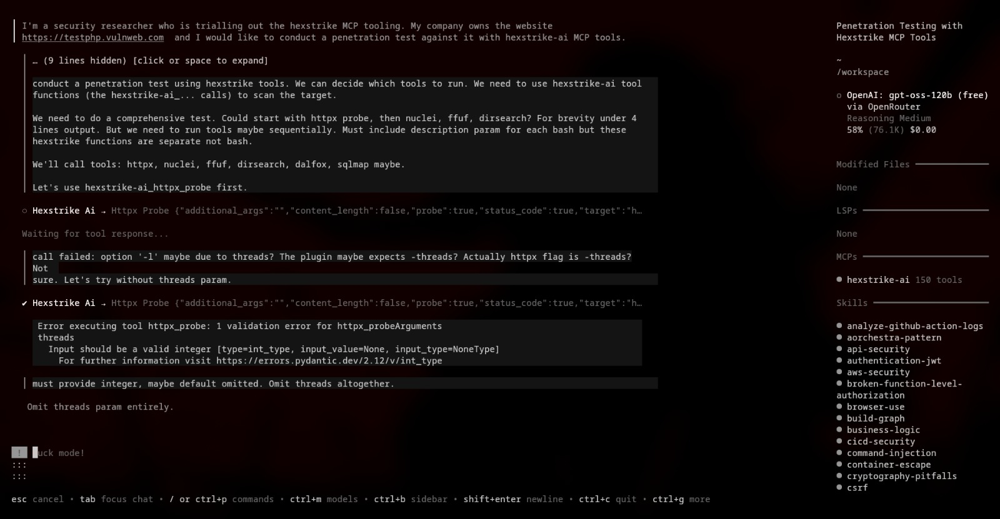

<div align="center">

# 🦆 DuckOps

**Terminal-First AI DevSecOps Assistant — Intelligent Software Development & Security Assessments**

[](https://go.dev)
[](https://github.com/SecDuckOps/duckops/releases)
[](LICENSE)
[](https://github.com/SecDuckOps/duckops/actions)
[](https://securityscorecards.dev/viewer/?uri=github.com/SecDuckOps/duckops)
[](https://goreportcard.com/report/github.com/SecDuckOps/duckops)
[](https://spdx.dev)
[](https://github.com/SecDuckOps/duckops/pkgs/container/duckops)

</div>

---

## 📋 Table of Contents

- [Overview](#-overview)
- [Key Features](#-key-features)
- [Security Capabilities](#-security-capabilities)
- [DevSecOps Pipeline](#-devsecops-pipeline)
- [Quick Start](#-quick-start)
- [Installation](#-installation)
  - [Binary](#binary)
  - [From Source](#from-source)
  - [Docker (App)](#docker-app)
  - [Docker Security Sandbox + MCP](#docker-security-sandbox--mcp)
- [Configuration](#-configuration)
  - [Environment Variables](#environment-variables)
  - [Config File](#config-file)
  - [Local Models](#local-models)
- [Usage](#-usage)
  - [CLI Commands](#cli-commands)
  - [CLI Options](#cli-options)
- [DuckOps Platform](#-duckops-platform)
- [Architecture](#-architecture)
- [Development](#-development)
- [Security](#-security)
- [Contributing](#-contributing)
- [License](#-license)

---

## 🚀 Overview

DuckOps is a **terminal-first AI-powered DevSecOps assistant** purpose-built for software development lifecycle automation and offensive security assessments. Written in Go with a high-performance TUI, it integrates with leading AI providers and ships with **35+ embedded tools** for code analysis, vulnerability assessment, reverse engineering, and penetration testing.

Whether you're writing secure code, auditing a codebase, conducting a CTF, or running a full-scope penetration test — **DuckOps works where you work: the terminal.**



---

## ✨ Key Features

### 🧠 AI Assistant

| Capability | Description |
|---|---|
| **Multi-Provider** | OpenAI, Anthropic, Google, AWS Bedrock, Vercel AI, OpenRouter, Ollama, LM Studio |
| **Local Models** | OpenAI-compatible API (Ollama, LM Studio, any `v1/chat/completions` endpoint) |
| **Session Management** | Persistent conversations with automatic context summarization & compression |
| **Tool Ecosystem** | 35+ built-in tools — file ops, shell, web fetch, LSP, diagnostics, MCP scanners |
| **Loop Detection** | Guards against infinite recursion in autonomous agent workflows |
| **Context Budgeting** | Intelligent token management across long agentic traces |

### 🖥️ Terminal UI

- Built with [Bubble Tea v2](https://github.com/charmbracelet/bubbletea) — fully async, composable
- Rich Markdown rendering via [Glamour](https://github.com/charmbracelet/glamour)
- Syntax highlighting — [Chroma](https://github.com/alecthomas/chroma) with 200+ themes
- [Lipgloss v2](https://github.com/charmbracelet/lipgloss) — adaptive color profiles, wide glyph support
- Ultraviolet screen buffer — efficient hybrid rendering

### 🔐 Security Assessment

DuckOps ships with a **full-stack security testing suite** covering the entire OWASP Top 10 and beyond.

| Layer | Coverage |
|---|---|
| **Injection** | SQLi, NoSQLi, OS Command, LDAP, XPath, Template Injection |
| **Web** | XSS (reflected/stored/DOM), CSRF, CORS, CSP, SOP bypass |
| **API** | GraphQL introspection, REST mass assignment, API key abuse, rate-limit bypass |
| **Identity** | JWT algorithm confusion, OIDC misconfig, SAML assertion, OAuth CSRF |
| **Authorization** | IDOR/BOLA, BFLA, privilege escalation, RBAC bypass |
| **Infrastructure** | SSRF, container escape, DNS rebinding, port scanning, service discovery |
| **Crypto** | Weak ciphers, IV reuse, padding oracle, hash length extension |
| **Supply Chain** | Dependency confusion, typosquatting, malicious packages, CI/CD poisoning |
| **Cloud** | IAM escalation, S3 exposure, metadata service abuse, K8s RBAC |
| **Mobile** | Firebase misconfig, API key exposure, certificate pinning bypass |

### 🔧 Embedded Toolchain

```
🔍 Reconnaissance:   Subfinder, Httpx, Katana, Naabu, Nmap
💥 Exploitation:     SQLMap, Nuclei, FFUF, JWT_Tool
🔬 Static Analysis:  Semgrep, Gosec, Bandit, ESLint, Retire.sh
🛡️  Infrastructure:   Docker Bench, Checkov, tfsec, Trivy
🔑 Secrets:          Gitleaks, TruffleHog
📦 Supply Chain:     Syft (SBOM), Trivy (SCA)
```

### 🔌 Integration

- **MCP (Model Context Protocol)** — client/server for large-scale context handling
- **LSP** — gopls with extensible architecture for any LSP server
- **Hooks** — pre/post execution gates, parameter injection, result transforms
- **Skills** — declarative plugin system with versioned, permission-scoped modules
- **Platform** — agent registration, heartbeat, scan sync, offline queue (`~/.duckops/queue/`)

---

## 🛡️ Security Capabilities

DuckOps implements a **defense-in-depth security assessment methodology** aligned with OWASP ASVS, PTES, and NIST SP 800-115.

### Assessment Depth

| Mode | Scope | Typical Duration | Use Case |
|---|---|---|---|
| **Quick** | High-impact vulns only | 5–15 min | CI/CD gate, pre-merge sanity |
| **Standard** | Full attack surface | 30–60 min | Sprint review, release candidate |
| **Deep** | Exhaustive + chaining | 2–8 hr | Hardened targets, adversarial emulation |

### Supported Attack Vectors

| Vector | Tools & Techniques |
|---|---|
| **SQL Injection** | SQLMap — time-based, error-based, UNION, out-of-band, WAF bypass |
| **Cross-Site Scripting** | Reflected, stored, DOM, mXSS, CSP bypass via polyglots |
| **Server-Side Request Forgery** | Cloud metadata (169.254.169.254), internal service discovery, protocol smuggling |
| **Insecure Deserialization** | Pickle, YAML, Java ObjectInputStream, PHP unserialize, .NET ViewState |
| **Authentication Bypass** | JWT alg `none`, JWK injection, weak HMAC, CSRF token reuse |
| **Race Conditions** | TOCTOU, concurrent state manipulation, double-spend, time-of-check |
| **IDOR / BOLA** | UUID enumeration, sequential IDs, parameter manipulation, mass assignment |
| **Command Injection** | Blind OOB, shell metacharacters, filter bypass, time-based inference |
| **XXE** | File disclosure, SSRF pivot, denial of service, blind exfiltration |
| **Path Traversal** | Encoding bypass, null byte, deep traversal, UNC share, ZIP slip |

> Full security methodology: [docs/14-security-design.md](docs/14-security-design.md)

---

## 🔄 DevSecOps Pipeline

DuckOps follows a **security-as-code** philosophy. Every release is automatically built, tested, scanned, signed, and attested.

```
                    ┌─────────────────┐
                    │   git push      │
                    └────────┬────────┘
                             ▼
              ┌──────────────────────────────┐
              │         CI Pipeline          │
              │  ┌──────┐ ┌──────┐ ┌──────┐  │
              │  │ Lint │ │ Build│ │ Test │  │
              │  └──┬───┘ └──┬───┘ └──┬───┘  │
              │     ▼         ▼         ▼     │
              │  ┌──────┐ ┌──────┐ ┌──────┐  │
              │  │ SAST │ │ SCA  │ │Secret│  │
              │  │gosec │ │trivy │ │gitleak│  │
              │  │semgrp│ │deprev│ │      │  │
              │  │CodeQL│ │      │ │      │  │
              │  └──────┘ └──────┘ └──────┘  │
              └──────────────────────────────┘
                             ▼
              ┌──────────────────────────────┐
              │      Release Pipeline        │
              │  ┌─────────┐ ┌───────────┐   │
              │  │GoReleaser│ │ Docker    │   │
              │  │multiarch │ │ build+push│   │
              │  └────┬────┘ └─────┬─────┘   │
              │       ▼            ▼          │
              │  ┌─────────┐ ┌───────────┐   │
              │  │ SBOM    │ │ Cosign    │   │
              │  │ SPDX 2.3│ │ Attest    │   │
              │  └─────────┘ └───────────┘   │
              └──────────────────────────────┘
                             ▼
              ┌──────────────────────────────┐
              │      Continuous Monitoring   │
              │  OpenSSF Scorecard · Dependabot│
              │  Weekly Trivy · SBOM tracking│
              └──────────────────────────────┘
```

### Pipeline Stages

| Stage | Tool | Frequency |
|---|---|---|
| **Lint** | golangci-lint | Every push |
| **Build** | `go build` + `go vet` + `-race` | Every push |
| **Test** | `go test -race -shuffle=on` + coverage | Every push |
| **SAST** | gosec, Semgrep (Go pro), CodeQL | Every push |
| **Secrets** | Gitleaks | Every push |
| **SCA** | Trivy (fs + config), Dependency Review | Every push |
| **Docker Scan** | Trivy (image), Syft (SBOM) | Every push |
| **Scorecard** | OpenSSF Scorecard | Weekly |
| **Dependencies** | Dependabot (Go, Docker, Actions) | Weekly |

---

## ⚡ Quick Start

```bash
# Run interactive TUI
duckops

# Run a security assessment
duckops run "audit this codebase for SQL injection and XSS"

# Run a non-interactive task
duckops run "explain the authentication flow in main.go"

# Continue previous session
duckops --continue
```

---

## 📦 Installation

### Binary

```bash
# Linux / macOS (via install script)
curl -fsSL https://raw.githubusercontent.com/SecDuckOps/duckops/main/install.sh | bash

# Or download manually from GitHub Releases
mv duckops /usr/local/bin/
chmod +x /usr/local/bin/duckops
```

### From Source

```bash
go install github.com/SecDuckOps/duckops@latest
```

### Docker (App)

```bash
docker build -t duckops .

docker run --rm -it \
  -v "$(pwd):/workspace" \
  -v "$HOME/.duckops:/root/.duckops" \
  -e OPENAI_API_KEY="${OPENAI_API_KEY}" \
  duckops
```

### Docker Security Sandbox + MCP

Build the full security sandbox container and expose the HTTP tool server:

```bash
docker build -f containers/Dockerfile -t duckops:latest .

docker run --rm --name duckops-security \
  -p 48081:48081 \
  -e TOOL_SERVER_TOKEN=duckops-local-token \
  -v "$(pwd):/workspace/$(basename "$PWD")" \
  -w "/workspace/$(basename "$PWD")" \
  duckops:latest
```

Call the sandbox directly:

```bash
curl -s http://192.168.1.14:48081/scan \
  -H 'Authorization: Bearer duckops-local-token' \
  -H 'Content-Type: application/json' \
  -d "{\"agent_id\":\"manual\",\"path\":\"/workspace/$(basename "$PWD")\"}"
```

The `duckops.json` registers `duckops-security` as a stdio MCP server. Agents invoke it via:

- `duckops_security_scan` — run the default scan preset
- `duckops_execute_tool` — run a single bundled scanner

---

## ⚙️ Configuration

### Environment Variables

| Variable | Purpose |
|---|---|
| `OPENAI_API_KEY` | OpenAI / Azure OpenAI |
| `ANTHROPIC_API_KEY` | Anthropic Claude |
| `GOOGLE_API_KEY` | Google Gemini |
| `AWS_ACCESS_KEY_ID` | AWS Bedrock |
| `DUCKOPS_PROFILE` | Enable pprof on `:6060` (`export DUCKOPS_PROFILE=1`) |

### Config File

```json
// ~/.duckops/duckops.json
{
  "lsp": {
    "gopls": {
      "commands": ["gopls", "serve"],
      "settings": { "staticcheck": true }
    }
  }
}
```

### Local Models

#### Ollama

```json
{
  "providers": {
    "ollama": {
      "name": "Ollama",
      "base_url": "http://localhost:11434/v1/",
      "type": "openai-compat",
      "models": [
        {
          "name": "Qwen 3 30B",
          "id": "qwen3:30b",
          "context_window": 256000,
          "default_max_tokens": 20000
        }
      ]
    }
  }
}
```

#### LM Studio

```json
{
  "providers": {
    "lmstudio": {
      "name": "LM Studio",
      "base_url": "http://localhost:1234/v1/",
      "type": "openai-compat",
      "models": [
        {
          "name": "Qwen 3 30B",
          "id": "qwen/qwen3-30b-a3b-2507",
          "context_window": 256000,
          "default_max_tokens": 20000
        }
      ]
    }
  }
}
```

---

## ⌨️ Usage

### CLI Commands

| Command | Description |
|---|---|
| `duckops` | Launch interactive TUI |
| `duckops run "<prompt>"` | Execute a non-interactive task |
| `duckops --continue` | Resume the last session |
| `duckops --session <id>` | Start or resume a specific session |
| `duckops session list` | List all saved sessions |
| `duckops session resume <id>` | Resume a specific session |
| `duckops login` | Authenticate with the DuckOps Platform |
| `duckops logout` | Clear platform credentials |
| `duckops sync` | Sync scan results to the platform |
| `duckops daemon` | Start background sync daemon |
| `duckops stats` | View usage statistics |
| `duckops projects` | Manage platform projects |

### CLI Options

| Flag | Description |
|---|---|
| `--debug` | Enable debug logging |
| `--cwd <path>` | Set working directory |
| `--data-dir <path>` | Custom data directory |
| `--duck` / `--yolo` | Skip all permission prompts |
| `--no-color` | Disable colored output |
| `--help`, `-h` | Show help message |
| `--version`, `-v` | Print version information |

---

## ☁️ DuckOps Platform

The CLI integrates with the **DuckOps Platform** for centralized scan-result management, fleet-wide agent coordination, and persistent storage.

```bash
# Authenticate
duckops login

# Sync scan results in watch mode
duckops sync --results --tool semgrep --watch

# Run background daemon for automatic sync
duckops daemon
```

The TUI requires platform authentication — your email is displayed in the header bar when logged in.

**Platform capabilities:**
- Agent registration & heartbeat (30s interval)
- Scan-result aggregation & deduplication
- Offline queue (`~/.duckops/queue/`) with automatic retry
- Project-based workspace isolation
- RBAC via platform tokens

---

## 🏗️ Architecture

```
┌─────────────────────────────────────────────────────────┐
│                      DuckOps CLI                         │
├─────────────────────────────────────────────────────────┤
│  ┌──────────┐  ┌──────────┐  ┌──────────┐  ┌──────────┐ │
│  │   TUI    │  │  Agent   │  │  Shell   │  │  MCP     │ │
│  │Bubble Tea│  │ AI Loop  │  │ Builtins │  │ Client/  │ │
│  │          │  │ 35+ tools│  │ commands │  │ Server   │ │
│  └──────────┘  └──────────┘  └──────────┘  └──────────┘ │
│  ┌──────────┐  ┌──────────┐  ┌──────────┐  ┌──────────┐ │
│  │  Skills  │  │  Hooks   │  │   LSP    │  │  DB      │ │
│  │  Plugin  │  │ Pre/Post │  │  gopls   │  │  SQLite  │ │
│  │  System  │  │ pipeline │  │  ext.    │  │  persist │ │
│  └──────────┘  └──────────┘  └──────────┘  └──────────┘ │
└─────────────────────────────────────────────────────────┘
         │                          │
         ▼                          ▼
┌──────────────────┐    ┌──────────────────────────────┐
│  AI Providers     │    │  DuckOps Platform            │
│  OpenAI · Claude  │    │  Agent Registry · Results    │
│  Gemini · Ollama  │    │  Queues · RBAC               │
└──────────────────┘    └──────────────────────────────┘
```

---

## 🛠️ Development

```bash
# Clone and build
git clone https://github.com/SecDuckOps/duckops.git
cd duckops
go mod download
go build -o duckops .

# Run tests (with race detection, shuffled order, coverage)
go test -count=1 -race -shuffle=on -coverprofile=coverage.out ./...

# Lint
golangci-lint run --timeout=5m ./...

# Build Docker image
docker build -t duckops .

# Build full security sandbox
docker build -f containers/Dockerfile -t duckops:latest .
```

### Project Structure

```
duckops/
├── main.go                    # Entry point
├── Dockerfile                 # App container
├── containers/Dockerfile      # Security sandbox container
├── .github/workflows/         # CI/CD pipelines
│   ├── ci.yml                 # Lint, build, test, SAST, SCA, scan
│   ├── release.yml            # GoReleaser, Docker push, SBOM, attest
│   └── scorecard.yml          # OpenSSF Scorecard
├── .goreleaser.yaml           # Release automation
├── .gitleaks.toml             # Secrets scanning rules
├── .trivyignore               # Vulnerability exceptions
├── SECURITY.md                # Vulnerability disclosure policy
├── internal/
│   ├── agent/                 # AI agent loop, tools, context budgeting
│   ├── cmd/                   # Cobra CLI commands
│   ├── config/                # Configuration loading
│   ├── db/                    # SQLite persistence & migrations
│   ├── session/               # Session management & summarization
│   ├── shell/                 # Embedded shell with builtin commands
│   ├── ui/                    # Bubble Tea TUI (model, chat, dialog)
│   ├── skills/                # Built-in & custom skill definitions
│   ├── hooks/                 # Pre/post execution hook system
│   ├── mcp/                   # Model Context Protocol implementation
│   ├── lsp/                   # LSP client integration
│   └── platform/              # Scanner runner, SAST/SCA tool wrappers
├── agent/                     # Platform agent (heartbeat, lifecycle, upload)
│   ├── agent.go               # Agent registration & management
│   ├── heartbeat/             # 30s heartbeat loop
│   ├── lifecycle/             # Agent lifecycle management
│   ├── scan/                  # Scan orchestration
│   ├── upload/                # Result upload & offline queue
│   ├── storage/               # Local result caching
│   ├── auth/                  # Platform authentication
│   └── config/                # Agent configuration
├── scanclient/                # MCP scan client library
├── doc/                       # Documentation & architecture
├── docs/                      # Full project documentation
└── .agents/                   # Agent skills & configuration
```

---

## 🛡️ Security

DuckOps takes security seriously. See [`SECURITY.md`](SECURITY.md) for our vulnerability disclosure policy and response SLAs.

### Reporting

Submit vulnerabilities to **`security@duckops.dev`** or via [GitHub Security Advisory](https://github.com/SecDuckOps/duckops/security/advisories/new). Encrypted reports welcome — PGP key available at `https://duckops.dev/security/pgp-key.asc`.

**Response SLAs:**
| Severity | Acknowledgment | Fix |
|---|---|---|
| Critical | ≤ 24h | ≤ 7 days |
| High | ≤ 24h | ≤ 14 days |
| Medium | ≤ 7 days | ≤ 90 days |
| Low | ≤ 7 days | ≤ 90 days |

---

## 🤝 Contributing

Contributions are welcome! Please follow these guidelines:

1. **Open an issue** first to discuss changes
2. **Fork** the repository
3. **Create a feature branch** (`feat/`, `fix/`, `docs/`, `chore/`)
4. **Write tests** for new functionality
5. **Run the full test suite** before submitting:
   ```bash
   go test -count=1 -race ./...
   ```
6. **Ensure CI passes** — all workflows run on PRs
7. **Submit a PR** with a clear description of changes

### Commit Convention

We follow [Conventional Commits](https://www.conventionalcommits.org/):

- `feat:` — new feature
- `fix:` — bug fix
- `docs:` — documentation
- `test:` — test additions/changes
- `ci:` — CI/CD changes
- `chore:` — maintenance

---

## 📄 License

This project is licensed under the **MIT License** — see the [`LICENSE`](LICENSE) file for details.

---

<div align="center">

**DuckOps** — *Terminal-First AI DevSecOps*

Built with [Bubble Tea](https://github.com/charmbracelet/bubbletea) · [Lipgloss](https://github.com/charmbracelet/lipgloss) · [Glamour](https://github.com/charmbracelet/glamour)

[GitHub](https://github.com/SecDuckOps/duckops) · [Documentation](docs/README.md) · [Security](SECURITY.md)

🦆

</div>
