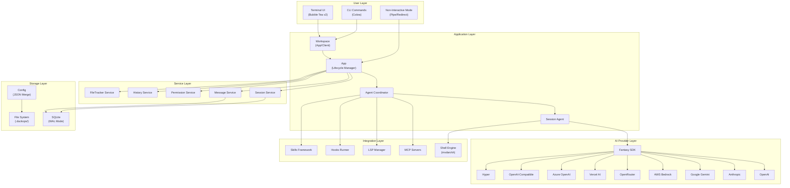
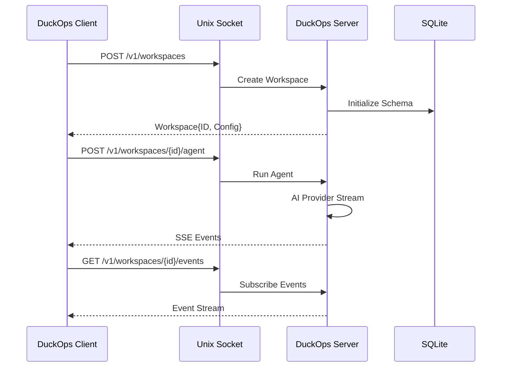
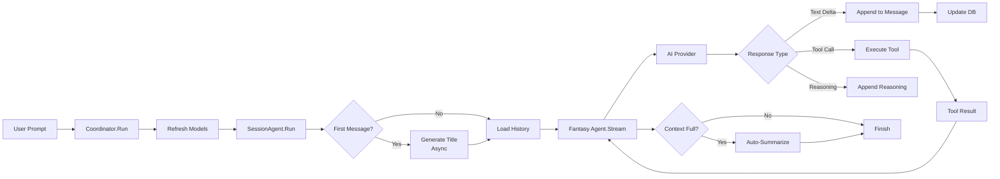

# DuckOps — Enterprise Documentation

> **Version**: 3.0.0 · **License**: MIT · **Module**: `github.com/SecDuckOps/duckops`
> **Go**: 1.26+ · **Organization**: SecDuckOps

---

# 1. Executive Summary

## 1.1 Product Overview

DuckOps is a **terminal-first AI-powered DevSecOps assistant** built entirely in Go. It combines an intelligent conversational AI agent with a comprehensive suite of embedded security assessment tools, delivered through a polished Terminal User Interface (TUI). DuckOps operates as both a local CLI tool and a client/server application, supporting multi-provider AI backends and extensible tool integrations.

## 1.2 Main Purpose

DuckOps exists to **unify software development, code review, and security assessment** into a single terminal-native workflow. Rather than context-switching between IDEs, security scanners, and chat interfaces, engineers interact with a single AI agent that can read code, execute commands, perform security assessments, and manage complex multi-step development tasks — all from within the terminal.

## 1.3 Target Users

| Persona | Use Case |
|---------|----------|
| **Software Engineers** | AI-assisted coding, refactoring, test generation, code explanation |
| **Security Engineers** | Automated vulnerability scanning, penetration testing assistance |
| **DevOps Engineers** | Infrastructure analysis, CI/CD debugging, deployment automation |
| **Technical Leads** | Code review acceleration, architecture analysis |
| **Open Source Contributors** | Rapid codebase onboarding, contribution workflow |

## 1.4 Core Value Proposition

1. **Terminal-Native**: No browser, no GUI — purpose-built for engineers who live in the terminal
2. **Multi-Provider AI**: Switch between OpenAI, Anthropic, Google, AWS Bedrock, OpenRouter, Vercel AI, Azure, and custom providers without changing workflows
3. **Integrated Security**: 50+ security skills covering OWASP Top 10, supply chain attacks, cryptography pitfalls, and more — with embedded tools (Nuclei, SQLMap, Nmap, etc.)
4. **Session Persistence**: SQLite-backed conversation history with auto-summarization, token tracking, and cost accounting
5. **Extensible Architecture**: MCP (Model Context Protocol), LSP integration, hooks system, and a skills framework for custom capabilities

## 1.5 Key Features

### AI Agent Engine
- **35+ Built-in Tools**: File I/O, shell execution, web search, code editing, grep, glob, diagnostics, and more
- **Multi-Provider Streaming**: Real-time token streaming with reasoning/thinking support (Anthropic extended thinking, OpenAI reasoning, Google Gemini thinking)
- **Auto-Summarization**: Automatic context window management that summarizes conversations before they exceed the model's context limit
- **Loop Detection**: Prevents infinite agent loops by detecting repeated tool call patterns
- **Message Queuing**: Queued prompt system for sending messages while the agent is busy
- **Sub-Agent Delegation**: Task agent for parallelizable read-only operations

### Terminal UI
- Built with **Bubble Tea v2** and **Lipgloss v2** (Charm ecosystem)
- **Syntax Highlighting** via Chroma
- **Markdown Rendering** via Glamour v2
- Diff viewer, image viewer, attachments panel, completions, animations
- Neon color theme with provider-specific theming

### Security Capabilities

| Category | Coverage |
|----------|----------|
| **Injection** | SQL Injection, Command Injection, RCE, XXE |
| **Web** | XSS, CSRF, IDOR, API Security, Open Redirect |
| **System** | Path Traversal, SSRF, File Inclusion, Container Escape |
| **Logic** | Business Logic, Race Conditions |
| **Auth** | JWT/OIDC, Authentication Bypass, BFLA, Mass Assignment |
| **Crypto** | Weak Algorithms, IV Reuse, Padding Oracle |
| **Supply Chain** | Dependency Confusion, Typosquatting |
| **Cloud** | AWS Misconfigurations, IAM Escalation |

**Embedded Security Tools**: Nuclei, SQLMap, Nmap, Subfinder, FFUF, Httpx, Katana, Naabu, Semgrep

### Integration Layer
- **MCP** (Model Context Protocol) — stdio, SSE, and HTTP transports
- **LSP** (Language Server Protocol) — gopls, with extensible architecture for any LSP server
- **Hooks System** — Pre/post tool execution shell hooks with Claude Code compatibility
- **Skills Framework** — Modular capability system with `SKILL.md` instruction files
- **OAuth** — GitHub Copilot and Hyper provider OAuth flows

## 1.6 Business Impact

- **Developer Velocity**: AI-assisted coding reduces boilerplate time by providing inline code generation, refactoring, and test writing
- **Security Posture**: Integrated security scanning shifts-left vulnerability detection into the developer workflow
- **Cost Optimization**: Multi-provider support with cost tracking enables teams to optimize AI spending per-model and per-session
- **Knowledge Retention**: Session persistence and auto-summarization preserve institutional knowledge across conversations

---

# 2. Product Architecture

## 2.1 High-Level Architecture



## 2.2 System Design

DuckOps follows a **layered monolith with optional client/server decomposition**:

| Layer | Responsibility | Key Packages |
|-------|---------------|--------------|
| **Presentation** | TUI rendering, CLI parsing, non-interactive I/O | `internal/ui`, `internal/cmd` |
| **Application** | Lifecycle management, workspace orchestration | `internal/app`, `internal/workspace` |
| **Agent** | AI orchestration, tool dispatch, session management | `internal/agent`, `internal/agent/tools` |
| **Service** | Business logic, CRUD operations, pub/sub events | `internal/session`, `internal/message`, `internal/permission` |
| **Integration** | External protocol adapters | `internal/lsp`, `internal/agent/tools/mcp`, `internal/hooks` |
| **Infrastructure** | Database, configuration, logging, versioning | `internal/db`, `internal/config`, `internal/log` |

### Client/Server Mode

When `DUCKOPS_CLIENT_SERVER=1`, DuckOps splits into:

1. **Server Process** — Long-running daemon bound to a Unix socket (or Windows named pipe) serving an HTTP/2 API
2. **Client Process** — TUI instance that connects to the server via the API

This enables workspace sharing, version-managed server restarts, and IDE integration via the REST API.



## 2.3 Components Breakdown

### Core Components

| Component | Package | Responsibility |
|-----------|---------|----------------|
| **App** | `internal/app` | Wires services, coordinates agents, manages lifecycle |
| **Agent Coordinator** | `internal/agent` | Builds AI providers, configures models, dispatches prompts |
| **Session Agent** | `internal/agent` | Manages per-session AI conversations, tool calls, streaming |
| **Backend** | `internal/backend` | Transport-agnostic workspace management for the server |
| **Server** | `internal/server` | HTTP/2 API with 60+ endpoints over Unix socket |
| **Workspace** | `internal/workspace` | Abstraction over local (AppWorkspace) and remote (ClientWorkspace) |

### Service Components

| Service | Package | Responsibility |
|---------|---------|----------------|
| **Session** | `internal/session` | CRUD for conversation sessions with pub/sub events |
| **Message** | `internal/message` | Message persistence with content parts (text, tool calls, binary) |
| **Permission** | `internal/permission` | Tool execution approval with auto-approve and allowlists |
| **History** | `internal/history` | File version history and undo/redo tracking |
| **FileTracker** | `internal/filetracker` | Tracks which files the agent has read per session |
| **Config** | `internal/config` | Multi-layer JSON config with shell variable expansion |

### Integration Components

| Component | Package | Responsibility |
|-----------|---------|----------------|
| **MCP Client** | `internal/agent/tools/mcp` | Model Context Protocol client (stdio/SSE/HTTP) |
| **LSP Manager** | `internal/lsp` | Language Server Protocol lifecycle and diagnostics |
| **Shell Engine** | `internal/shell` | POSIX shell interpreter with `jq`, background jobs |
| **Hooks Runner** | `internal/hooks` | Pre/post tool execution hook system |
| **Skills** | `internal/skills` | Capability discovery and tracking from SKILL.md files |
| **PubSub** | `internal/pubsub` | In-process event broker for decoupled communication |

## 2.4 Data Flow



## 2.5 Security Architecture

### Permission Model
- **Interactive Mode**: Every destructive tool call (bash, write, edit) requires explicit user approval via TUI prompt
- **YOLO Mode** (`--duck`/`-y`): Auto-approves all permissions (for automation/CI)
- **Allowlists**: `permissions.allowed_tools` in config pre-approves specific tools
- **Hooks**: Pre-tool-use hooks can programmatically allow/deny tool calls

### Secrets Management
- API keys support shell variable expansion (`$OPENAI_API_KEY`, `$(cmd)`)
- OAuth tokens stored in config with refresh flow
- Environment variables never logged or persisted
- SQLite database uses `secure_delete = ON` pragma

### Network Isolation
- Server mode communicates via Unix socket (no TCP by default)
- Non-root user in Docker container
- No external network calls except to configured AI providers and MCP servers

---

# 3. Technical Stack

## 3.1 Core Technologies

| Category | Technology | Version | Purpose |
|----------|-----------|---------|---------|
| **Language** | Go | 1.26+ | Primary implementation language |
| **Module** | `github.com/SecDuckOps/duckops` | v3.0.0 | Go module path |
| **CLI Framework** | Cobra + Fang | v1.10+ / v2.0+ | Command-line parsing and execution |
| **TUI Framework** | Bubble Tea v2 | v2.0.6 | Terminal UI rendering and event loop |
| **TUI Styling** | Lipgloss v2 | v2.0.3 | Terminal CSS-like styling |
| **AI SDK** | Fantasy (Charm) | v0.23+ | Multi-provider AI abstraction |
| **Model Registry** | Catwalk (Charm) | v0.39+ | Model metadata and provider discovery |

## 3.2 Database

| Component | Technology | Details |
|-----------|-----------|---------|
| **Engine** | SQLite | Via `ncruces/go-sqlite3` (WASM) + `modernc.org/sqlite` (CGo-free) |
| **Migrations** | Goose v3 | Embedded SQL migrations with `embed.FS` |
| **Query Gen** | sqlc v1.30 | Type-safe Go code from SQL queries |
| **Mode** | WAL | Write-Ahead Logging for concurrent reads |
| **Connection** | Single conn | `MaxOpenConns(1)` to prevent WAL desync |

### SQLite Pragmas

```sql
PRAGMA foreign_keys   = ON;
PRAGMA journal_mode   = WAL;
PRAGMA page_size      = 4096;
PRAGMA cache_size     = -8000;  -- 8MB
PRAGMA synchronous    = NORMAL;
PRAGMA secure_delete  = ON;
PRAGMA busy_timeout   = 30000;  -- 30s
```

## 3.3 AI Provider Integrations

| Provider | SDK | Auth Method | Features |
|----------|-----|-------------|----------|
| **OpenAI** | `charmbracelet/openai-go` | API Key | Responses API, reasoning effort |
| **Anthropic** | `charmbracelet/anthropic-sdk-go` | API Key / Bearer | Extended thinking, cache control |
| **Google Gemini** | `google.golang.org/genai` | API Key | Thinking config, thought signatures |
| **AWS Bedrock** | AWS SDK v2 | API Key / IAM | Anthropic models via Bedrock |
| **Azure OpenAI** | Custom | API Key | Responses API, version pinning |
| **OpenRouter** | Custom | API Key | Exacto suffix, cost tracking |
| **Vercel AI** | Custom | API Key (`vck_*`) | Reasoning, cache control |
| **OpenAI-Compatible** | Custom | API Key | Generic compat layer for local models |
| **Hyper** | Custom | OAuth Bearer | Thinking mode, credits check |
| **GitHub Copilot** | OpenAI-compat | OAuth | Responses API via Copilot proxy |

## 3.4 Key Dependencies

| Category | Library | Purpose |
|----------|---------|---------|
| **Shell** | `mvdan.cc/sh` | POSIX shell interpreter (no `/bin/sh` dependency) |
| **JSON** | `tidwall/gjson`, `tidwall/sjson` | Fast JSON get/set |
| **Git** | `go-git/go-git` | Git operations |
| **Markdown** | `glamour` v2, `goldmark` | Markdown rendering |
| **Syntax** | `alecthomas/chroma` v2 | Syntax highlighting |
| **HTML→MD** | `JohannesKaufmann/html-to-markdown` | Web fetch conversion |
| **Fuzzy** | `sahilm/fuzzy` | Fuzzy text matching |
| **UUID** | `google/uuid` | Session/message IDs |
| **Hash** | `zeebo/xxh3` | Fast session ID hashing |
| **JSON Schema** | `invopop/jsonschema` | Config schema generation |
| **jq** | `itchyny/gojq` | In-process jq evaluation |
| **MCP** | `modelcontextprotocol/go-sdk` | MCP client implementation |
| **LSP** | `sourcegraph/jsonrpc2` | LSP JSON-RPC transport |
| **Logging** | `lumberjack` v2 | Log rotation |
| **Analytics** | `posthog/posthog-go` | Optional usage metrics |
| **Clipboard** | `aymanbagabas/go-nativeclipboard` | System clipboard access |
| **Notifications** | `gen2brain/beeep` | Desktop notifications |

## 3.5 DevOps & Deployment

| Component | Technology |
|-----------|-----------|
| **Container** | Docker (multi-stage, Alpine 3.20) |
| **Build** | `go build` with `-ldflags` for version injection |
| **CI/CD** | GitHub Actions (inferred) |
| **Distribution** | Binary releases, `go install`, Docker, install script |
| **Profiling** | pprof (opt-in via `DUCKOPS_PROFILE=1`) |
| **Swagger** | `swaggo/swag` + `swaggo/http-swagger` for API docs |
