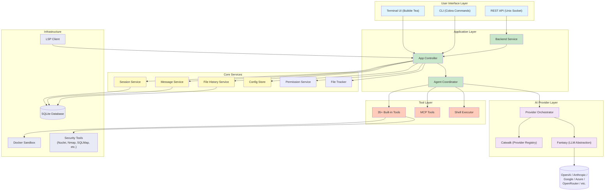
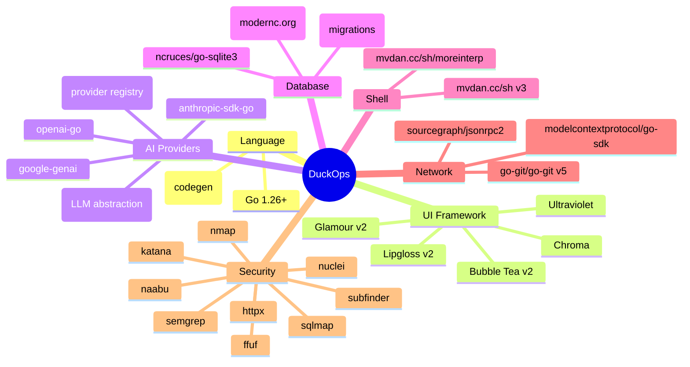

# File: docs/01-project-overview.md

# Chapter 1: Project Overview

## 1.1 Project Title

### Multiple Title Suggestions

| # | Title | Rationale |
|---|-------|-----------|
| 1 | **DuckOps: AI-Powered DevSecOps Terminal Assistant** | Emphasizes both development and security capabilities |
| 2 | **DuckOps: The Terminal-Native AI Coding & Security Platform** | Captures the dual coding + security assessment nature |
| 3 | **DuckOps: Multi-Provider AI Agent for Software Engineering** | Focuses on the AI agent orchestration aspect |
| 4 | **DuckOps: Context-Aware AI DevSecOps Framework** | Highlights the context management and compression engine |
| 5 | **Project Duck: Intelligent Terminal Agent for Modern DevOps** | Short, memorable brand name |

### Final Selected Title

**DuckOps: An AI-Powered DevSecOps Terminal Assistant with Multi-Provider Orchestration, Context-Aware Compression, and Embedded Security Assessment**

### Project Tagline

> *Your terminal-native AI teammate for development, security assessment, and everything in between.*

### Project Vision

To create a unified, terminal-first AI assistant that seamlessly integrates software development workflows with comprehensive security assessment capabilities — all within the developer's native environment. DuckOps envisions a world where developers never need to leave the terminal to get AI assistance, run security scans, manage context, or orchestrate complex multi-agent workflows. It aims to be the single pane of glass for AI-assisted software engineering, combining the power of multiple language models, embedded security tooling, and rich terminal UI into one cohesive experience.

## 1.2 Project Overview Diagram

## 1.3 Key Differentiators

| Feature | DuckOps | GitHub Copilot | Claude Code | ChatGPT | Shell-GPT |
|---------|---------|---------------|-------------|---------|-----------|
| **Multi-Provider** | 25+ providers | OpenAI only | Anthropic only | OpenAI only | OpenAI/Anthropic |
| **Terminal Native** | Full TUI | IDE plugin | CLI only | Web/Desktop | CLI only |
| **Security Tools** | 15+ embedded | None | None | None | None |
| **Session Persistence** | SQLite-backed | Per-file | Per-session | Web history | None |
| **Context Compression** | Auto-summarization | None | Limited | Manual | None |
| **MCP Protocol** | Client + Server | None | None | None | None |
| **LSP Integration** | Full (gopls) | Limited | None | None | None |
| **Skills Framework** | Extensible | None | None | None (GPTs) | None |
| **Docker Sandbox** | Full support | None | None | None | None |
| **Cost Tracking** | Per-session/model | Subscription | Per-token | Subscription | Per-token |
| **Open Source** | ✅ MIT | ❌ Proprietary | ❌ Proprietary | ❌ Proprietary | ✅ |

## 1.4 Technical Stack Overview

## 1.5 Module Count by Layer

| Layer | Packages | Files | Purpose |
|-------|----------|-------|---------|
| CLI | 1 (`cmd`) | 22 | Cobra command definitions |
| Application | 3 (`app`, `backend`, `workspace`) | 12 | Service wiring and lifecycle |
| UI | 15 subpackages (`ui/*`) | 60+ | Terminal user interface |
| Agent | 2 (`agent`, `agent/tools`) | 80+ | AI orchestration and tool implementations |
| Core Services | 8 (`session`, `message`, `config`, etc.) | 30+ | Business logic |
| Infrastructure | 6 (`db`, `server`, `client`, `lsp`, etc.) | 25+ | Database, networking, protocol support |
| Security | 2 (`security`, `graphx`) | 40+ | Security analysis engine |
| **Total** | **43 packages** | **~270 files** | |

## 1.6 Project Metadata

| Attribute | Value |
|-----------|-------|
| **Module Path** | `github.com/SecDuckOps/duckops` |
| **Go Version** | 1.26.3 |
| **Direct Dependencies** | 77 |
| **Indirect Dependencies** | ~100+ |
| **Build Time** | ~30s (clean build) |
| **Binary Size** | ~50MB (static) |
| **License** | MIT |
| **API Version** | v1 (Unix socket) |

---

**END OF CHAPTER 1**
