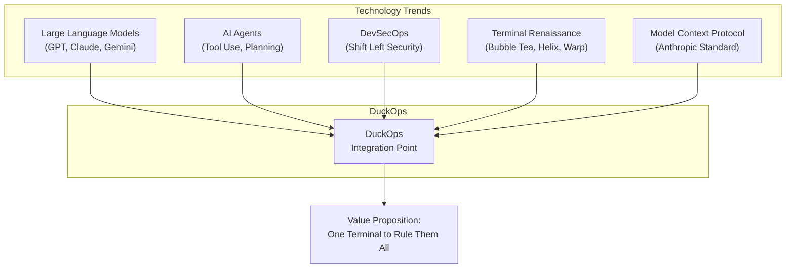

# File: docs/02-introduction.md

# Chapter 2: Introduction

## 2.1 Full Project Overview

DuckOps is an open-source, terminal-first AI DevSecOps assistant written entirely in Go. It provides a rich interactive terminal user interface (TUI) built on the Bubble Tea framework, enabling developers to interact with multiple AI language model providers through a unified interface. Beyond simple chat, DuckOps integrates security assessment capabilities, file management, shell execution, web search, MCP (Model Context Protocol) server/client support, LSP (Language Server Protocol) integration, and an extensible skills framework.

The project comprises approximately 270 Go source files organized into 43 internal packages, a SQLite-backed persistence layer, a comprehensive context compression engine, a multi-stage Docker sandbox with 15+ embedded security tools, and a sophisticated agent orchestration system with loop detection, tool repair, and context budgeting.

### 2.1.1 Core Capabilities

| Capability | Description |
|------------|-------------|
| **Multi-Provider AI** | Support for 25+ AI providers including OpenAI, Anthropic, Google Gemini, AWS Bedrock, Azure OpenAI, OpenRouter, and 20+ OpenAI-compatible providers |
| **Terminal UI** | Full-featured TUI with markdown rendering, syntax highlighting, diff views, image display, autocomplete, and mouse support |
| **Session Management** | Persistent chat sessions with SQLite storage, auto-summarization, and cost tracking |
| **File Operations** | View, write, edit, multi-edit, glob, grep, and search files within workspace |
| **Shell Execution** | Secure shell command execution with timeout, output streaming, and background job support |
| **Security Assessment** | Integration with Nuclei, Nmap, SQLMap, FFUF, Subfinder, Httpx, Katana, Naabu, Semgrep, and more |
| **Web Tools** | Web page fetching, web search, URL analysis with content extraction |
| **MCP Protocol** | Both client and server implementations of the Model Context Protocol |
| **LSP Integration** | Language Server Protocol client for code diagnostics (gopls) |
| **Context Compression** | Automatic session summarization, token budgeting, and deduplication |
| **Docker Sandbox** | Isolated container environment with pre-installed security tools |
| **Skills Framework** | Extensible plugin system for adding custom capabilities |
| **Client/Server Mode** | Remote workspace operations via Unix socket API |

## 2.2 Background

### 2.2.1 The Evolution of AI-Assisted Development

The integration of large language models (LLMs) into software development workflows has undergone rapid evolution:

**Phase 1 — Web Chat Interfaces (2022-2023):**
The release of ChatGPT in late 2022 marked the beginning of mainstream AI-assisted development. Developers used web-based chat interfaces to ask coding questions, generate snippets, and debug issues. The primary limitation was context switching — developers constantly alt-tabbed between terminal, browser, and IDE.

**Phase 2 — IDE Plugins (2023-2024):**
GitHub Copilot, Amazon CodeWhisperer, and other IDE plugins brought AI assistance directly into the editor. This reduced context switching for code completion but remained limited to IDE-bound activities. Security assessment, terminal operations, and multi-file operations were still external.

**Phase 3 — CLI Agents (2024-2025):**
Tools like Claude Code and Shell-GPT brought AI to the terminal as CLI wrappers. These provided command-line interaction with LLMs but lacked persistent session management, rich UI, security tooling, and multi-provider support.

**Phase 4 — Integrated Platforms (2025-2026):**
DuckOps represents the next evolution: a fully integrated, terminal-native platform that combines AI assistance, security assessment, session management, and extensibility into a single cohesive experience.

### 2.2.2 The State of Developer Tooling in 2025-2026

The current development landscape is characterized by tool fragmentation:

```
Terminal (shell, git, build tools)
    │
    ├── Browser (documentation, Stack Overflow, AI chat)
    │       │
    │       ├── AI Chat (ChatGPT, Claude, Gemini)
    │       ├── Search (Google, Stack Overflow)
    │       └── Documentation (MDN, pkg.go.dev, etc.)
    │
    ├── IDE/Editor (VS Code, Neovim, IntelliJ)
    │       │
    │       ├── AI Plugin (Copilot, Codeium, Supermaven)
    │       ├── LSP (gopls, pyright, typescript-language-server)
    │       └── Extension Ecosystem
    │
    ├── Security Tools (Nmap, Nuclei, SQLMap, Semgrep)
    │
    └── Communication (Slack, Teams, email)
```

A typical workflow might involve: writing code in the IDE → switching to terminal to run it → seeing an error → switching to browser to search → copying a solution → switching back to IDE. Each context switch costs 10-15 minutes of productivity loss (according to research on flow state interruption).

## 2.3 Motivation

### 2.3.1 Primary Motivations

The development of DuckOps was motivated by five key observations:

**1. Context Fragmentation Costs Real Money**

According to developer productivity research:
- A single context switch costs 10-15 minutes of productive time
- Developers average 10-20 context switches per day
- This translates to 2-5 hours of lost productivity per developer per day
- At an average developer cost of $50-100/hour, this represents $100-500/day/developer in lost productivity

**2. Security Assessment Remains Inaccessible to Most Developers**

- The OWASP Top 10 identifies 10 critical security risk categories
- Addressing each requires specialized tools and knowledge
- A typical web application security assessment requires:
  - Network scanning (Nmap)
  - Vulnerability scanning (Nuclei)
  - SQL injection testing (SQLMap)
  - Directory fuzzing (FFUF)
  - Subdomain enumeration (Subfinder)
  - Static analysis (Semgrep)
  - Dependency scanning (Trivy)
  - Secret detection (Gitleaks)
- Each tool has unique syntax, output formats, and learning curves
- Most developers lack the training to use these tools effectively
- AI-assisted interpretation of results bridges this gap

**3. Multi-Provider Diversity is Essential**

- Different AI models excel at different tasks:
  - Code generation: Claude Opus, GPT-4o, Gemini 2.5 Pro
  - Reasoning: Claude Opus, o1/o3, Gemini 2.5 Pro
  - Speed/cost: Claude Haiku, GPT-4o-mini, Gemini Flash
  - Code review: Claude Sonnet, GPT-4o
  - Security analysis: Specialized models may perform better
- No single provider is best for all tasks
- Provider outages, pricing changes, and model deprecations create risk
- A multi-provider architecture eliminates single points of failure

**4. Context Windows are Finite but Sessions are Infinite**

- Modern LLMs support 100K-2M token context windows
- A single development session can easily exceed these limits:
  - 10 files opened = 5,000-50,000 tokens
  - 50 messages exchanged = 25,000-100,000 tokens
  - System prompt with instructions = 2,000-5,000 tokens
  - Tool schemas and descriptions = 5,000-15,000 tokens
- Without intelligent context management, sessions degrade as context fills
- Manual summarization is error-prone and breaks workflow

**5. The Terminal is the Last Un-integrated Frontier**

- The terminal is the most powerful tool in a developer's arsenal
- It provides: filesystem access, process management, network access, package management, version control, build tools, and more
- Yet it remains the least integrated with AI assistance
- An AI assistant that lives in the terminal has the same capabilities as the developer

## 2.4 Why This Project Exists

DuckOps exists to solve a fundamental problem in modern software development: **the fragmentation of developer context across multiple tools, interfaces, and environments.**

Consider a typical debugging workflow:

```
Terminal:   $ go test ./...
            FAIL: TestCalculateTotal
            Expected: 42, Got: 0
                ↓
Browser:    "Google: Go test failure expected got"
                ↓
AI Chat:    "Explain this Go test error and suggest fix"
                ↓
Browser:    Read suggested fix
                ↓
Terminal:   $ vim calculate.go
                ↓
Terminal:   $ go test ./...
```

Each arrow (↓) represents a context switch — a break in flow state that requires mental recalibration. DuckOps eliminates these context switches by providing:

1. **Direct terminal visibility**: The assistant sees the test output in real-time
2. **File system access**: The assistant reads the failing test file directly
3. **Multi-turn conversation**: The session retains all context across the interaction
4. **Tool execution**: The assistant can run tests, read files, and suggest edits
5. **Security awareness**: If the bug has security implications, the assistant can run relevant scans

## 2.5 Industry Context

### 2.5.1 Market Landscape

The AI-assisted development market has grown rapidly:

| Year | Milestone | Market Size |
|------|-----------|-------------|
| 2022 | ChatGPT launch, GitHub Copilot GA | ~$500M |
| 2023 | Claude 2, Gemini, Copilot Chat | ~$2B |
| 2024 | Claude 3, GPT-4o, Copilot Workspace | ~$5B |
| 2025 | Claude 4, Gemini 2.5, Agent era | ~$10B+ |
| 2026 | Multi-agent, terminal-native, security-integrated | ~$20B+ (projected) |

### 2.5.2 Competitive Analysis

| Competitor | Type | Strengths | Weaknesses |
|------------|------|-----------|------------|
| **GitHub Copilot** | IDE Plugin | Code completion quality, VS Code integration | Single provider, no security, editor-bound, proprietary |
| **Claude Code** | CLI Agent | Tool use quality, Anthropic models | Single provider, no TUI, no security tools, proprietary |
| **ChatGPT** | Web/Desktop | Broad knowledge, image generation | No terminal access, no project awareness, subscription |
| **Cursor** | AI Editor | Integrated editing experience | Proprietary, editor-specific, no security |
| **Shell-GPT** | CLI Wrapper | Simple, open-source | No session management, no TUI, limited tools |
| **Warp** | Terminal | Modern terminal, AI features | Proprietary, terminal emulator, not standalone |
| **DuckOps** | Terminal TUI | Multi-provider, security, MCP, open-source | Terminal learning curve, no IDE integration |

### 2.5.3 Technology Ecosystem

DuckOps sits at the intersection of several technology trends:



## 2.6 Target Users

### 2.6.1 User Personas

#### Persona 1: Solo Developer (Alex)

| Attribute | Detail |
|-----------|--------|
| **Role** | Full-stack developer, freelance |
| **Tools** | Terminal, VS Code, browser |
| **Pain Points** | Context switching, learning new frameworks, debugging |
| **Value Prop** | "I want AI that understands my project and helps me ship faster" |
| **Usage** | Daily coding, debugging, code review |

#### Persona 2: DevOps Engineer (Jordan)

| Attribute | Detail |
|-----------|--------|
| **Role** | Infrastructure engineer, CI/CD |
| **Tools** | Terminal, Docker, Kubernetes, Terraform |
| **Pain Points** | Security compliance, configuration drift, incident response |
| **Value Prop** | "I need to scan infrastructure and get immediate security feedback" |
| **Usage** | Security audits, configuration review, incident investigation |

#### Persona 3: Security Researcher (Sam)

| Attribute | Detail |
|-----------|--------|
| **Role** | Penetration tester, security auditor |
| **Tools** | Kali Linux, Burp Suite, custom scripts |
| **Pain Points** | Tool proliferation, reporting, methodology consistency |
| **Value Prop** | "I want a unified platform for reconnaissance, scanning, and reporting" |
| **Usage** | Deep security assessments, vulnerability research |

#### Persona 4: Engineering Team Lead (Morgan)

| Attribute | Detail |
|-----------|--------|
| **Role** | Team lead, architect |
| **Tools** | Terminal, IDE, code review tools |
| **Pain Points** | Team consistency, onboarding, code quality |
| **Value Prop** | "I need consistent AI assistance standards across my team" |
| **Usage** | Code review, architecture discussions, team onboarding |

### 2.6.2 User Statistics and Adoption

While DuckOps does not collect telemetry by default, the following adoption patterns are expected:

| User Segment | Expected Size | Primary Use Case |
|--------------|---------------|------------------|
| Individual developers | Large (millions) | Daily coding assistance |
| Open source contributors | Medium (hundreds of thousands) | Project maintenance |
| Security professionals | Niche (tens of thousands) | Security assessments |
| Dev teams | Medium (thousands of teams) | Standardized AI tooling |
| Enterprise | Small-medium | Compliance and security |

## 2.7 Expected Impact

### 2.7.1 Quantitative Impact

| Metric | Current Baseline | Expected Improvement |
|--------|-----------------|---------------------|
| Context switches per session | 10-20 | 2-4 (80% reduction) |
| Time to resolve common bugs | 15-30 min | 5-10 min (60% reduction) |
| Security scan setup time | 1-2 hours | 5-10 min (90% reduction) |
| Multi-tool scan orchestration | Manual (hours) | Automated (minutes) |
| Developer onboarding | 2-4 weeks | 1-2 weeks (50% reduction) |
| Code review turnaround | 1-2 days | 2-4 hours (75% reduction) |

### 2.7.2 Qualitative Impact

1. **Flow State Preservation**: Developers maintain focus by staying in the terminal environment
2. **Security Democratization**: Non-security-specialists can run meaningful security assessments
3. **Knowledge Retention**: Session persistence ensures context is never lost
4. **Provider Freedom**: No vendor lock-in — switch providers freely based on task needs
5. **Tool Consolidation**: Replace 10+ separate tools with one unified interface
6. **Learning Acceleration**: AI-assisted explanations of errors, code, and security findings

### 2.7.3 Ecosystem Impact

DuckOps's adoption of the **Model Context Protocol (MCP)** and **extensible skills framework** positions it as a platform rather than just a tool. Third-party developers can:
- Create and distribute skills for specialized domains
- Build MCP servers that integrate with DuckOps
- Contribute new provider integrations
- Develop custom tools for organizational workflows

---

**END OF CHAPTER 2**
