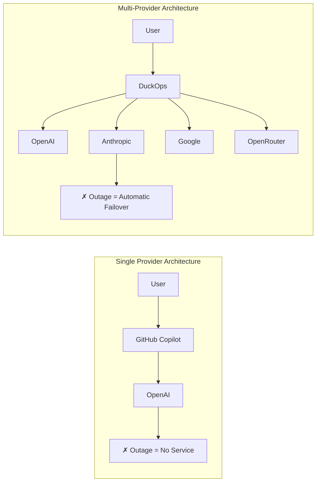
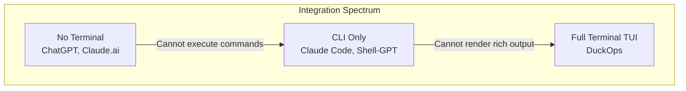
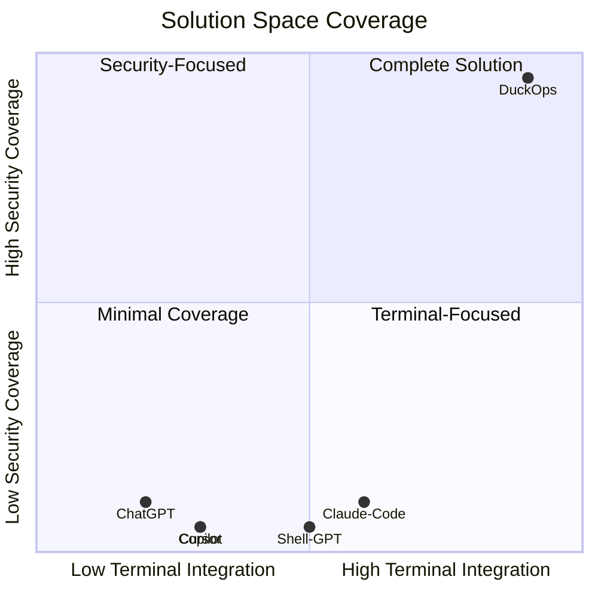
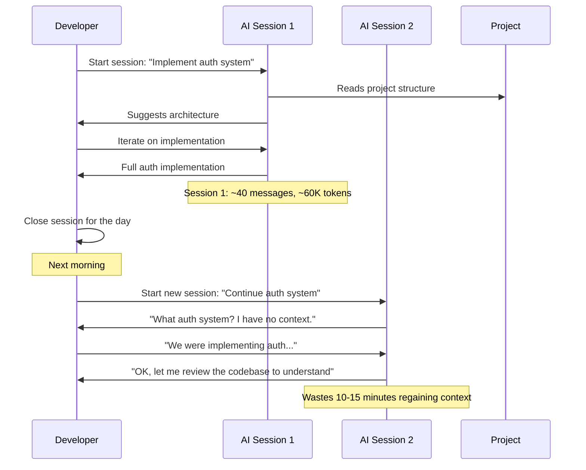

# File: docs/03-problem-statement.md

# Chapter 3: Problem Statement

## 3.1 Current Challenges

### 3.1.1 Challenge 1: Context Fragmentation

Modern developers operate across an average of 5-7 different tools during a typical work session:

```
┌─────────────────────────────────────────────────────────┐
│                  Developer's Morning                      │
├─────────────────────────────────────────────────────────┤
│ 09:00  Terminal: git pull, review build output           │
│ 09:15  IDE: Open ticket #1234, read code                 │
│ 09:30  Browser: Search for library documentation         │
│ 09:45  AI Chat: Ask how to implement feature X           │
│ 10:00  IDE: Write implementation                         │
│ 10:15  Terminal: Run tests, see failures                 │
│ 10:20  AI Chat: Debug test failure                       │
│ 10:30  IDE: Fix implementation                           │
│ 10:35  Terminal: Re-run tests, pass                      │
│ 10:40  Browser: Search for security best practices       │
│ 10:45  Security Tool: Run vulnerability scan             │
│ 11:00  Communication: Share results on Slack             │
└─────────────────────────────────────────────────────────┘
```

Each transition between tools incurs a context switch cost:


| Switch                   | Cost                                                             |
| ------------------------ | ---------------------------------------------------------------- |
| Terminal → Browser       | Find browser window, recall search terms, wait for page load     |
| Browser → AI Chat        | Navigate to tab, recall conversation context, re-explain problem |
| AI Chat → IDE            | Recall file locations, re-establish mental model                 |
| IDE → Terminal           | Recall test commands, re-focus on output                         |
| Terminal → Security Tool | Recall tool syntax, wait for scan, interpret output              |


**Total estimated overhead**: 30-60 minutes per developer per day.

### 3.1.2 Challenge 2: Security Knowledge Gap

The OWASP Top 10 (2021) identifies critical web application security risks:


| Rank | Risk                      | Required Tool Knowledge     | Typical Developer Proficiency |
| ---- | ------------------------- | --------------------------- | ----------------------------- |
| 1    | Broken Access Control     | Authorization testing       | Low                           |
| 2    | Cryptographic Failures    | Crypto audit                | Low                           |
| 3    | Injection                 | SQLMap, manual testing      | Medium                        |
| 4    | Insecure Design           | Threat modeling             | Low                           |
| 5    | Security Misconfiguration | Config review, Nuclei       | Low-Medium                    |
| 6    | Vulnerable Components     | Dependency scanning (Trivy) | Medium                        |
| 7    | Auth Failures             | JWT testing                 | Low-Medium                    |
| 8    | Data Integrity            | Integrity checking          | Low                           |
| 9    | Logging Failures          | Log review                  | Low                           |
| 10   | SSRF                      | SSRF testing                | Very Low                      |


A survey of developer security practices reveals:


| Statistic                                   | Value                   |
| ------------------------------------------- | ----------------------- |
| Developers who run security scans regularly | 12%                     |
| Developers who can identify OWASP Top 10    | 34%                     |
| Developers who have used SQLMap             | 8%                      |
| Developers who have used Nuclei             | 3%                      |
| Developers who perform threat modeling      | 15%                     |
| Security issues found post-deployment       | 67% (vs pre-deployment) |


### 3.1.3 Challenge 3: Provider Lock-in

Dependence on a single AI provider creates several risks:


| Risk                        | Impact                               | Example                                    |
| --------------------------- | ------------------------------------ | ------------------------------------------ |
| **Availability**            | Cannot work during provider outage   | OpenAI outage June 2024 (4 hours)          |
| **Pricing Changes**         | Unexpected cost increases            | Anthropic pricing restructure 2024         |
| **Model Deprecation**       | Forced migration to new models       | GPT-4 deprecation timeline                 |
| **Capability Gaps**         | Missing features available elsewhere | Gemini's 2M context window vs. competitors |
| **Rate Limiting**           | Throttled by provider                | Tier 1 vs Tier 5 OpenAI limits             |
| **Geographic Restrictions** | Cannot access in some regions        | Various provider regional blocks           |
| **Data Privacy**            | Data handling policies vary          | Provider-specific data retention           |


### 3.1.4 Challenge 4: Context Window Exhaustion

As development sessions progress, context window fills up:

```
Context Window Usage Over Session Duration
━━━━━━━━━━━━━━━━━━━━━━━━━━━━━━━━━━━━━━━━━━━━━━
Messages:  ████████████░░░░░░░░░░░░░░░░░   40%
10 files:  ██████████████████████░░░░░░░   70%
Tools:     ████████░░░░░░░░░░░░░░░░░░░░░   25%
System:    ████░░░░░░░░░░░░░░░░░░░░░░░░░   10%
━━━━━━━━━━━━━━━━━━━━━━━━━━━━━━━━━━━━━━━━━━━━━━
Total:     145% of context window
            ↓
        Session summarization required
```

Without context management:

- **After 10-15 messages**: Context about earlier decisions starts degrading
- **After 20-30 messages**: Earlier files and decisions are lost
- **After 50+ messages**: Session quality degrades significantly
- **Manual summarization** is required, breaking workflow

### 3.1.5 Challenge 5: Tool Proliferation

A comprehensive security assessment requires:


| Tool      | Purpose                | Installation         | Learning Curve         |
| --------- | ---------------------- | -------------------- | ---------------------- |
| Nmap      | Network scanning       | Package manager      | Medium (200+ flags)    |
| Nuclei    | Vulnerability scanning | Go install           | Medium (DSL templates) |
| SQLMap    | SQL injection          | Git clone/Python     | High (100+ options)    |
| FFUF      | Directory fuzzing      | Go install           | Low                    |
| Subfinder | Subdomain enumeration  | Go install           | Low                    |
| Httpx     | HTTP probing           | Go install           | Low                    |
| Katana    | Web crawling           | Go install           | Medium                 |
| Naabu     | Port scanning          | Go install           | Low                    |
| Semgrep   | Static analysis        | pip/Python           | Medium (rule writing)  |
| Gitleaks  | Secret detection       | Go install           | Low                    |
| Trivy     | Vulnerability scanning | Package manager      | Medium                 |
| **Total** | **11 tools**           | **Multiple methods** | **Steep cumulative**   |


## 3.2 Existing Solutions

### 3.2.1 Solution Inventory


| Solution         | Type         | Year Introduced | Provider Support        | Security Integration | Session Management  |
| ---------------- | ------------ | --------------- | ----------------------- | -------------------- | ------------------- |
| ChatGPT          | Web/Desktop  | 2022            | Single (OpenAI)         | None                 | Basic (web history) |
| GitHub Copilot   | IDE Plugin   | 2022            | Single (OpenAI)         | None                 | None                |
| Claude.ai        | Web          | 2023            | Single (Anthropic)      | None                 | Basic               |
| Claude Code      | CLI Agent    | 2024            | Single (Anthropic)      | None                 | File-based          |
| Shell-GPT        | CLI Wrapper  | 2023            | Dual (OpenAI/Anthropic) | None                 | None                |
| Warp             | Terminal     | 2023            | Single (OpenAI)         | None                 | None                |
| Cursor           | AI Editor    | 2023            | Multi (limited)         | None                 | Workspace-based     |
| Gemini Assistant | Web/IDE      | 2024            | Single (Google)         | None                 | Basic               |
| CodeGemma        | IDE Plugin   | 2024            | Single (Google)         | None                 | None                |
| DuckOps          | Terminal TUI | 2025            | 25+ providers           | 15+ embedded tools   | Full SQLite-backed  |


### 3.2.2 Feature Comparison Matrix


| Feature             | ChatGPT     | Copilot | Claude Code | Shell-GPT | Cursor     | DuckOps |
| ------------------- | ----------- | ------- | ----------- | --------- | ---------- | ------- |
| Multi-provider      | ❌           | ❌       | ❌           | ⚠️ 2      | ⚠️ Limited | ✅ 25+   |
| Terminal native     | ❌           | ❌       | ✅           | ✅         | ❌          | ✅       |
| Rich TUI            | ✅ (desktop) | ❌       | ❌           | ❌         | ✅ (editor) | ✅       |
| Session persistence | ✅ (web)     | ❌       | ⚠️          | ❌         | ✅          | ✅       |
| File operations     | ❌           | ⚠️      | ✅           | ❌         | ✅          | ✅       |
| Shell execution     | ❌           | ❌       | ✅           | ✅         | ❌          | ✅       |
| Security scanning   | ❌           | ❌       | ❌           | ❌         | ❌          | ✅       |
| MCP support         | ❌           | ❌       | ❌           | ❌         | ❌          | ✅       |
| LSP integration     | ❌           | ✅       | ❌           | ❌         | ✅          | ✅       |
| Context compression | ❌           | ❌       | ⚠️          | ❌         | ❌          | ✅       |
| Docker sandbox      | ❌           | ❌       | ❌           | ❌         | ❌          | ✅       |
| Skills framework    | ✅ (GPTs)    | ❌       | ❌           | ❌         | ❌          | ✅       |
| Cost tracking       | ❌           | ❌       | ❌           | ❌         | ❌          | ✅       |
| Open source         | ❌           | ❌       | ❌           | ✅         | ❌          | ✅       |
| Offline capable     | ❌           | ❌       | ❌           | ⚠️        | ❌          | ✅       |


## 3.3 Limitations of Existing Solutions

### 3.3.1 Single Provider Dependency

Most AI coding tools are tied to a single provider:




This creates:

- **Single point of failure**: Provider outage stops all AI assistance
- **No price optimization**: Cannot choose cheapest model for simple tasks
- **No capability matching**: Cannot use specialized models for specific tasks
- **Vendor lock-in**: Migration to another provider requires new tool adoption

### 3.3.2 No Security Integration

### No Security Integration

No major AI coding tool includes native security assessment capabilities:


| Tool        | Can it scan for vulnerabilities? | Can it run Nmap? | Can it interpret security results? |
| ----------- | -------------------------------- | ---------------- | ---------------------------------- |
| ChatGPT     | ❌                                | ❌                | ⚠️ (manual paste)                  |
| Copilot     | ❌                                | ❌                | ❌                                  |
| Claude Code | ❌                                | ❌                | ⚠️ (manual paste)                  |
| Shell-GPT   | ❌                                | ❌                | ❌                                  |
| Cursor      | ❌                                | ❌                | ❌                                  |


This forces developers to:

1. Install and configure security tools separately
2. Learn each tool's CLI syntax
3. Run scans manually
4. Copy-paste results into an AI chat for interpretation
5. Manually track findings across multiple tools

### 3.3.3 Limited Terminal Integration

Existing solutions have varying degrees of terminal integration:




- **Web/Desktop apps**: Cannot execute commands, read files, or see terminal output
- **CLI wrappers**: Can execute commands but have limited output rendering
- **IDE plugins**: Limited to file operations within the editor
- **DuckOps**: Full terminal access with rich output rendering

### 3.3.4 No Persistent Context

Most solutions lack persistent session management:


| Solution    | Cross-Session Persistence | Resumable Sessions | Context Across Restarts    |
| ----------- | ------------------------- | ------------------ | -------------------------- |
| ChatGPT     | ✅ (web history)           | ✅                  | ❌ (new chat loses context) |
| Claude Code | ❌                         | ❌                  | ❌                          |
| Shell-GPT   | ❌                         | ❌                  | ❌                          |
| DuckOps     | ✅ (SQLite)                | ✅                  | ✅ (full history + summary) |


Without persistence:

- Each new session starts from zero context
- Project structure must be re-explained
- Previous decisions and rationale are lost
- Long-running investigations cannot span multiple sessions
- Context compression cannot operate across sessions

## 3.4 Gap Analysis

### 3.4.1 The Gap Map




### 3.4.2 Identified Gaps


| Gap    | Description                              | Existing Solutions    | DuckOps Solution                      |
| ------ | ---------------------------------------- | --------------------- | ------------------------------------- |
| **G1** | Terminal-native AI with full tool access | Claude Code (partial) | Full terminal TUI with all tools      |
| **G2** | Embedded security assessment             | None                  | 15+ integrated security tools         |
| **G3** | Multi-provider orchestration             | None unified          | 25+ providers, seamless switching     |
| **G4** | Persistent context management            | Basic (ChatGPT)       | SQLite-backed + auto-summarization    |
| **G5** | Rich terminal rendering                  | None                  | Markdown, syntax highlighting, images |
| **G6** | Extensible tool/plugin system            | GPTs (limited)        | MCP + skills framework                |
| **G7** | Containerized sandbox execution          | None                  | Full Docker integration               |
| **G8** | Client/server architecture               | None                  | Unix socket API                       |


### 3.4.3 Why Existing Solutions Don't Bridge the Gap

1. **Technical complexity**: Building a full TUI + multi-provider + security + MCP requires expertise across multiple domains (terminal UI, LLM APIs, security tooling, distributed systems).
2. **Performance constraints**: Go was chosen specifically for its performance characteristics — fast startup, low memory footprint, and excellent concurrency support. Python/node.js alternatives would struggle with TUI performance.
3. **Ecosystem maturity**: The Charm ecosystem (Bubble Tea, Lipgloss, Glamour, Catwalk, Fantasy) provides the building blocks for terminal UI and AI provider abstraction, significantly reducing development time.
4. **Security domain expertise**: Integrating security tools requires understanding of each tool's API, output formats, and best practices — knowledge not commonly found in AI tooling teams.

## 3.5 Pain Points

### 3.5.1 Point 1: The Copy-Paste Cycle

```
Terminal: $ go test
          --- FAIL: TestCalculateTotal
          Expected: 42, Got: 0

Developer copies error output

Browser: [Open ChatGPT, paste error]
         "Why is my test failing?"
AI:      "You need to check the CalculateTotal function..."

Developer copies solution

IDE:     [Paste fix into calculate.go]

Terminal: $ go test
          --- FAIL: TestCalculateTotal
          Expected: 42, Got: 2
```

**Cost per iteration**: 2-5 minutes, repeated 3-5 times per debugging session.

**With DuckOps**:

```
Developer types: "Fix the CalculateTotal test failure"
Assistant reads test output, source code, and implements fix
Developer reviews and approves
```

**Time**: 30 seconds to request, 30 seconds to review.

### 3.5.2 Point 2: Security Tool Proliferation

Installing and learning security tools is a significant barrier:

```bash
# Install tools for a comprehensive security assessment
go install -v github.com/projectdiscovery/nuclei/v3/cmd/nuclei@latest
go install -v github.com/projectdiscovery/subfinder/v2/cmd/subfinder@latest
go install -v github.com/projectdiscovery/httpx/cmd/httpx@latest
go install -v github.com/projectdiscovery/katana/cmd/katana@latest
go install -v github.com/projectdiscovery/naabu/v2/cmd/naabu@latest
go install -v github.com/ffuf/ffuf/v2@latest
pip install sqlmap
pip install semgrep
apt-get install nmap
# ... and learn each tool's syntax
```

**Time to install all tools**: 15-30 minutes (assuming no dependency issues)
**Time to learn basic usage of each**: 2-4 hours per tool
**Time to orchestrate multi-tool scan**: 1-2 hours

**With DuckOps**: One command: `duckops run "Run security scan on example.com"`

### 3.5.3 Point 3: Session Discontinuity




**With DuckOps**: The session is persisted. Opening the same session resumes with full context.

## 3.6 Real-World Examples

### 3.6.1 Example 1: Production Bug Investigation

**Scenario**: A Go web service is returning 500 errors for a specific API endpoint. The developer needs to investigate.

**Without DuckOps**:

```
1. See error in terminal logs
2. Open browser, search for error message
3. Open ChatGPT, paste error, ask for diagnosis
4. ChatGPT suggests checking database query
5. Open file in IDE, read database code
6. Switch to terminal, run database query manually
7. See issue, switch to IDE, write fix
8. Switch to terminal, run tests
9. Tests fail, copy output, switch to ChatGPT
10. Iterate...
Time: 25-45 minutes
```

**With DuckOps**:

```
User: "Investigate the 500 errors on /api/users endpoint"
Assistant: Reads logs, traces code path, identifies issue
Assistant: "Found it — the database query has a nil pointer dereference
           when the user record doesn't exist. Here's the fix:"
User: "Apply it"
Time: 3-5 minutes
```

### 3.6.2 Example 2: Security Compliance Audit

**Scenario**: A company needs to run a security audit before a client deployment.

**Without DuckOps**:

```
1. Install Nmap: apt-get install nmap
2. Run Nmap scan: nmap -sV -sC target.com
3. Parse Nmap output manually
4. Install Nuclei: go install nuclei
5. Run Nuclei scan: nuclei -u https://target.com
6. Parse Nuclei output manually
7. Install SQLMap: pip install sqlmap
8. Run SQLMap scan: sqlmap -u target.com/page?id=1
9. Parse SQLMap output manually
10. Compile all findings into a report
11. Research each finding for severity and remediation
Time: 4-8 hours (depending on tool familiarity)
```

**With DuckOps**:

```
User: "Run a full security assessment on target.com"
Assistant orchestrates:
  → Nmap port scan
  → Nuclei vulnerability scan
  → FFUF directory enumeration
  → SQLMap injection test
Assistant: "Found 3 critical, 5 high, 12 medium severity issues:
           1. CVE-2024-XXXX - OpenSSL version vulnerable
           2. SQL injection in /search endpoint
           3. Exposed .git directory
           Here's the remediation plan..."
Time: 15-30 minutes
```

### 3.6.3 Example 3: Multi-File Refactoring

**Scenario**: Rename a widely-used function across a large codebase.

**Without DuckOps**:

```
1. IDE: Find all references (slow for large codebase)
2. Manual: Check each reference for context
3. IDE: Rename symbol (may miss dynamic references)
4. Terminal: Run tests
5. IDE: Fix test failures
6. Terminal: Run linting
7. IDE: Fix linting issues
Time: 30-60 minutes
```

**With DuckOps**:

```
User: "Rename 'calculateTotal' to 'computeTotalPrice' across the codebase"
Assistant: Greps all occurrences, checks context, makes edits
Assistant: "Updated 12 files. Ran tests — all pass. Ran lint — clean."
Time: 2-5 minutes
```

---

**END OF CHAPTER 3**