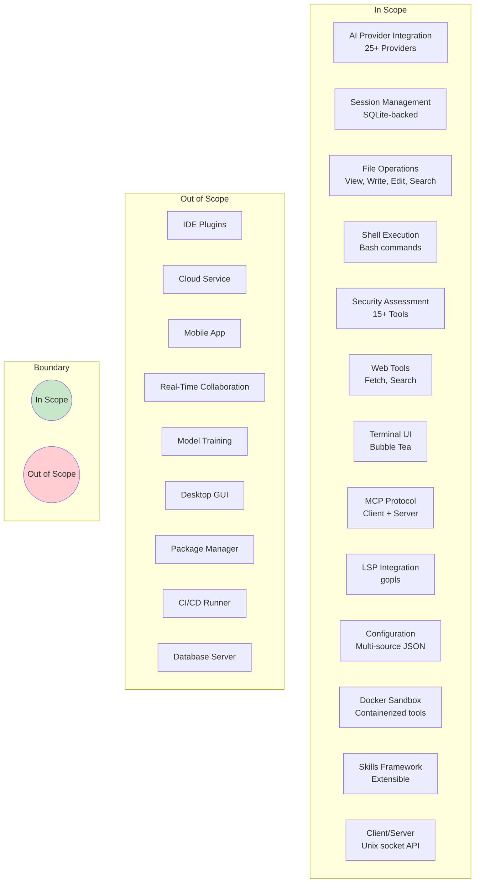

# File: docs/05-scope.md

# Chapter 5: Scope

## 5.1 In Scope

### 5.1.1 AI Provider Integration

| Provider Type | Support Level | Details |
|---------------|---------------|---------|
| OpenAI | Full | GPT-4, GPT-4o, o1, o3, and all models |
| Anthropic | Full | Claude Opus, Sonnet, Haiku series |
| Google Gemini | Full | Gemini 1.5, 2.0, 2.5 Flash/Pro |
| AWS Bedrock | Full | Anthropic, Meta, Mistral models via AWS |
| Azure OpenAI | Full | OpenAI models via Azure |
| OpenRouter | Full | 200+ models with unified API |
| Vercel AI | Full | Vercel AI SDK integration |
| Google Vertex AI | Full | Gemini models via GCP |
| OpenAI-Compatible | Full | 20+ providers (Groq, Cerebras, Together, etc.) |
| Ollama (Local) | Full | Local model serving |
| Custom Providers | Full | User-defined API endpoints |

### 5.1.2 Session Management

- Persistent SQLite-backed chat sessions
- Message history with full CRUD operations
- File version tracking per session
- Token usage and cost accumulation
- Auto-generated session titles
- Session listing, searching, and archiving
- Cross-session context preservation

### 5.1.3 File Operations

- View file contents with syntax highlighting
- Write new files with directory creation
- Edit existing files with surgical line-based edits
- Multi-edit across multiple files in one operation
- Glob pattern file searching
- Grep/regex file content searching
- File browser and directory listing
- Download files from URLs
- Drag-and-drop attachment support

### 5.1.4 Shell Execution

- Bash command execution with real-time output
- Command timeout controls (configurable)
- Background job support
- Output streaming and pagination
- Working directory management
- Environment variable handling
- Signal handling for long-running commands

### 5.1.5 Security Assessment Tools

| Tool | Purpose | Integration Method |
|------|---------|-------------------|
| Nuclei | Vulnerability scanning | CLI wrapper + result parsing |
| Nmap | Network port scanning | CLI wrapper + XML parsing |
| SQLMap | SQL injection detection | CLI wrapper + output parsing |
| FFUF | Directory/file fuzzing | CLI wrapper + JSON parsing |
| Subfinder | Subdomain enumeration | CLI wrapper |
| Httpx | HTTP probing | CLI wrapper |
| Katana | Web crawling | CLI wrapper |
| Naabu | Port scanning | CLI wrapper |
| Semgrep | Static analysis | CLI wrapper + SARIF parsing |
| Trivy | Vulnerability scanning | CLI wrapper (Docker sandbox) |
| Gitleaks | Secret detection | CLI wrapper (Docker sandbox) |
| Nuclei Templates | Vulnerability templates | Bundled in Docker sandbox |

### 5.1.6 Web Tools

- Web page fetching with content extraction
- Web search (via configured search provider)
- URL content analysis
- HTML to Markdown conversion
- JavaScript-rendered content support (via ChromeDP)

### 5.1.7 Terminal User Interface

| Feature | Implementation |
|---------|----------------|
| Framework | Bubble Tea v2 |
| Styling | Lipgloss v2 |
| Markdown Rendering | Glamour v2 |
| Syntax Highlighting | Chroma v2 (50+ languages) |
| Screen Rendering | Ultraviolet |
| Diff Views | Unified and Split |
| Image Display | Kitty terminal protocol |
| Autocomplete | File paths, commands, models |
| Mouse Support | Scroll, click, text selection |
| Animations | Spinners, progress indicators |
| Dialog System | Modal overlays for permissions, settings |
| Theme System | Provider-specific color themes |

### 5.1.8 MCP Protocol

| Feature | Description |
|---------|-------------|
| MCP Client | Connect to external MCP servers |
| MCP Server | Expose DuckOps tools via MCP |
| Transport | stdio and HTTP/SSE |
| Resource Sharing | Expose files and data as MCP resources |
| Prompt Templates | Define MCP prompt templates |
| Tool Discovery | Automatic MCP tool registration |

### 5.1.9 LSP Integration

| Feature | Description |
|---------|-------------|
| LSP Client | Connect to language servers |
| Language Support | Go (gopls), extensible to others |
| Diagnostics | Display errors and warnings |
| Code Actions | Apply suggested fixes |
| Completions | LSP-backed code completion |
| References | Find references and definitions |

### 5.1.10 Configuration Management

- Multi-source configuration loading (global, workspace, project)
- JSON schema validation
- Environment variable resolution
- Provider configuration with API keys, endpoints
- Model selection (large/small/local)
- MCP and LSP server configuration
- Tool permissions and safety settings
- UI preferences (compact mode, themes)

### 5.1.11 Docker Sandbox

- Multi-stage Dockerfile with security tools
- Non-root user execution
- Pre-installed security tooling (15+ tools)
- Caido web proxy integration
- MCP tool server on port 48081
- Environment variable passthrough
- Volume mounting for workspace access

### 5.1.12 Client/Server Architecture

- HTTP server over Unix domain socket
- RESTful API for workspace operations
- Client library for remote connections
- Version compatibility checking
- Multi-workspace management
- Event streaming (SSE)

### 5.1.13 Skills Framework

- Skill discovery from filesystem
- Built-in skill packs (security, development)
- Custom skill definition
- Tool registration from skills
- Prompt template management

## 5.2 Out of Scope

### 5.2.1 Explicitly Excluded

| Feature | Reason for Exclusion |
|---------|---------------------|
| **IDE Plugins** | DuckOps is terminal-native; IDE integration would require separate plugins per editor |
| **Cloud Service** | No hosted/managed cloud offering; self-hosted only |
| **Mobile Support** | Terminal UI is not suitable for mobile form factors |
| **Real-Time Collaboration** | Multi-user editing is a different product category |
| **Custom Model Training** | Fine-tuning infrastructure is outside DuckOps scope |
| **Graphical Desktop UI** | GTK/Qt/Electron UI would duplicate terminal functionality |
| **Package Manager** | Language-specific package management is outside scope |
| **CI/CD Runner** | Pipeline execution is better served by dedicated tools |
| **Database Server** | SQLite is embedded; no PostgreSQL/MySQL server support |
| **Cloud Sync** | No built-in cloud sync for sessions or config |
| **Plugin Marketplace** | No centralized plugin registry (skills are filesystem-based) |

### 5.2.2 Future Considerations

The following may be considered for future versions but are currently out of scope:

- Web-based companion UI
- Team workspace sharing
- Managed cloud deployment
- Mobile companion app
- CI/CD integration plugin

## 5.3 Assumptions

### 5.3.1 Technical Assumptions

1. **Go Runtime**: Users have Go 1.26+ (for source builds) or use pre-compiled binaries
2. **Terminal Emulator**: Users have a modern terminal emulator supporting:
   - 24-bit true color
   - Unicode/emoji rendering
   - Mouse reporting (for TUI features)
   - Kitty image protocol (optional, for image display)
3. **Network Connectivity**: Internet access for AI provider APIs and web searches
4. **Docker Availability**: Docker installed for sandbox mode (optional)
5. **Workspace Directory**: The working directory is accessible and writable
6. **API Keys**: Users have at least one AI provider API key
7. **Shell Access**: Standard Unix shell (bash, zsh) available

### 5.3.2 User Assumptions

1. **CLI Proficiency**: Users are comfortable with command-line interfaces
2. **Terminal Familiarity**: Users understand basic terminal operations (scrolling, copying)
3. **Provider Knowledge**: Users understand which AI provider they want to use
4. **Security Awareness**: Users understand the implications of running AI-assisted security scans
5. **File System Access**: Users have appropriate permissions for file operations

### 5.3.3 Environmental Assumptions

1. **Unix-like OS**: Primary target is Linux; macOS is secondary
2. **Filesystem**: Standard POSIX filesystem with symlink support
3. **IPC**: Unix domain sockets available (or named pipes on Windows)
4. **Memory**: Minimum 256MB RAM available
5. **Disk**: Minimum 100MB free space for application + SQLite database

## 5.4 Constraints

### 5.4.1 Technical Constraints

| Constraint | Description | Impact |
|------------|-------------|--------|
| **Go Language** | Entire codebase is Go; no Python/Node.js components | Limits library ecosystem but ensures single binary |
| **SQLite Only** | Database uses SQLite exclusively | No PostgreSQL/MySQL support; limits concurrent write scaling |
| **Terminal-Only** | No graphical interface | Not suitable for non-terminal users |
| **Single Binary** | All dependencies compile into one binary | Increases binary size (~50MB) |
| **No External DB** | SQLite is embedded; no separate DB server | Limits horizontal scaling |
| **No Cloud Dependency** | Self-contained; no required cloud services | No cloud sync, no managed backups |
| **Unix Priority** | Linux primary; macOS/Windows secondary | Windows users may have reduced experience |
| **CGO Limitations** | Some SQLite drivers use CGO | Cross-compilation complexity |

### 5.4.2 Performance Constraints

| Constraint | Limit | Rationale |
|------------|-------|-----------|
| TUI frame rate | 60fps target | Terminal emulator limitations |
| LLM response time | Provider-dependent | Network latency + model inference |
| SQLite database size | Practically unlimited | Single-file storage |
| Session history | 10,000+ sessions | Storage-bound |
| Concurrent agents | Memory-bound | Go goroutines are lightweight |
| Tool timeout | Configurable (default 120s) | Safety against runaway commands |
| Output capture | 100MB per tool execution | Memory constraints |

### 5.4.3 Security Constraints

| Constraint | Implementation |
|------------|----------------|
| API Keys | Environment variables only, never in config files |
| Tool Permissions | Allow/deny/ask per tool with session persistence |
| Shell Execution | No interactive shell; command-level timeout |
| File Access | Workspace-bound with path traversal prevention |
| Network Access | Outbound only (to AI providers and web) |
| Docker Execution | Non-root user, limited capabilities |

### 5.4.4 Dependency Constraints

| Category | Constraint | Rationale |
|----------|------------|-----------|
| Go Version | 1.26+ | Uses modern Go features (range func, iter) |
| Bubble Tea | v2 | Latest version with tea.WindowSizeMsg changes |
| SQLite | modernc.org or ncruces | Pure Go or CGO-enabled drivers |
| Fantasy | Specific version | AI provider abstraction library |
| Catwalk | Bundled | Provider registry with embedded configs |

## 5.5 Scope Diagram

---

**END OF CHAPTER 5**
