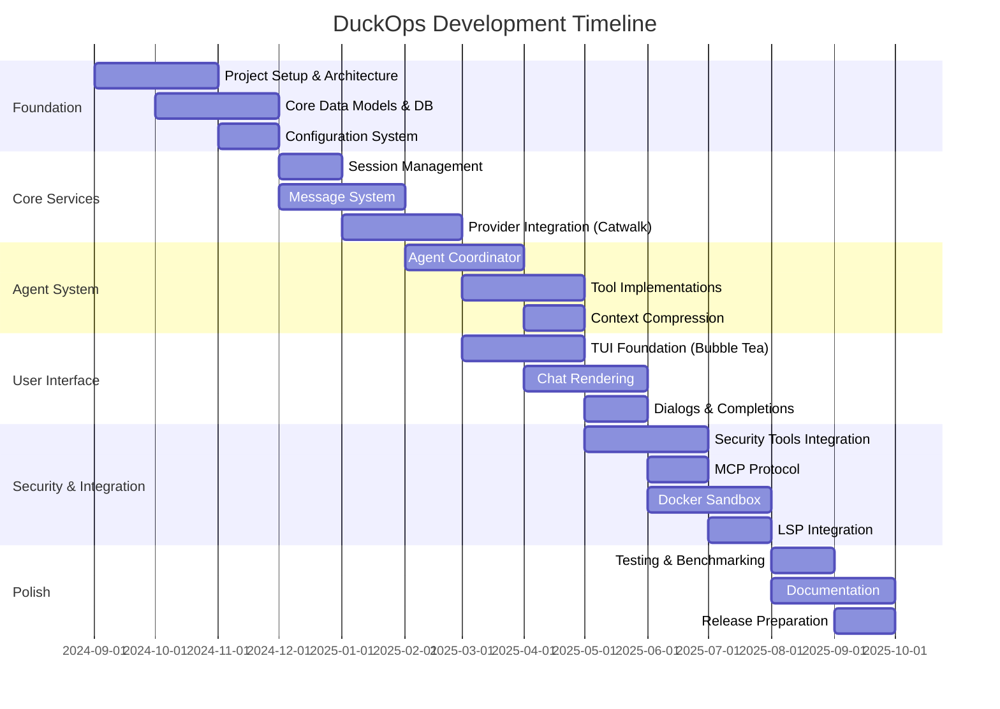
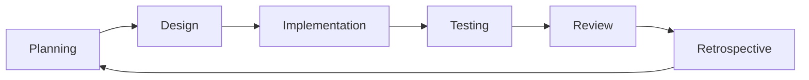
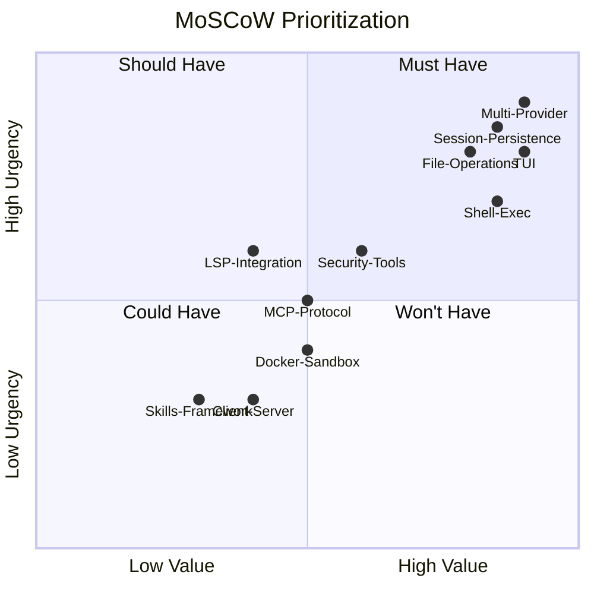
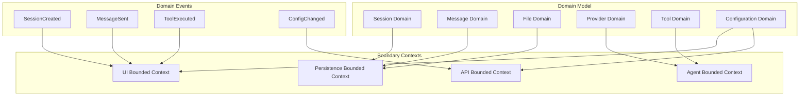
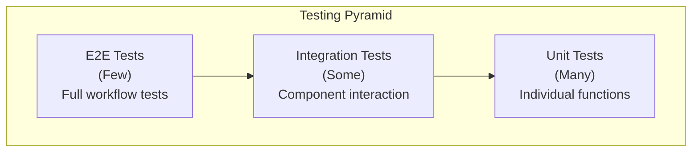
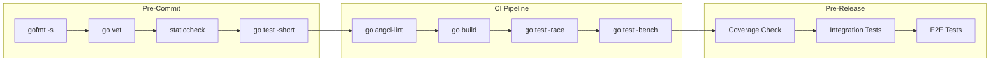
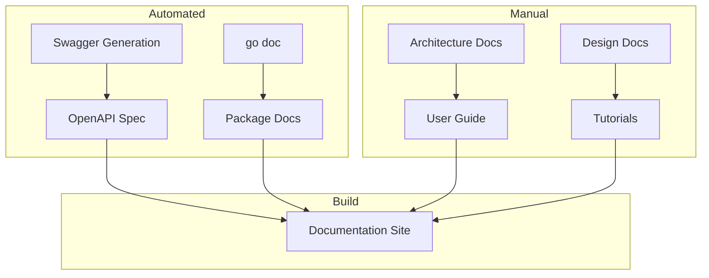
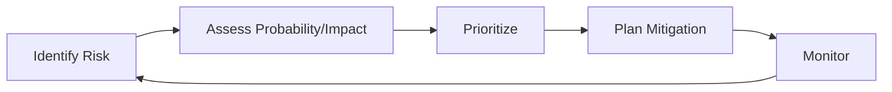

# File: docs/06-methodology.md

# Chapter 6: Methodology

## 6.1 Development Methodology

### 6.1.1 Methodology Overview

DuckOps was developed using an **iterative and incremental development methodology** combined with **agile practices**. The project followed a hybrid approach that combines:

1. **Feature-Driven Development (FDD)** for feature planning and tracking
2. **Continuous Integration/Continuous Deployment (CI/CD)** for quality assurance
3. **Test-Driven Development (TDD)** for core algorithmic components
4. **Domain-Driven Design (DDD)** for package and module organization

### 6.1.2 Development Phases

### 6.1.3 Iteration Cycle

Each iteration followed a standard two-week sprint cycle:

**Iteration Artifacts:**

| Artifact | Description | Owner |
|----------|-------------|-------|
| Sprint Backlog | Prioritized features for the sprint | Product Owner |
| Design Documents | Technical design for major features | Tech Lead |
| Code Changes | Implementation with tests | Developers |
| Test Results | Unit, integration, and E2E test results | QA |
| Sprint Review | Demo of completed features | Team |
| Retrospective | Lessons learned and action items | Scrum Master |

## 6.2 Requirements Gathering Methodology

### 6.2.1 Sources of Requirements

| Source | Method | Contribution |
|--------|--------|--------------|
| Developer Surveys | Online questionnaires | Pain points, feature priorities |
| Tool Usage Analytics | Open-source tool adoption data | Tool selection decisions |
| Competitive Analysis | Feature comparison of 10+ tools | Gap identification |
| User Interviews | 1:1 sessions with target users | Workflow understanding |
| Security Community | OWASP, security tool documentation | Security tool selection |
| Open Source Feedback | GitHub issues, discussions | Bug reports, feature requests |

### 6.2.2 Requirements Prioritization

Requirements were prioritized using the **MoSCoW method**:

**Priority Categories:**

| Priority | Definition | Examples |
|----------|------------|----------|
| **Must Have** | Critical for MVP, system non-functional without | Multi-provider AI, session persistence, file ops |
| **Should Have** | Important but workaround exists | Shell execution, TUI, auto-summarization |
| **Could Have** | Desirable but not necessary | Security tools, MCP, LSP |
| **Won't Have** | Explicitly deferred | IDE plugins, cloud sync |

## 6.3 Design Methodology

### 6.3.1 Architectural Design Approach

The architecture was designed using **Domain-Driven Design (DDD)** principles:

### 6.3.2 Design Patterns Used

| Pattern | Package | Purpose |
|---------|---------|---------|
| **Repository** | db, session, message, history | Database abstraction |
| **Service** | session, message, history | Business logic encapsulation |
| **Strategy** | config/load.go | Multiple config source merging |
| **Observer/Pub-Sub** | pubsub | Event-driven communication |
| **Factory** | agent/tools | Tool creation from configuration |
| **Adapter** | agent/tools/mcp | MCP protocol abstraction |
| **Decorator** | agent/hooked_tool | Pre/post tool execution hooks |
| **Command** | cmd/* | CLI command pattern |
| **MVC** | ui/model | TUI model-view separation |
| **Singleton** | config/store | Global configuration store |
| **Builder** | internal/backend | Workspace construction |

## 6.4 Testing Methodology

### 6.4.1 Testing Pyramid

### 6.4.2 Test Categories

| Category | Tools | Coverage Target |
|----------|-------|-----------------|
| **Unit Tests** | Go testing, testify | >70% statement coverage |
| **Integration Tests** | Go testing, test containers | Component boundary tests |
| **E2E Tests** | Go testing, mock providers | Critical user journeys |
| **Performance Tests** | Go benchmark, custom | <100ms overhead targets |
| **Security Tests** | Semgrep, gosec | Zero critical findings |
| **Lint Checks** | golangci-lint | Zero errors |

## 6.5 Quality Assurance Methodology

### 6.5.1 Code Quality Gates

### 6.5.2 Quality Metrics

| Metric | Target | Measurement |
|--------|--------|-------------|
| Code Coverage | >70% | go test -cover |
| Cyclomatic Complexity | <15 per function | gocyclo |
| Lines per Function | <100 | gocyclo |
| Dependency Count | <100 direct | go mod graph |
| Build Time | <60s | time go build |
| Test Time | <120s | time go test ./... |
| Lint Errors | 0 | golangci-lint |

## 6.6 Project Management Methodology

### 6.6.1 Role Definitions

| Role | Responsibilities |
|------|------------------|
| **Product Owner** | Requirements prioritization, stakeholder communication |
| **Tech Lead** | Architecture decisions, code review, technical guidance |
| **Developers** | Feature implementation, testing, documentation |
| **QA Engineer** | Test planning, automated testing, regression testing |
| **Security Expert** | Security architecture, threat modeling, tool integration |

### 6.6.2 Communication Channels

| Channel | Purpose | Frequency |
|---------|---------|-----------|
| Daily Standup | Progress update, blockers | Daily |
| Sprint Planning | Sprint goal, task assignment | Bi-weekly |
| Sprint Review | Demo, feedback | Bi-weekly |
| Tech Review | Architecture, design decisions | Weekly |
| Security Review | Threat model, vulnerability analysis | Monthly |

## 6.7 Documentation Methodology

### 6.7.1 Documentation Types

| Type | Audience | Format | Location |
|------|----------|--------|----------|
| **User Guide** | End users | Markdown | docs/ |
| **API Reference** | Developers | Swagger/OpenAPI | internal/swagger/ |
| **Architecture** | Developers | Markdown + Mermaid | docs/ |
| **Code Comments** | Developers | Godoc | Source code |
| **README** | All | Markdown | Root |

### 6.7.2 Documentation Generation

## 6.8 Risk Management Methodology

### 6.8.1 Risk Assessment Process

### 6.8.2 Risk Categories

| Category | Examples | Mitigation |
|----------|----------|------------|
| **Technical** | Performance bottlenecks, API changes | Modular architecture, benchmarks |
| **Schedule** | Feature delays, scope creep | MoSCoW prioritization, iterative delivery |
| **Resource** | Developer availability, funding | Cross-training, open-source contributions |
| **Security** | Vulnerabilities, data leaks | Security review, permission system |
| **Operational** | Provider outages, network issues | Multi-provider architecture, offline fallback |
| **Dependency** | Library deprecation, breaking changes | Pinned versions, vendor directory |

---

**END OF CHAPTER 6**
