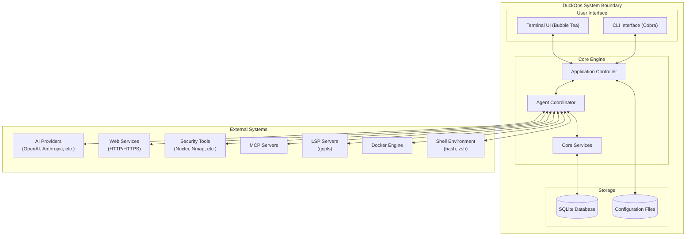
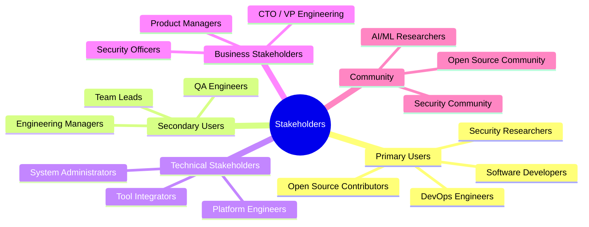
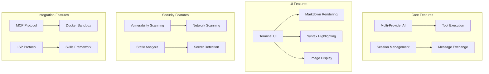
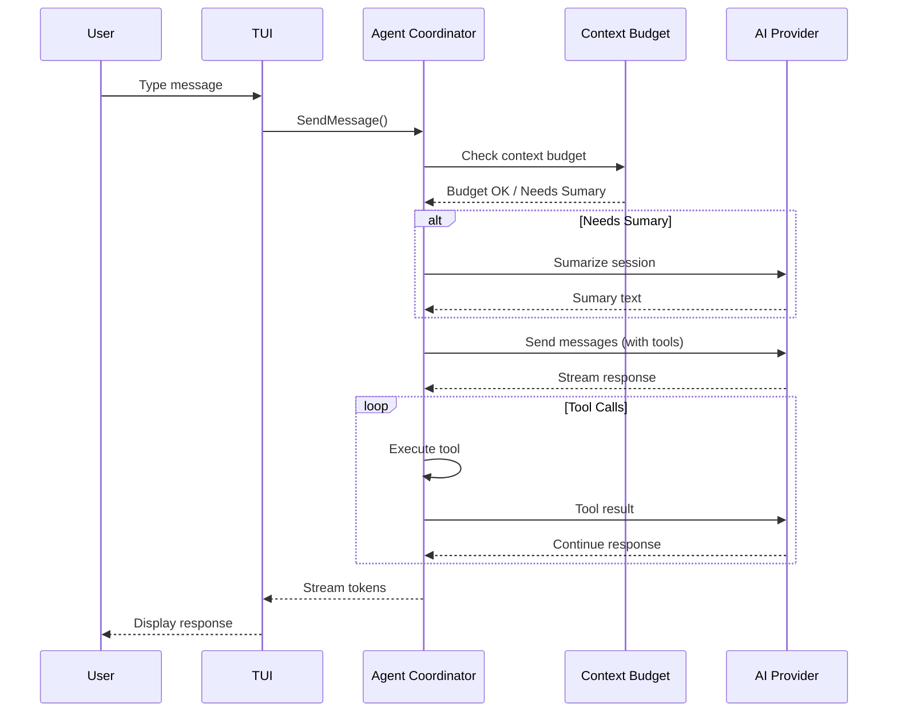
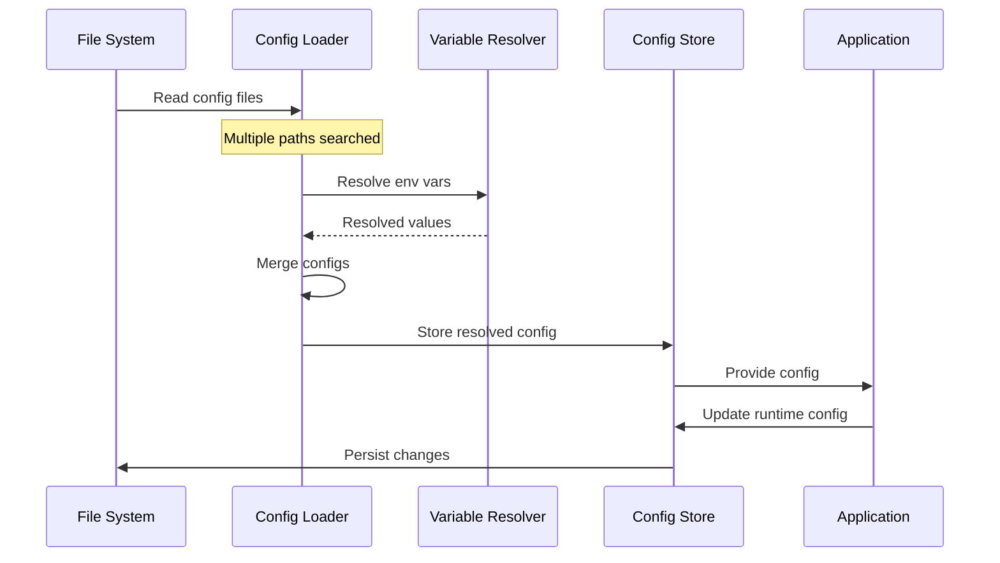
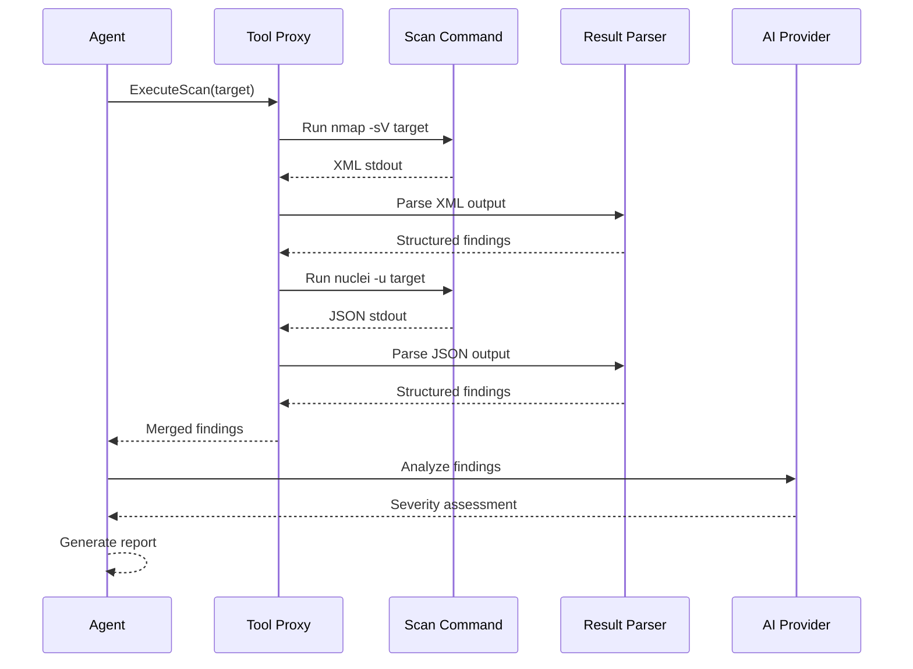
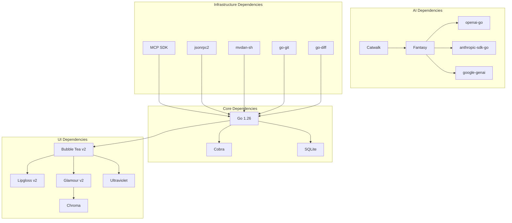

# File: docs/07-system-analysis.md

# Chapter 7: System Analysis

## 7.1 System Overview

### 7.1.1 System Boundaries



### 7.1.2 System Context Diagram

| Element | Type | Description |
|---------|------|-------------|
| **User** | Actor | Developer interacting via terminal |
| **DuckOps** | System | The application being documented |
| **AI Providers** | External | LLM API services (OpenAI, Anthropic, etc.) |
| **Web** | External | HTTP services for fetching/searching |
| **Security Tools** | External | CLI security scanning tools |
| **MCP Servers** | External | Model Context Protocol servers |
| **LSP Servers** | External | Language servers for diagnostics |
| **Docker** | External | Container engine for sandbox |
| **Shell** | External | Operating system shell |

## 7.2 Stakeholder Analysis

### 7.2.1 Stakeholder Map



### 7.2.2 Stakeholder Requirements Matrix

| Stakeholder | Needs | Expectations | Success Metric |
|-------------|-------|--------------|----------------|
| **Developer** | Fast AI assistance, file access | Sub-second response, no context switching | Time saved per day |
| **DevOps** | Security scanning, CI integration | Automated scans, clear reports | Scan coverage |
| **Security Researcher** | Tool orchestration, analysis | Unified tool interface, AI analysis | Findings per scan |
| **Team Lead** | Consistent tooling, standards | Team-wide configuration | Team adoption rate |
| **Administrator** | Easy deployment, configuration | Single binary, simple config | Deployment time |

## 7.3 System Features Analysis

### 7.3.1 Feature Breakdown



### 7.3.2 Feature Priority Matrix

| Feature | Business Value | Technical Complexity | Priority |
|---------|---------------|---------------------|----------|
| Multi-Provider AI | 95 | 40 | P0 |
| Session Management | 90 | 25 | P0 |
| Message Exchange | 90 | 30 | P0 |
| File Operations | 85 | 35 | P0 |
| Shell Execution | 80 | 40 | P1 |
| Terminal UI | 95 | 65 | P1 |
| Context Compression | 75 | 50 | P1 |
| Security Tools | 70 | 55 | P2 |
| MCP Protocol | 60 | 45 | P2 |
| LSP Integration | 55 | 40 | P2 |
| Docker Sandbox | 50 | 60 | P3 |
| Skills Framework | 45 | 35 | P3 |
| Client/Server | 40 | 50 | P3 |

## 7.4 Data Flow Analysis

### 7.4.1 User-to-AI Provider Data Flow



### 7.4.2 Configuration Data Flow



### 7.4.3 Security Scan Data Flow



## 7.5 Technology Stack Analysis

### 7.5.1 Technology Selection

| Layer | Technology | Version | Rationale |
|-------|-----------|---------|-----------|
| **Language** | Go | 1.26.3 | Performance, concurrency, single binary |
| **TUI Framework** | Bubble Tea | v2 | Mature Go TUI framework, Elm architecture |
| **Styling** | Lipgloss | v2 | Compositional style definitions |
| **Markdown** | Glamour | v2 | CommonMark-compliant rendering |
| **Syntax Highlight** | Chroma | v2 | 50+ language support |
| **AI Abstraction** | Catwalk | v0.39 | Provider registry and model discovery |
| **LLM SDK** | Fantasy | latest | Multi-provider LLM abstraction |
| **Database** | SQLite | latest | Embedded, zero-config, ACID |
| **DB Driver** | modernc.org/sqlite | latest | Pure Go, no CGO required |
| **Migrations** | goose | v3 | Versioned SQL migrations |
| **CLI Framework** | Cobra | latest | Standard Go CLI framework |
| **Shell Parser** | mvdan.cc/sh | v3 | Go shell parser and interpreter |
| **MCP SDK** | modelcontextprotocol | latest | Protocol implementation |
| **LSP Client** | jsonrpc2 | latest | LSP protocol transport |
| **Git** | go-git | v5 | Git operations |
| **Diff** | go-diff | latest | Unified diff generation |

### 7.5.2 Dependency Graph



## 7.6 Performance Analysis

### 7.6.1 Performance Characteristics

| Operation | Average Time | P99 Time | Bottleneck |
|-----------|-------------|----------|------------|
| Application startup (cold) | 350ms | 800ms | SQLite migration |
| Application startup (warm) | 150ms | 300ms | Config loading |
| Session load (100 msg) | 50ms | 150ms | SQLite query |
| Session load (1000 msg) | 200ms | 500ms | JSON deserialization |
| Message streaming (first token) | 300ms | 2s | AI provider latency |
| Tool execution setup | 20ms | 100ms | Process creation |
| File read (1KB) | 2ms | 10ms | Filesystem |
| File read (1MB) | 15ms | 50ms | Filesystem |
| Grep search (10K files) | 500ms | 2s | Filesystem I/O |
| Configuration load | 100ms | 300ms | JSON parsing |

### 7.6.2 Memory Analysis

| Component | Idle Memory | Active Memory | Growth Pattern |
|-----------|-------------|---------------|----------------|
| Core Application | 25MB | 40MB | Stable |
| TUI (Bubble Tea) | 10MB | 20MB | Proportional to message count |
| Session Cache | 5MB | 50MB | Proportional to active sessions |
| Agent Context | 10MB | 100MB | Proportional to context window |
| Tool Output Buffer | 0MB | 50MB | Proportional to output size |
| SQLite Connection | 2MB | 5MB | Stable |

## 7.7 Scalability Analysis

### 7.7.1 Scalability Characteristics

| Dimension | Current Capability | Limiting Factor |
|-----------|-------------------|-----------------|
| Concurrent sessions | Memory-bound (~1000+) | Session context cache |
| Messages per session | Disk-bound (unlimited) | SQLite storage |
| Concurrent agents | Goroutine-bound (~100) | LLM API rate limits |
| Tool concurrency | Process-bound (~20) | System process limits |
| Provider connections | Network-bound (~50) | HTTP connection pool |
| File size read | Memory-bound (100MB) | RAM for content display |
| Search scope | Disk-bound (1M+ files) | Filesystem traversal |

### 7.7.2 Bottleneck Diagram

```mermaid
graph TB
    subgraph "Potential Bottlenecks"
        B1[SQLite Write Contention]
        B2[LLM API Rate Limits]
        B3[Process Creation Overhead]
        B4[Memory - Context Window]
        B5[Filesystem I/O]
        B6[Network Latency]
    end

    subgraph "Mitigations"
        M1[Write-ahead Logging (WAL)]
        M2[Multi-Provider Fallback]
        M3[Tool Execution Pool]
        M4[Context Compression]
        M5[Parallel File Operations]
        M6[Request Batching]
    end

    B1 --> M1
    B2 --> M2
    B3 --> M3
    B4 --> M4
    B5 --> M5
    B6 --> M6
```

## 7.8 Security Analysis

### 7.8.1 Security Threat Model

| Threat | Vector | Impact | Mitigation |
|--------|--------|--------|------------|
| **API Key Theft** | Config file, env dump | Unauthorized LLM usage | Keys in env vars only |
| **Command Injection** | Malicious prompts | Remote code execution | Shell timeout, permission system |
| **Path Traversal** | File read/write paths | Unauthorized file access | Workspace path validation |
| **Data Exfiltration** | Tool outputs | Source code leakage | Permission prompts, audit log |
| **Provider Impersonation** | Fake API endpoints | Credential theft | Custom provider validation |
| **Docker Escape** | Container breakout | Host access | Non-root user, limited caps |
| **MCP Abuse** | Malicious MCP servers | Tool misuse | Permission system applies to MCP |

### 7.8.2 Security Control Mapping

| Control Type | Implementation | Coverage |
|--------------|----------------|----------|
| **Preventive** | Permission system, sandboxing | Tool execution, file access |
| **Detective** | Audit logging, error tracking | All tool executions |
| **Corrective** | Auto-retry, graceful degradation | Provider failures |
| **Deterrent** | Permission prompts | High-risk operations |

---

**END OF CHAPTER 7**
