# File: docs/09-use-cases.md

# Chapter 9: Use Cases

## 9.1 Use Case Diagram

### 9.1.1 High-Level Use Case Diagram

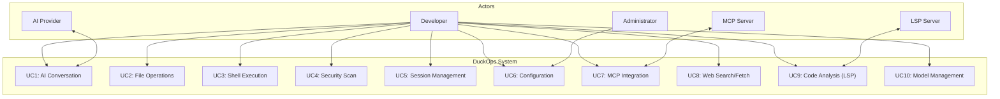

## 9.2 Detailed Use Cases

### 9.2.1 Use Case UC1: AI Conversation

| Field | Value |
|-------|-------|
| **ID** | UC1 |
| **Name** | AI Conversation |
| **Actor** | Developer |
| **Description** | User sends a message to the AI and receives a response with optional tool execution |
| **Preconditions** | At least one AI provider configured with valid API key |
| **Postconditions** | Message and response saved to session history |
| **Priority** | Critical |
| **Frequency** | Continuous |

**Main Flow:**

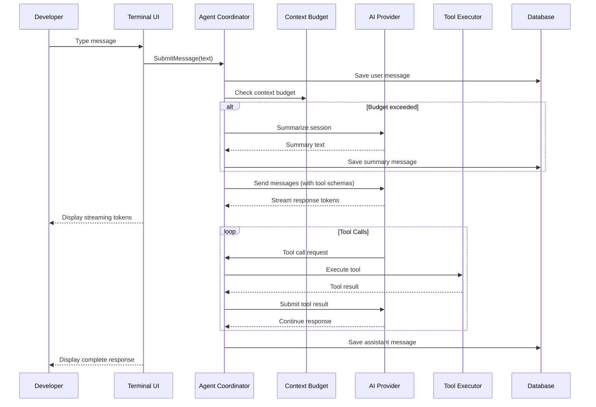

**Alternative Flows:**

| Flow | Trigger | Action |
|------|---------|--------|
| **AF1.1: Provider Error** | Provider API returns error | Agent retries with exponential backoff (3 attempts), then notifies user |
| **AF1.2: Rate Limited** | Provider rate limit hit | Agent waits and retries with backoff |
| **AF1.3: Session Busy** | Agent is processing another request | Message queued, user notified of position |
| **AF1.4: Context Full** | Context window exhausted | Auto-summarization before sending |
| **AF1.5: Tool Loop** | Tool calls exceed 50 iterations | Agent breaks loop and notifies user |

### 9.2.2 Use Case UC2: File Operations

| Field | Value |
|-------|-------|
| **ID** | UC2 |
| **Name** | File Operations |
| **Actor** | Developer (via AI agent) |
| **Description** | Agent reads, writes, edits, and searches files in the workspace |
| **Preconditions** | Active session, workspace directory accessible |
| **Postconditions** | File changes tracked with version history |
| **Priority** | Critical |
| **Frequency** | High |

**Activity Diagram:**

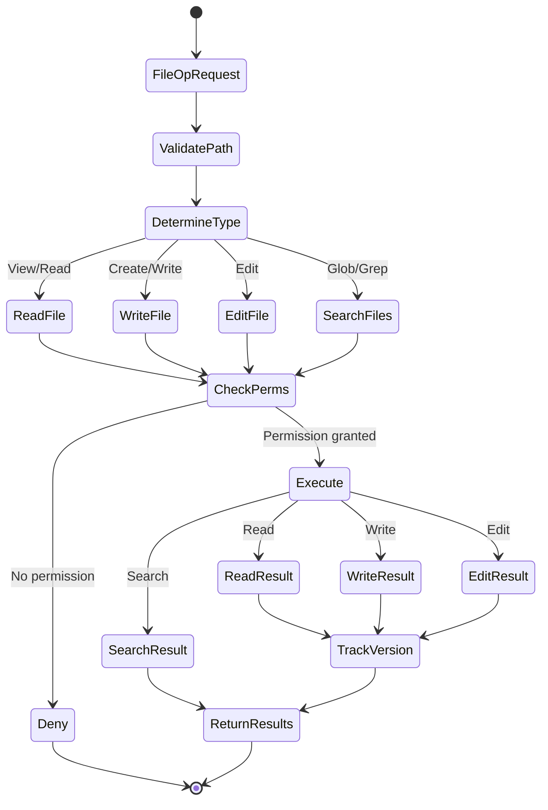

**Scenarios:**

| Operation | Input | Output |
|-----------|-------|--------|
| **View** | File path | File content with syntax highlighting |
| **Write** | File path + content | New file created, version 1 |
| **Edit** | File path + line range + new content | File updated, version incremented |
| **Glob** | Pattern (e.g., `**/*.go`) | Matching file paths |
| **Grep** | Pattern (regex) + optional path | Matching lines with context |
| **Multi-Edit** | List of {file, edits} | All files updated atomically |

### 9.2.3 Use Case UC3: Shell Execution

| Field | Value |
|-------|-------|
| **ID** | UC3 |
| **Name** | Shell Execution |
| **Actor** | Developer (via AI agent) |
| **Description** | Agent executes shell commands with output capture |
| **Preconditions** | Active session |
| **Postconditions** | Command output saved in message history |
| **Priority** | High |
| **Frequency** | High |

**Flowchart:**

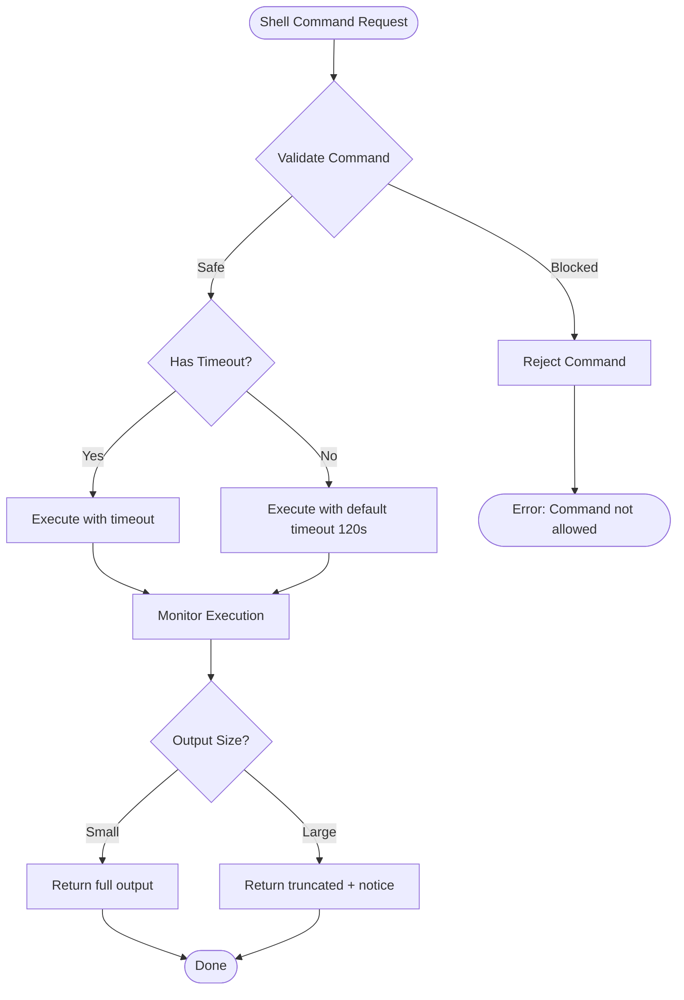

**Error Handling:**

| Error | Cause | Handling |
|-------|-------|----------|
| **Timeout** | Command exceeds time limit | Kill process, return partial output |
| **Permission** | Command not in allowed list | Return permission denied message |
| **Not Found** | Command does not exist | Suggest installation |
| **Non-Zero Exit** | Command failed | Return exit code + output |
| **Output Too Large** | Exceeds 100MB limit | Truncate and notify |

### 9.2.4 Use Case UC4: Security Scan

| Field | Value |
|-------|-------|
| **ID** | UC4 |
| **Name** | Security Scan |
| **Actor** | Developer (via AI agent) |
| **Description** | Agent orchestrates security scanning tools and analyzes results |
| **Preconditions** | Security tools installed (natively or via Docker) |
| **Postconditions** | Scan results analyzed and report generated |
| **Priority** | Medium |
| **Frequency** | Low-Medium |

**Sequence Diagram:**

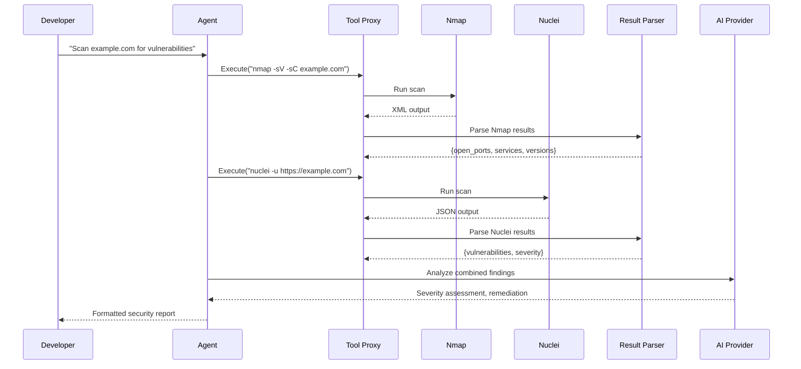

**Supported Scan Types:**

| Tool | Input | Output Format | Use Case |
|------|-------|---------------|----------|
| Nmap | Target host/IP | XML | Port discovery, service detection |
| Naabu | Target host | JSON | Fast port scanning |
| Nuclei | Target URL | JSON | Vulnerability scanning |
| SQLMap | Target URL + params | Text | SQL injection detection |
| FFUF | Target URL + wordlist | JSON | Directory fuzzing |
| Subfinder | Domain | Text | Subdomain enumeration |
| Httpx | URL/probe | JSON | HTTP probing |
| Katana | Target URL | JSON | Web crawling |
| Semgrep | Source directory | SARIF | Static code analysis |

### 9.2.5 Use Case UC5: Session Management

| Field | Value |
|-------|-------|
| **ID** | UC5 |
| **Name** | Session Management |
| **Actor** | Developer |
| **Description** | User manages chat sessions (create, list, resume, delete) |
| **Preconditions** | Application initialized |
| **Postconditions** | Session state changes persisted |
| **Priority** | High |
| **Frequency** | Medium |

**Use Case Flow:**

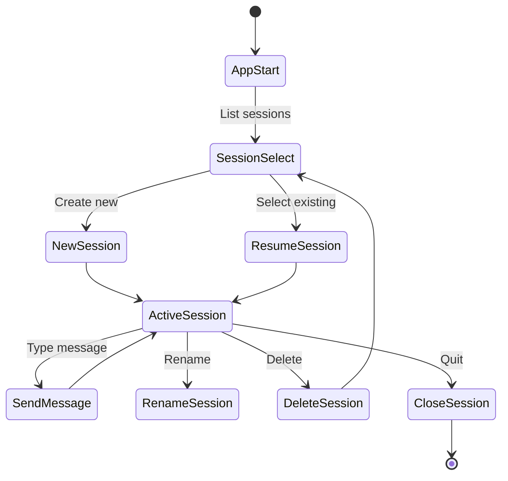

**Session Operations:**

| Operation | Description | CLI Command |
|-----------|-------------|-------------|
| **Create** | Start new conversation | `duckops` (new session) |
| **List** | Show all sessions | `duckops session list` |
| **Resume** | Continue existing session | `duckops --session <id>` |
| **Rename** | Change session title | Via TUI or API |
| **Delete** | Remove session | `duckops session delete <id>` |
| **Archive** | Hide from active list | Future feature |

### 9.2.6 Use Case UC6: Configuration Management

| Field | Value |
|-------|-------|
| **ID** | UC6 |
| **Name** | Configuration Management |
| **Actor** | Developer, Administrator |
| **Description** | User configures providers, models, tools, and preferences |
| **Preconditions** | Configuration file accessible |
| **Postconditions** | Configuration changes applied |
| **Priority** | High |
| **Frequency** | Low |

**Configuration Sources:**

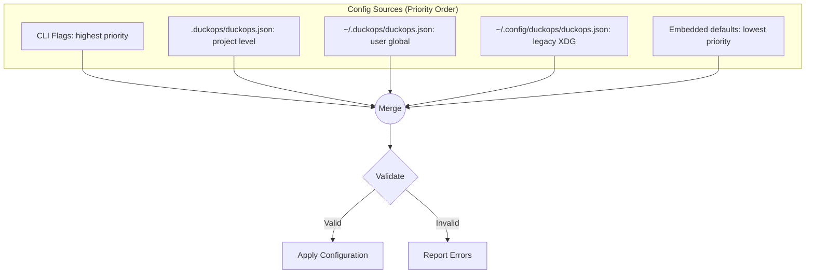

### 9.2.7 Use Case UC7: MCP Integration

| Field | Value |
|-------|-------|
| **ID** | UC7 |
| **Name** | MCP Integration |
| **Actor** | Developer, MCP Server |
| **Description** | System connects to MCP servers for additional tools and resources |
| **Preconditions** | MCP server configured with valid transport |
| **Postconditions** | MCP tools available to agent |
| **Priority** | Medium |
| **Frequency** | Low |

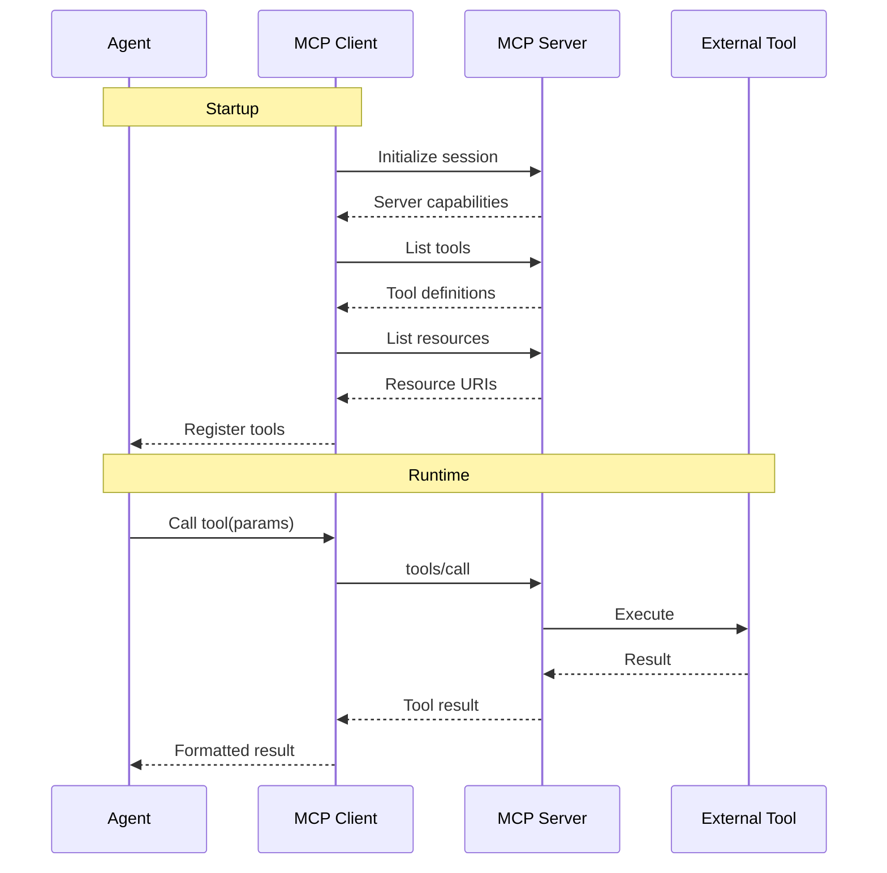

### 9.2.8 Use Case UC8: Web Search/Fetch

| Field | Value |
|-------|-------|
| **ID** | UC8 |
| **Name** | Web Search and Fetch |
| **Actor** | Developer (via AI agent) |
| **Description** | Agent fetches web pages or performs web searches |
| **Preconditions** | Network connectivity |
| **Postconditions** | Content saved in message history |
| **Priority** | Medium |
| **Frequency** | Medium |

**Fetch Flow:**

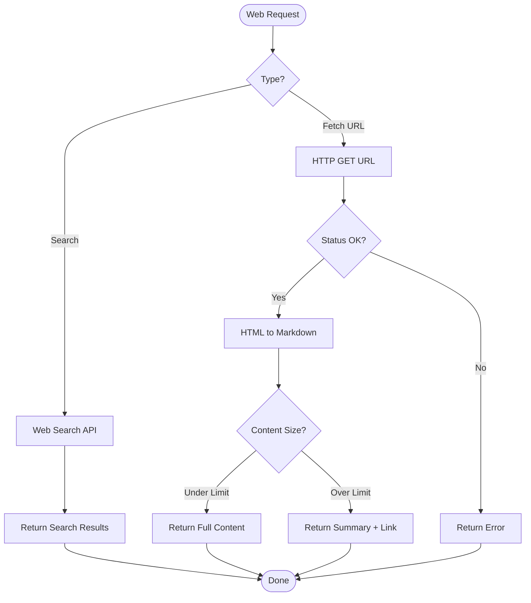

## 9.3 User Stories

### 9.3.1 Epic: AI Assistance

| Story ID | As a... | I want to... | So that... | Priority | Effort |
|----------|---------|--------------|------------|----------|--------|
| US-001 | Developer | Chat with multiple AI providers in one session | I can use the best model for each task | P0 | L |
| US-002 | Developer | Resume interrupted sessions | I don't lose context when closing the app | P0 | M |
| US-003 | Developer | Have the AI read my project files | I don't need to copy-paste code | P0 | M |
| US-004 | Developer | Execute shell commands through AI | I stay in the terminal context | P1 | M |
| US-005 | Developer | Have the AI edit multiple files | I can refactor across the codebase | P1 | H |
| US-006 | Developer | Search my codebase through AI | I can find relevant code quickly | P0 | M |
| US-007 | Developer | Get web search results in chat | I don't switch to browser | P2 | M |

### 9.3.2 Epic: Security Assessment

| Story ID | As a... | I want to... | So that... | Priority | Effort |
|----------|---------|--------------|------------|----------|--------|
| US-008 | Developer | Run vulnerability scans from chat | I find security issues early | P1 | H |
| US-009 | Security Researcher | Orchestrate multiple security tools | I do comprehensive assessments | P2 | H |
| US-010 | Developer | Get AI analysis of scan results | I understand the findings | P1 | M |
| US-011 | Developer | Scan dependencies for vulnerabilities | I avoid supply chain attacks | P2 | M |

### 9.3.3 Epic: Configuration & Control

| Story ID | As a... | I want to... | So that... | Priority | Effort |
|----------|---------|--------------|------------|----------|--------|
| US-012 | Developer | Configure AI providers easily | I can start using the tool quickly | P0 | M |
| US-013 | Administrator | Set default models for my team | everyone uses approved models | P2 | L |
| US-014 | Developer | Control which tools the AI can use | I prevent dangerous operations | P1 | M |
| US-015 | Developer | See my token usage and costs | I manage my API budget | P1 | L |

### 9.3.4 Epic: Integration

| Story ID | As a... | I want to... | So that... | Priority | Effort |
|----------|---------|--------------|------------|----------|--------|
| US-016 | Developer | Connect MCP servers for custom tools | I extend DuckOps capabilities | P2 | M |
| US-017 | Developer | See LSP diagnostics in chat | I fix code issues faster | P2 | M |
| US-018 | Developer | Use Docker sandbox for secure execution | I safely run untrusted tools | P3 | H |
| US-019 | Developer | Create custom skills | I share workflows with my team | P3 | M |

## 9.4 Use Case Prioritization Matrix

| Use Case | Business Value | Technical Risk | User Impact | Priority |
|----------|---------------|----------------|-------------|----------|
| UC1: AI Conversation | 95 | 40 | 95 | P0 |
| UC5: Session Management | 90 | 25 | 85 | P0 |
| UC2: File Operations | 85 | 35 | 80 | P0 |
| UC6: Configuration | 80 | 20 | 70 | P0 |
| UC3: Shell Execution | 75 | 40 | 75 | P1 |
| UC8: Web Search/Fetch | 70 | 25 | 65 | P1 |
| UC4: Security Scan | 65 | 55 | 60 | P2 |
| UC7: MCP Integration | 55 | 45 | 50 | P2 |
| UC9: Code Analysis (LSP) | 50 | 40 | 45 | P2 |
| UC10: Model Management | 45 | 30 | 40 | P2 |

## 9.5 System Workflows

### 9.5.1 Startup Workflow

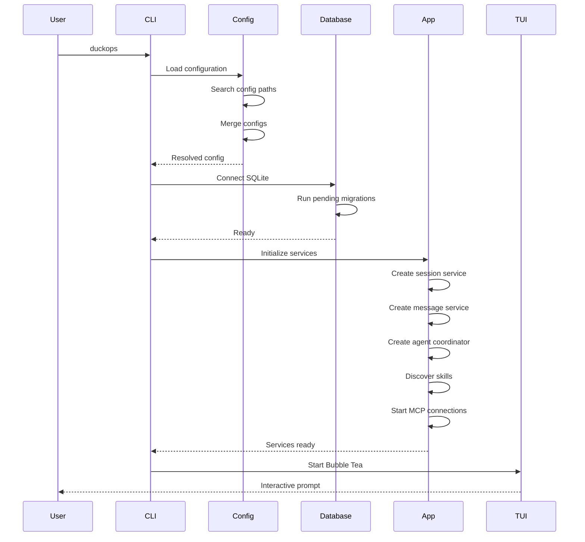

### 9.5.2 Non-Interactive Run Workflow

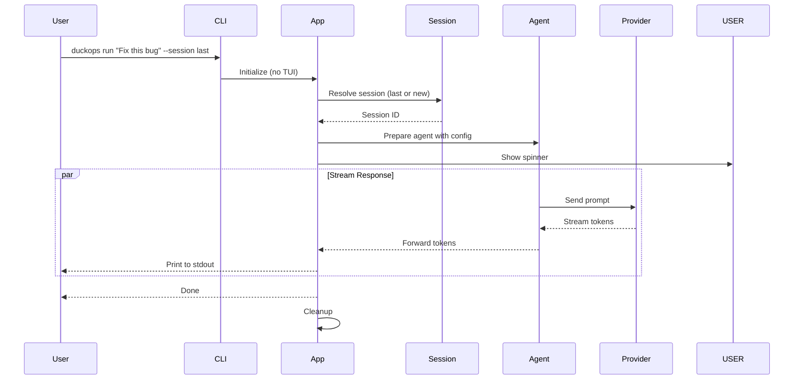

## 9.6 Process Flowcharts

### 9.6.1 Tool Execution Flowchart

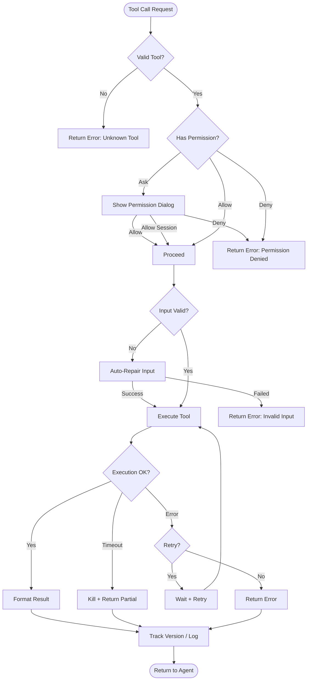

### 9.6.2 Message Processing Flowchart

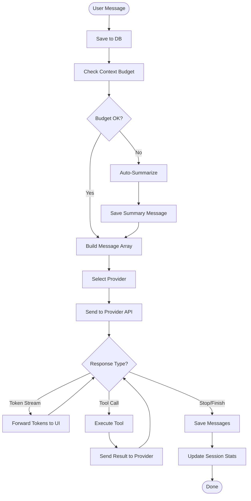

---

**END OF CHAPTER 9**
