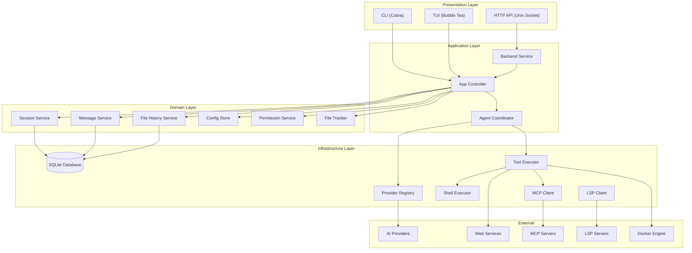
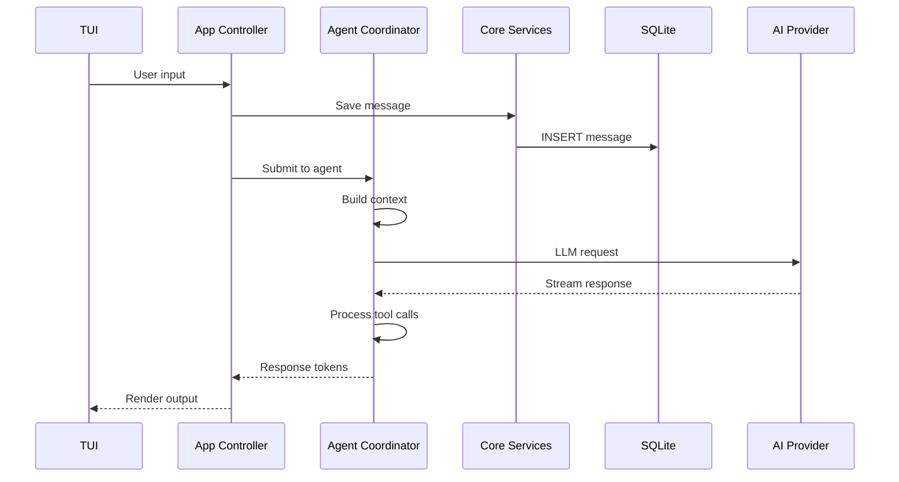
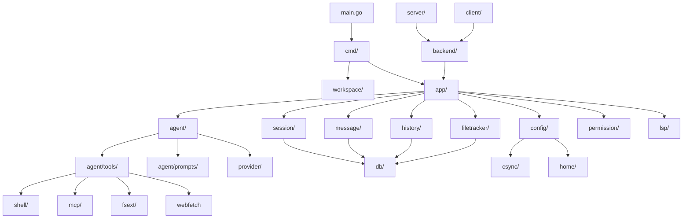
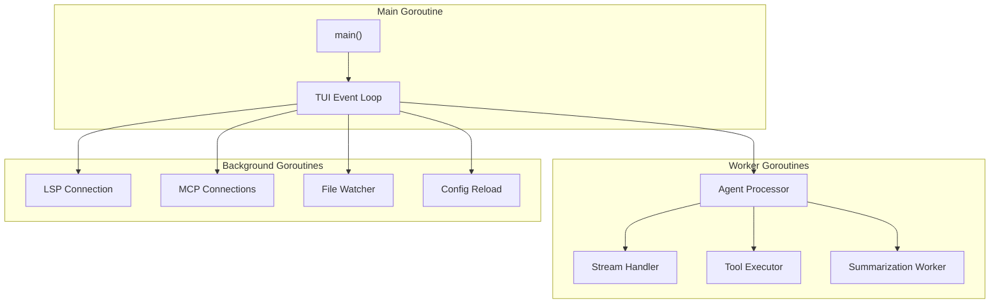

# File: docs/10-system-design.md

# Chapter 10: System Design

## 10.1 High-Level System Architecture

### 10.1.1 Architecture Overview

DuckOps follows a **layered architecture** with clear separation of concerns. Each layer communicates through well-defined interfaces, enabling independent testing, modification, and extension of components.



### 10.1.2 Architecture Principles

| Principle | Description | Implementation |
|-----------|-------------|----------------|
| **Single Responsibility** | Each package has one clearly defined purpose | 43 packages, each with focused scope |
| **Interface Segregation** | Components depend on interfaces, not implementations | Querier interface, Service interfaces |
| **Dependency Inversion** | High-level modules don't depend on low-level modules | Domain services depend on db.Querier interface |
| **Separation of Concerns** | UI, business logic, and data access are separated | ui/ -> app/ -> db/ layering |
| **Event-Driven Communication** | Components communicate via events | pubsub.Broker for cross-component events |

## 10.2 Component Architecture

### 10.2.1 Core Components

| Component | Responsibility | Key Interfaces | Dependencies |
|-----------|---------------|----------------|--------------|
| **Config Store** | Load, merge, validate, persist configuration | VariableResolver | None |
| **Session Service** | CRUD for chat sessions | session.Service | db.Querier |
| **Message Service** | CRUD for messages, content parts | message.Service | db.Querier |
| **History Service** | File version tracking | history.Service | db.Querier |
| **Agent Coordinator** | AI provider orchestration, tool execution | agent.Coordinator | All services |
| **Permission Service** | Tool execution authorization | permission.Service | None |
| **File Tracker** | Track file read/write operations | filetracker.Service | db.Querier |

### 10.2.2 Component Interaction Diagram



## 10.3 Low-Level Design

### 10.3.1 Package Dependency Graph



### 10.3.2 Module Design: Config Store

**Package**: `internal/config/`

```go
// ConfigStore is the single entry point for all configuration access.
type ConfigStore struct {
    mu           sync.RWMutex
    cfg          *Config
    workingDir   string
    resolver     VariableResolver
    globalPath   string
    workspacePath string
    sessionOverrides map[string]SessionOverride
}

// Config holds all user-configurable settings.
type Config struct {
    Schema       string                          `json:"$schema,omitempty"`
    Models       map[SelectedModelType]ModelRef   `json:"models,omitempty"`
    Providers    *csync.Map[string, ProviderConfig] `json:"providers,omitempty"`
    MCP          MCPs                            `json:"mcp,omitempty"`
    LSP          LSPs                            `json:"lsp,omitempty"`
    Options      *Options                        `json:"options,omitempty"`
    Permissions  *Permissions                    `json:"permissions,omitempty"`
    Tools        Tools                           `json:"tools,omitzero"`
    Hooks        map[string][]HookConfig         `json:"hooks,omitempty"`
}
```

**Design Decisions**:

1. **Multiple Config Sources**: Config is loaded from global (~/.duckops/), project (.duckops/), and workspace locations, merged with last-write-wins semantics.
2. **Environment Variable Resolution**: All string values can reference environment variables via $VAR or ${VAR} syntax.
3. **Concurrent Access**: Provider config uses csync.Map for safe concurrent read/write from multiple goroutines.
4. **JSON Schema**: Config includes jsonschema tags for automatic validation and IDE support.

### 10.3.3 Module Design: Agent Coordinator

**Package**: `internal/agent/`

```go
// Coordinator manages agent lifecycle across sessions.
type Coordinator interface {
    Run(ctx context.Context, req Request) error
    Cancel(sessionID string)
    CancelAll()
    IsSessionBusy(sessionID string) bool
    Summarize(ctx context.Context, sessionID string) error
    Model() *Model
    UpdateModels(ctx context.Context, large, small, local *ModelRef)
}

// SessionAgent handles a single conversation session.
type SessionAgent interface {
    Run(ctx context.Context, req Request) error
    SetModels(large, small, local *fantasy.LanguageModel)
    SetTools(tools []fantasy.Tool)
    SetSystemPrompt(prompt string)
    Cancel()
    Summarize(ctx context.Context) error
}
```

**Design Decisions**:

1. **Coordinator/SessionAgent Split**: Coordinator manages multiple sessions; SessionAgent handles one conversation.
2. **Context Budgeting**: Before each request, the agent checks context window usage and auto-summarizes if needed.
3. **Tool Loop Detection**: After 50 consecutive tool calls without user input, the agent breaks the loop.
4. **Tool Call Repair**: Malformed tool calls are automatically corrected based on error analysis before retry.

### 10.3.4 Module Design: Message System

**Package**: `internal/message/`

```go
// ContentPart is a discriminated union of message content types.
type ContentPart interface {
    isPart()
}

type TextContent struct { Text string }
type ReasoningContent struct { Reasoning string }
type ImageURLContent struct { ImageURL string; Detail string }
type BinaryContent struct { Data []byte; MimeType string }
type ToolCall struct { ID string; Name string; Input json.RawMessage }
type ToolResult struct { ToolCallID string; Content string; IsError bool }
type Finish struct { FinishReason string }

// MarshalParts serializes ContentPart slice to JSON with type discriminator.
func MarshalParts(parts []ContentPart) (string, error)

// UnmarshalParts deserializes JSON to ContentPart slice.
func UnmarshalParts(data string) ([]ContentPart, error)
```

**Design Decisions**:

1. **Discriminated Union**: Content parts use a `type` discriminator field for JSON serialization/deserialization.
2. **Type Safety**: The `isPart()` marker method prevents external packages from implementing ContentPart.
3. **Minimal Allocation**: Binary content uses byte slices to avoid unnecessary copying.
4. **Provider Agnostic**: Content parts abstract provider-specific formats (Anthropic's content blocks, OpenAI's content array).

## 10.4 Concurrency Design

### 10.4.1 Concurrency Model

DuckOps uses Go's goroutine-based concurrency model:



### 10.4.2 Synchronization Strategy

| Resource | Synchronization Mechanism | Purpose |
|----------|---------------------------|---------|
| Configuration | csync.Map (concurrent map) | Thread-safe provider/hook config |
| Session State | sync.Mutex per session | Prevent concurrent modification |
| Database | SQLite WAL mode + transactions | Concurrent reads, serialized writes |
| Tool Execution | Context cancellation + timeout | Safe termination |
| Event Bus | pubsub.Broker with channels | Publisher/subscriber pattern |
| Stream Output | io.Pipe + channel | Non-blocking token streaming |

## 10.5 Error Handling Design

### 10.5.1 Error Hierarchy

```go
// Sentinel errors (defined once, compared by identity)
var (
    ErrSessionNotFound    = errors.New("session not found")
    ErrProviderNotFound   = errors.New("provider not configured")
    ErrModelNotFound      = errors.New("model not found")
    ErrPermissionDenied   = errors.New("permission denied")
    ErrToolExecutionFailed = errors.New("tool execution failed")
    ErrLoopDetected       = errors.New("infinite loop detected")
    ErrContextCancelled   = errors.New("context cancelled")
)

// Wrapped errors (add context)
if err != nil {
    return fmt.Errorf("saving session %s: %w", id, err)
}
```

### 10.5.2 Error Recovery Strategy

| Error Type | Detection | Recovery Action |
|------------|-----------|-----------------|
| Provider API Error | HTTP status code 4xx/5xx | Retry with backoff (3 attempts) |
| Rate Limit | HTTP 429 | Wait and retry with exponential backoff |
| Network Error | Connection refused/timeout | Retry with backoff, switch provider |
| Tool Timeout | Context deadline exceeded | Kill process, return partial output |
| Invalid Tool Call | Schema validation failure | Auto-repair and retry (1 attempt) |
| Permission Error | Permission check fail | Prompt user for decision |

---

**END OF CHAPTER 10**
