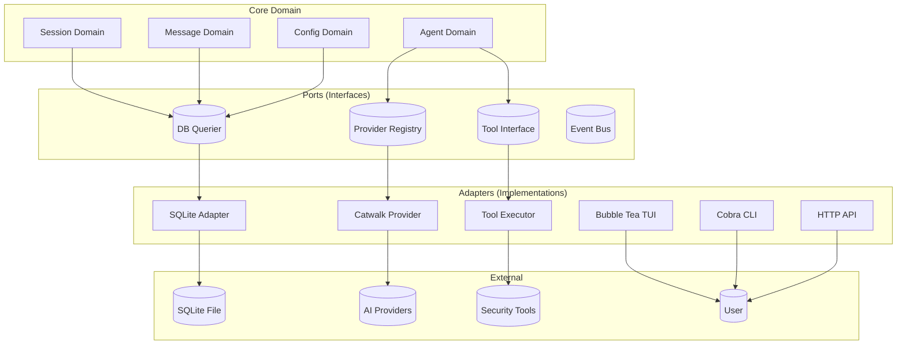
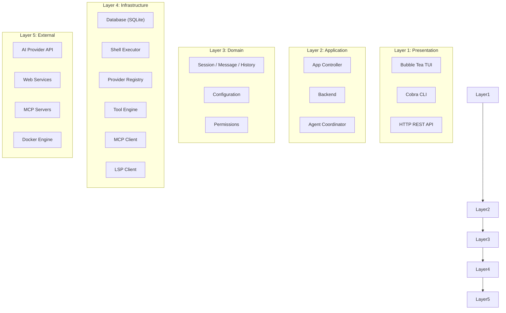
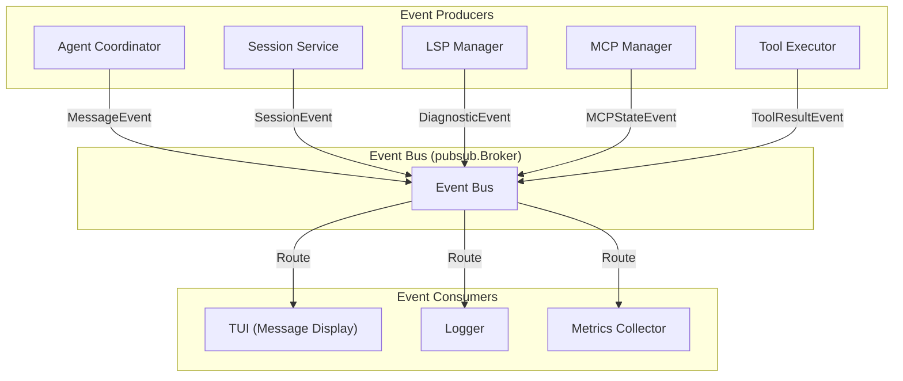
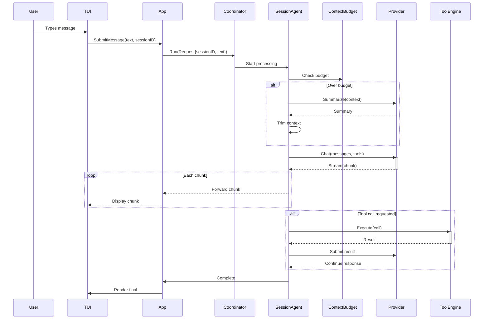
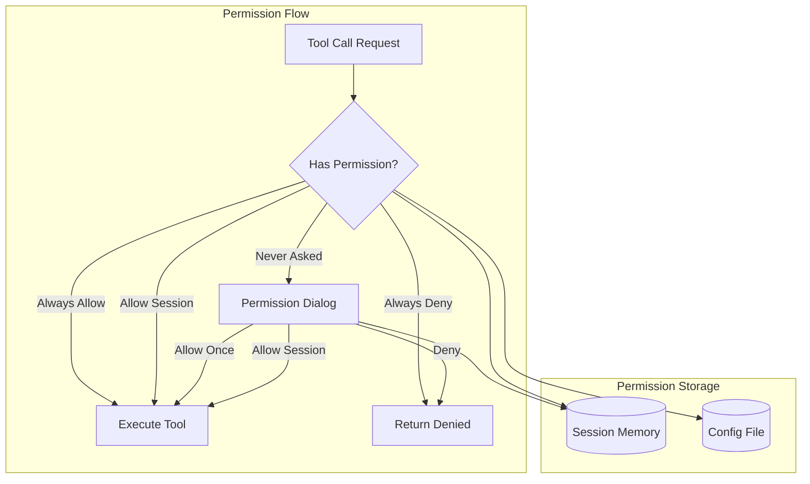
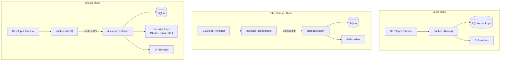

# File: docs/11-architecture.md

# Chapter 11: Architecture

## 11.1 High-Level Architecture

### 11.1.1 Architecture Overview

DuckOps follows a **Hexagonal Architecture (Ports and Adapters)** pattern at its core, combined with **Layered Architecture** for the internal structure. This hybrid approach provides:

1. **Testability**: Core business logic can be tested without external dependencies
2. **Flexibility**: Adapters can be swapped (e.g., different SQLite drivers)
3. **Maintainability**: Clear boundaries between layers
4. **Extensibility**: New providers, tools, and skills can be added via ports



## 11.2 Package Architecture

### 11.2.1 Package Map

```mermaid
graph TB
    subgraph "Entry"
        MAIN["main.go"]
    end

    subgraph "Commands"
        CMD["cmd/"]
    end

    subgraph "App Layer"
        APP["app/"]
        BACKEND["backend/"]
        WORKSPACE["workspace/"]
    end

    subgraph "Domain Services"
        SESSION["session/"]
        MESSAGE["message/"]
        HISTORY["history/"]
        CONFIG["config/"]
        PERM["permission/"]
        FILETRACK["filetracker/"]
    end

    subgraph "Infrastructure"
        DB["db/"]
        SHELL["shell/"]
        LSP["lsp/"]
        SERVER["server/"]
        CLIENT["client/"]
        HOME["home/"]
        FSEXT["fsext/"]
        CSYNC["csync/"]
        PUBSUB["pubsub/"]
    end

    subgraph "Agent System"
        AGENT["agent/"]
        TOOLS["agent/tools/"]
        MCP["agent/tools/mcp/"]
        PROMPT["agent/prompts/"]
        HYPER["agent/hyper/"]
    end

    subgraph "UI"
        UI["ui/"]
        CHAT["ui/chat/"]
        DIALOG["ui/dialog/"]
        MODEL["ui/model/"]
        STYLES["ui/styles/"]
    end

    subgraph "Protocol"
        PROTO["proto/"]
    end

    subgraph "Security"
        SEC["security/"]
        GRAPHX["graphx/"]
    end

    MAIN --> CMD
    CMD --> APP
    CMD --> WORKSPACE --> APP
    CMD --> BACKEND --> APP
    APP --> AGENT
    APP --> SESSION
    APP --> MESSAGE
    APP --> HISTORY
    APP --> CONFIG
    APP --> PERM
    APP --> FILETRACK
    APP --> LSP
    AGENT --> TOOLS
    AGENT --> PROMPT
    AGENT --> HYPER
    TOOLS --> MCP
    TOOLS --> SHELL
    TOOLS --> FSEXT
    SESSION --> DB
    MESSAGE --> DB
    HISTORY --> DB
    CONFIG --> CSYNC
    CONFIG --> HOME
    APP --> PUBSUB
    SERVER --> BACKEND
    CLIENT --> SERVER
    BACKEND --> PROTO
    SESSION --> PROTO
    MESSAGE --> PROTO
    UI --> MODEL
    MODEL --> CHAT
    MODEL --> DIALOG
    MODEL --> STYLES
    SEC --> GRAPHX
```

## 11.3 Component Architecture

### 11.3.1 Core Components

| Layer | Component | Package | Responsibility |
|-------|-----------|---------|----------------|
| **Entry** | Main | main.go | Application startup, CLI execution |
| **Commands** | CLI | cmd/ | Cobra command definitions, flags |
| **Application** | App Controller | app/ | Service wiring, lifecycle management |
| **Application** | Backend | backend/ | Multi-workspace management (server mode) |
| **Application** | Workspace | workspace/ | Local/remote workspace abstraction |
| **Domain** | Session Service | session/ | Session CRUD, todo management |
| **Domain** | Message Service | message/ | Message CRUD, content part handling |
| **Domain** | Config Store | config/ | Configuration loading, resolving, persisting |
| **Domain** | Permission | permission/ | Tool execution authorization |
| **Domain** | File Tracker | filetracker/ | File read/write tracking |
| **Agent** | Coordinator | agent/ | Multi-session agent orchestration |
| **Agent** | Session Agent | agent/ | Single-session AI conversation |
| **Agent** | Tools | agent/tools/ | 35+ built-in tool implementations |
| **Infrastructure** | Database | db/ | SQLite queries (sqlc-generated) |
| **Infrastructure** | Shell | shell/ | Command execution and parsing |
| **Infrastructure** | LSP | lsp/ | Language Server Protocol client |
| **Infrastructure** | Server | server/ | HTTP server over Unix socket |
| **Infrastructure** | Client | client/ | HTTP client for remote server |
| **UI** | Main Model | ui/model/ | Bubble Tea application model |
| **UI** | Chat | ui/chat/ | Message rendering components |
| **UI** | Dialog | ui/dialog/ | Overlay dialog components |
| **UI** | Styles | ui/styles/ | Style definitions and themes |
| **Protocol** | Proto | proto/ | Wire-format type definitions |

### 11.3.2 Component Responsibilities

**App Controller** (`internal/app/app.go`):
- Initializes all services (session, message, history, permission, file tracker)
- Creates the agent coordinator with coder agent
- Starts MCP connections and LSP manager
- Manages graceful shutdown (cancel agents, kill shells, close LSP)
- Bridges application events to the Bubble Tea TUI

**Agent Coordinator** (`internal/agent/coordinator.go`):
- Manages multiple session agents
- Discovers and registers skills
- Handles model configuration updates
- Provides session queuing and cancellation

**Session Agent** (`internal/agent/agent.go`):
- Manages a single conversation session
- Handles context budgeting and auto-summarization
- Executes the agent loop (message -> LLM -> tool -> LLM -> ...)
- Detects and breaks infinite loops
- Auto-repairs malformed tool calls

**Config Store** (`internal/config/store.go`):
- Single entry point for all configuration access
- Loads config from multiple sources with merging
- Provides session-level configuration overrides
- Persists runtime configuration changes
- Handles provider API key management and OAuth

## 11.4 Layered Architecture Details

### 11.4.1 Layer Separation



### 11.4.2 Layer Rules

| Rule | Description | Enforcement |
|------|-------------|-------------|
| **L1** | Presentation depends only on Application | Import validation |
| **L2** | Application depends only on Domain | Interface injection |
| **L3** | Domain depends only on Infrastructure (interfaces) | Dependency inversion |
| **L4** | Infrastructure depends on external libraries | Direct imports |
| **L5** | No layer skips a level | Go import cycle detection |

## 11.5 Event Architecture

### 11.5.1 Event Bus

DuckOps uses an internal pub/sub event bus for cross-component communication:



### 11.5.2 Event Types

| Event Type | Producer | Consumers | Payload |
|------------|----------|-----------|---------|
| MessageEvent | Agent | TUI, Logger | Message struct with content parts |
| SessionEvent | Session | TUI | Session status change |
| ToolResultEvent | Tool Executor | TUI | Tool name, status, output |
| LSPDiagnosticEvent | LSP Manager | TUI | File path, diagnostics list |
| MCPStateEvent | MCP Manager | TUI, Logger | Server ID, connection state |
| ErrorEvent | Any | TUI, Logger | Error message, stack trace |

## 11.6 Data Flow Architecture

### 11.6.1 Request Processing Pipeline



## 11.7 Security Architecture

### 11.7.1 Permission System Architecture



### 11.7.2 Security Boundaries

| Boundary | Trust Level | Access |
|----------|-------------|--------|
| **User Environment** | High | Full filesystem, network |
| **DuckOps Process** | Medium | Workspace files, env vars |
| **AI Provider API** | Low | Prompt/response only |
| **Docker Sandbox** | Low | Scoped to container |
| **MCP Server** | Low | Defined by tool permissions |

## 11.8 Deployment Architecture

See also: Chapter 16 - Docker Architecture

### 11.8.1 Deployment Modes

| Mode | Description | Use Case |
|------|-------------|----------|
| **Local Binary** | Direct execution on host | Daily development |
| **Client/Server** | Unix socket API | Remote workspace, team use |
| **Docker Container** | Sandboxed execution | Security assessments, CI/CD |

### 11.8.2 Deployment Architecture Diagram



---

**END OF CHAPTER 11**
