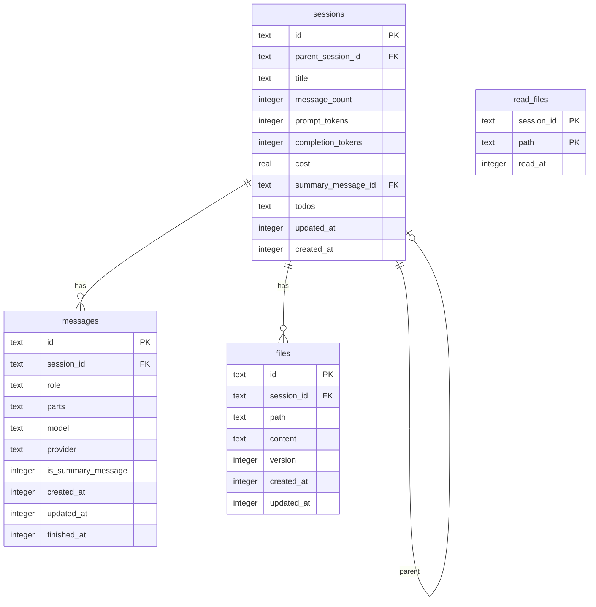
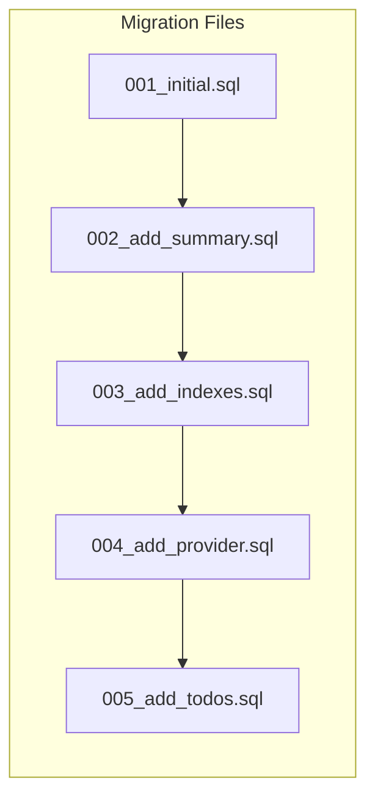

# File: docs/12-database-design.md

# Chapter 12: Database Design

## 12.1 Database Technology

DuckOps uses **SQLite** as its embedded database engine. SQLite was chosen for:

| Feature | Benefit |
|---------|---------|
| **Zero Configuration** | No database server to install, configure, or maintain |
| **Embedded** | Database is a single file in the workspace directory |
| **ACID Compliance** | Full transactional guarantees for data integrity |
| **Cross-Platform** | Works identically on Linux, macOS, Windows |
| **Single-Binary** | No external database driver or server required |
| **Performance** | Excellent read performance for local workloads |
| **SQL Support** | Full SQL query capabilities for complex reporting |

### 12.1.1 SQLite Configuration

| Parameter | Value | Rationale |
|-----------|-------|-----------|
| Journal Mode | WAL (Write-Ahead Logging) | Better concurrent read performance |
| Synchronous | NORMAL | Balance between safety and speed |
| Cache Size | -20000 (20MB) | Keep working set in memory |
| Busy Timeout | 5000ms | Wait for locks up to 5 seconds |
| Foreign Keys | ON | Referential integrity enforcement |
| Temp Store | MEMORY | Faster temporary tables |

## 12.2 Entity-Relationship Diagram



## 12.3 Table Definitions

### 12.3.1 sessions

Stores conversation session metadata.

```sql
CREATE TABLE sessions (
    id                TEXT PRIMARY KEY,
    parent_session_id TEXT REFERENCES sessions(id),
    title             TEXT NOT NULL DEFAULT '',
    message_count     INTEGER NOT NULL DEFAULT 0,
    prompt_tokens     INTEGER NOT NULL DEFAULT 0,
    completion_tokens INTEGER NOT NULL DEFAULT 0,
    cost              REAL NOT NULL DEFAULT 0.0,
    summary_message_id TEXT,
    todos             TEXT,
    updated_at        INTEGER NOT NULL,
    created_at        INTEGER NOT NULL
);

CREATE INDEX idx_sessions_updated_at ON sessions(updated_at DESC);
CREATE INDEX idx_sessions_parent ON sessions(parent_session_id);
CREATE INDEX idx_sessions_created_at ON sessions(created_at DESC);
```

**Column Details:**

| Column | Type | Description | Constraints |
|--------|------|-------------|-------------|
| id | TEXT | UUID v4 or hash-based ID | Primary Key |
| parent_session_id | TEXT | Parent session for branching | FK -> sessions(id), NULLABLE |
| title | TEXT | Auto-generated or user-set title | NOT NULL, DEFAULT '' |
| message_count | INTEGER | Total messages in session | NOT NULL, DEFAULT 0 |
| prompt_tokens | INTEGER | Cumulative prompt tokens | NOT NULL, DEFAULT 0 |
| completion_tokens | INTEGER | Cumulative completion tokens | NOT NULL, DEFAULT 0 |
| cost | REAL | Cumulative cost in USD | NOT NULL, DEFAULT 0.0 |
| summary_message_id | TEXT | Latest summary message | FK -> messages(id) |
| todos | TEXT | JSON-encoded todo list | NULLABLE |
| updated_at | INTEGER | Unix timestamp (seconds) | NOT NULL |
| created_at | INTEGER | Unix timestamp (seconds) | NOT NULL |

### 12.3.2 messages

Stores individual messages within sessions.

```sql
CREATE TABLE messages (
    id                TEXT PRIMARY KEY,
    session_id        TEXT NOT NULL REFERENCES sessions(id) ON DELETE CASCADE,
    role              TEXT NOT NULL,
    parts             TEXT NOT NULL DEFAULT '[]',
    model             TEXT,
    provider          TEXT,
    is_summary_message INTEGER NOT NULL DEFAULT 0,
    created_at        INTEGER NOT NULL,
    updated_at        INTEGER NOT NULL,
    finished_at       INTEGER
);

CREATE INDEX idx_messages_session ON messages(session_id, created_at ASC);
CREATE INDEX idx_messages_created_at ON messages(created_at DESC);
CREATE INDEX idx_messages_model ON messages(model);
```

**Column Details:**

| Column | Type | Description | Constraints |
|--------|------|-------------|-------------|
| id | TEXT | UUID v4 | Primary Key |
| session_id | TEXT | Parent session | FK -> sessions(id), NOT NULL |
| role | TEXT | 'user', 'assistant', 'system', 'tool' | NOT NULL |
| parts | TEXT | JSON array of ContentPart | NOT NULL, DEFAULT '[]' |
| model | TEXT | Model ID that generated this message | NULLABLE |
| provider | TEXT | Provider that generated this message | NULLABLE |
| is_summary_message | INTEGER | Flag for auto-generated summaries | DEFAULT 0 |
| created_at | INTEGER | Unix timestamp | NOT NULL |
| updated_at | INTEGER | Unix timestamp | NOT NULL |
| finished_at | INTEGER | When streaming completed | NULLABLE |

### 12.3.3 files

Tracks file versions created or modified during sessions.

```sql
CREATE TABLE files (
    id         TEXT PRIMARY KEY,
    session_id TEXT NOT NULL REFERENCES sessions(id) ON DELETE CASCADE,
    path       TEXT NOT NULL,
    content    TEXT NOT NULL,
    version    INTEGER NOT NULL DEFAULT 1,
    created_at INTEGER NOT NULL,
    updated_at INTEGER NOT NULL
);

CREATE INDEX idx_files_session ON files(session_id);
CREATE INDEX idx_files_path ON files(path);
CREATE UNIQUE INDEX idx_files_session_path_version 
    ON files(session_id, path, version);
```

**Column Details:**

| Column | Type | Description | Constraints |
|--------|------|-------------|-------------|
| id | TEXT | UUID v4 | Primary Key |
| session_id | TEXT | Parent session | FK -> sessions(id) |
| path | TEXT | Relative file path | NOT NULL |
| content | TEXT | File contents | NOT NULL |
| version | INTEGER | Auto-incrementing version | DEFAULT 1 |
| created_at | INTEGER | Unix timestamp | NOT NULL |
| updated_at | INTEGER | Unix timestamp | NOT NULL |

### 12.3.4 read_files

Tracks which files have been read during a session.

```sql
CREATE TABLE read_files (
    session_id TEXT NOT NULL REFERENCES sessions(id) ON DELETE CASCADE,
    path       TEXT NOT NULL,
    read_at    INTEGER NOT NULL,
    PRIMARY KEY (session_id, path)
);
```

## 12.4 Migration Strategy

DuckOps uses **goose** for database migrations:



### 12.4.1 Migration Files

```sql
-- 001_initial.sql
-- +goose Up
CREATE TABLE sessions ( ... );
CREATE TABLE messages ( ... );
CREATE TABLE files ( ... );
CREATE TABLE read_files ( ... );

-- +goose Down
DROP TABLE IF EXISTS read_files;
DROP TABLE IF EXISTS files;
DROP TABLE IF EXISTS messages;
DROP TABLE IF EXISTS sessions;
```

```sql
-- 002_add_summary_message_id.sql
-- +goose Up
ALTER TABLE sessions ADD COLUMN summary_message_id TEXT;

-- +goose Down
ALTER TABLE sessions DROP COLUMN summary_message_id;
```

### 12.4.2 Migration Execution

Migrations run automatically on application startup:

```go
func connectAndMigrate(ctx context.Context, dbPath string) (*sql.DB, error) {
    db, err := sql.Open("sqlite3", dbPath)
    if err != nil {
        return nil, fmt.Errorf("opening database: %w", err)
    }

    // Run goose migrations
    if err := goose.Up(db, migrationsDir); err != nil {
        return nil, fmt.Errorf("running migrations: %w", err)
    }

    return db, nil
}
```

## 12.5 Query Patterns

### 12.5.1 Generated Queries (sqlc)

All database queries are defined as annotated SQL and generated into Go code by **sqlc**. This provides:

1. **Type Safety**: Go structs are generated from SQL schemas
2. **Compile-Time Checking**: SQL syntax errors are caught at build time
3. **No ORM** overhead or magic
4. **Explicit SQL**: Full control over query performance

**Query Example** (`internal/db/sql/sessions.sql`):

```sql
-- name: CreateSession :one
INSERT INTO sessions (
    id, parent_session_id, title, message_count,
    prompt_tokens, completion_tokens, cost,
    summary_message_id, updated_at, created_at
) VALUES (
    ?, ?, ?, ?, ?, ?, ?, null,
    strftime('%s', 'now'), strftime('%s', 'now')
) RETURNING *;

-- name: GetSessionByID :one
SELECT * FROM sessions WHERE id = ? LIMIT 1;

-- name: ListSessions :many
SELECT * FROM sessions
WHERE parent_session_id IS NULL
ORDER BY updated_at DESC;

-- name: UpdateSession :one
UPDATE sessions SET
    title = ?, prompt_tokens = ?, completion_tokens = ?,
    summary_message_id = ?, cost = ?, todos = ?
WHERE id = ? RETURNING *;

-- name: DeleteSession :exec
DELETE FROM sessions WHERE id = ?;
```

**Generated Go Code** (simplified):

```go
// Querier interface defines all query methods
type Querier interface {
    CreateSession(ctx context.Context, arg CreateSessionParams) (Session, error)
    GetSessionByID(ctx context.Context, id string) (Session, error)
    ListSessions(ctx context.Context) ([]Session, error)
    UpdateSession(ctx context.Context, arg UpdateSessionParams) (Session, error)
    DeleteSession(ctx context.Context, id string) error
}

// CreateSessionParams holds the parameters for CreateSession
type CreateSessionParams struct {
    ID              string
    ParentSessionID sql.NullString
    Title           string
    MessageCount    int64
    PromptTokens    int64
    CompletionTokens int64
    Cost            float64
}
```

### 12.5.2 Prepared Statements

For performance, all queries are prepared at startup:

```go
type Queries struct {
    db                DBTX
    createSessionStmt *sql.Stmt
    getSessionStmt    *sql.Stmt
    listSessionsStmt  *sql.Stmt
    // ... one per query
}

func Prepare(ctx context.Context, db DBTX) (*Queries, error) {
    q := Queries{db: db}
    var err error
    q.createSessionStmt, err = db.PrepareContext(ctx, createSession)
    // ...
    return &q, nil
}
```

## 12.6 Performance Considerations

### 12.6.1 Index Strategy

| Table | Index | Type | Purpose |
|-------|-------|------|---------|
| sessions | idx_sessions_updated_at | B-Tree DESC | Session listing (most recent first) |
| sessions | idx_sessions_created_at | B-Tree DESC | Session listing by creation date |
| sessions | idx_sessions_parent | B-Tree | Parent-child session traversal |
| messages | idx_messages_session | B-Tree ASC | Session message loading |
| messages | idx_messages_created_at | B-Tree DESC | Recent messages query |
| messages | idx_messages_model | B-Tree | Model usage analytics |
| files | idx_files_session | B-Tree | Session file listing |
| files | idx_files_path | B-Tree | File path lookup |
| files | idx_files_session_path_version | UNIQUE | Version uniqueness |

### 12.6.2 Query Performance Targets

| Query | Expected Rows | Target Time | Index Used |
|-------|--------------|-------------|------------|
| List sessions (last 50) | 50 | <5ms | idx_sessions_updated_at |
| Load session messages | 1000 | <20ms | idx_messages_session |
| Get file by path | 10 | <5ms | idx_files_path |
| Count by model | 10000 | <50ms | idx_messages_model |
| Session token sum | 5000 | <10ms | idx_sessions_updated_at |

---

**END OF CHAPTER 12**
