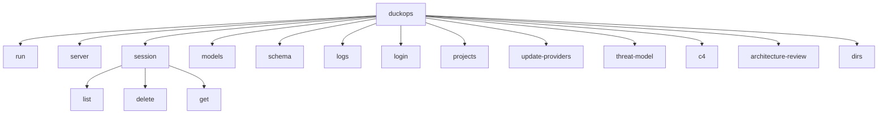

# File: docs/13-api-design.md

# Chapter 13: API Design

## 13.1 API Overview

DuckOps exposes two API surfaces:

1. **CLI API** (via Cobra commands) — Primary user interface
2. **HTTP REST API** (via Unix domain socket) — Programmatic access in client/server mode

## 13.2 CLI API

### 13.2.1 Command Structure



### 13.2.2 Global Flags

| Flag | Shorthand | Type | Default | Description |
|------|-----------|------|---------|-------------|
| `--cwd` | `-c` | string | `.` | Working directory |
| `--data-dir` | `-D` | string | `.duckops` | Data directory |
| `--debug` | `-d` | bool | false | Debug mode |
| `--host` | `-h` | bool | false | Client/server mode (connect to daemon) |
| `--session` | `-s` | string | - | Session ID (resume or create) |
| `--continue` | `-C` | bool | false | Continue from last session |
| `--yolo` | `-y` | bool | false | Approve all permission requests |

### 13.2.3 Command Details

**`duckops run [prompt...]`**

Non-interactive execution. Sends a prompt and streams response to stdout.

| Flag | Type | Default | Description |
|------|------|---------|-------------|
| `--model` / `-m` | string | - | Model override (format: `provider/model` or just `model`) |
| `--output` / `-o` | string | - | Output format: `text`, `json`, `markdown` |
| `--small` | string | - | Small model override |
| `--provider` | string | - | Provider override |

Examples:
```bash
# Basic usage
duckops run "Explain this codebase"

# With model override
duckops run -m claude-opus-4-8-fast "Review this function"

# Continue from last session
duckops -C run "Continue the refactoring"

# Pipe input
echo "Fix this code" | duckops run
```

**`duckops server`**

Starts the DuckOps server for client/server mode.

| Flag | Type | Default | Description |
|------|------|---------|-------------|
| `--host` | string | - | Network host to bind (empty = Unix socket only) |
| `--port` | int | 48080 | Network port |
| `--timeout` | duration | 5m | Session timeout |

**`duckops session`**

Session management commands.

```bash
# List all sessions
duckops session list

# Get session details
duckops session get <id>

# Delete session
duckops session delete <id>
```

## 13.3 HTTP REST API (Unix Socket)

### 13.3.1 Transport

The API is served over a **Unix domain socket** (or named pipe on Windows) located at:

| Platform | Path |
|----------|------|
| Linux | `/run/user/<uid>/duckops.sock` or `$TMPDIR/duckops.sock` |
| macOS | `$TMPDIR/duckops.sock` |
| Windows | `\\.\pipe\duckops` |

### 13.3.2 API Endpoints

| Method | Path | Description |
|--------|------|-------------|
| GET | `/v1/workspaces` | List workspaces |
| POST | `/v1/workspaces` | Create workspace |
| DELETE | `/v1/workspaces/{id}` | Delete workspace |
| GET | `/v1/workspaces/{id}` | Get workspace info |
| POST | `/v1/workspaces/{id}/config` | Set config field |
| DELETE | `/v1/workspaces/{id}/config` | Remove config field |
| POST | `/v1/workspaces/{id}/sessions` | Create session |
| GET | `/v1/workspaces/{id}/sessions` | List sessions |
| POST | `/v1/workspaces/{id}/sessions/{sid}/messages` | Send message |
| GET | `/v1/workspaces/{id}/sessions/{sid}/messages` | List messages |
| GET | `/v1/workspaces/{id}/agent` | Get agent info |
| POST | `/v1/workspaces/{id}/agent/prompt` | Send agent prompt |
| POST | `/v1/workspaces/{id}/agent/cancel` | Cancel agent |
| GET | `/v1/workspaces/{id}/events` | SSE event stream |
| GET | `/v1/version` | Version info |

### 13.3.3 Request/Response Formats

**Create Workspace:**

```json
POST /v1/workspaces
{
    "id": "my-project",
    "path": "/home/user/projects/my-project",
    "config": {}
}

Response 201:
{
    "id": "my-project",
    "path": "/home/user/projects/my-project",
    "config": {}
}
```

**Send Message:**

```json
POST /v1/workspaces/{id}/sessions/{sid}/messages
{
    "role": "user",
    "parts": [
        {"type": "text", "text": "Explain the architecture"}
    ]
}

Response 200 (streaming SSE):
event: token
data: {"type": "text", "text": "The architecture follows..."}

event: done
data: {}
```

**Agent Prompt:**

```json
POST /v1/workspaces/{id}/agent/prompt
{
    "prompt": "Find security vulnerabilities in the codebase",
    "session_id": "sess_abc123"
}

Response 200 (streaming SSE):
event: token
data: {"type": "text", "text": "Running security scan..."}

event: tool_call
data: {"type": "tool_call", "name": "bash", "input": {"command": "nuclei -u ..."}}

event: token
data: {"type": "text", "text": "Found 5 vulnerabilities..."}

event: done
data: {}
```

### 13.3.4 Event Stream Format

The API uses **Server-Sent Events (SSE)** for streaming responses:

```text
event: token
data: {"type": "text", "text": "Hello"}

event: tool_call
data: {"type": "tool_call", "name": "read_file", "input": {"path": "main.go"}}

event: tool_result
data: {"type": "tool_result", "tool_call_id": "call_123", "content": "package main..."}

event: error
data: {"type": "error", "error": "provider rate limited"}

event: done
data: {}
```

**Event Types:**

| Event | Description | Data Schema |
|-------|-------------|-------------|
| `token` | Response token stream | ContentPart |
| `tool_call` | AI requests tool execution | ToolCall |
| `tool_result` | Tool execution result | ToolResult |
| `error` | Error occurred | Error object |
| `done` | Processing complete | Empty |
| `progress` | Progress update | Progress object |

## 13.4 Protocol Types (Proto Package)

The `internal/proto/` package defines all wire-format types shared between server and client.

### 13.4.1 Session Protocol

```go
type Session struct {
    ID               string  `json:"id"`
    ParentSessionID  string  `json:"parent_session_id"`
    Title            string  `json:"title"`
    MessageCount     int64   `json:"message_count"`
    PromptTokens     int64   `json:"prompt_tokens"`
    CompletionTokens int64   `json:"completion_tokens"`
    SummaryMessageID string  `json:"summary_message_id"`
    Cost             float64 `json:"cost"`
    CreatedAt        int64   `json:"created_at"`
    UpdatedAt        int64   `json:"updated_at"`
}
```

### 13.4.2 Message Protocol

```go
type Message struct {
    ID        string `json:"id"`
    SessionID string `json:"session_id"`
    Role      string `json:"role"`
    Parts     string `json:"parts"`  // JSON-encoded ContentPart array
    Model     string `json:"model,omitempty"`
    Provider  string `json:"provider,omitempty"`
    CreatedAt int64  `json:"created_at"`
    UpdatedAt int64  `json:"updated_at"`
    FinishedAt int64 `json:"finished_at,omitempty"`
}

// ContentPart is serialized with type discriminator:
// {"type": "text", "text": "..."}
// {"type": "tool_call", "id": "...", "name": "...", "input": {...}}
// {"type": "tool_result", "tool_call_id": "...", "content": "..."}
```

### 13.4.3 Tool Protocol

```go
type ToolParams struct {
    Command string `json:"command,omitempty"`
    Path    string `json:"path,omitempty"`
    Content string `json:"content,omitempty"`
    Pattern string `json:"pattern,omitempty"`
    URL     string `json:"url,omitempty"`
    // ... 50+ fields for different tools
}

type ToolResponse struct {
    Type    ToolResponseType `json:"type"`
    Content []ContentPart    `json:"content"`
    Error   string           `json:"error,omitempty"`
}
```

## 13.5 Internal API (Go Interfaces)

### 13.5.1 Service Interfaces

```go
// Session Service
type sessionService interface {
    Create(ctx context.Context, title string) (Session, error)
    Get(ctx context.Context, id string) (Session, error)
    List(ctx context.Context) ([]Session, error)
    Save(ctx context.Context, session Session) (Session, error)
    Delete(ctx context.Context, id string) error
}

// Message Service
type messageService interface {
    Create(ctx context.Context, params CreateMessageParams) (Message, error)
    Get(ctx context.Context, id string) (Message, error)
    List(ctx context.Context, sessionID string) ([]Message, error)
    Delete(ctx context.Context, id string) error
}

// Agent Coordinator
type agentCoordinator interface {
    Run(ctx context.Context, req Request) error
    Cancel(sessionID string)
    IsSessionBusy(sessionID string) bool
}

// Config Store
type configStore interface {
    Config() *Config
    SetConfigField(path string, value interface{}) error
    RemoveConfigField(path string) error
}
```

### 13.5.2 Tool Interface

```go
// All tools implement this interface
type Tool interface {
    Name() string
    Description() string
    ParameterSchema() jsonschema.Schema
    Execute(ctx context.Context, params json.RawMessage) (ToolResult, error)
}
```

## 13.6 Authentication

### 13.6.1 API Authentication

Unix socket API uses **Bearer token** authentication stored at `~/.duckops/tool-server.token`:

```text
Authorization: Bearer <random-64-char-hex-token>
```

### 13.6.2 Provider Authentication

AI provider API keys are passed via **environment variables**:

| Provider | Variable |
|----------|----------|
| OpenAI | OPENAI_API_KEY |
| Anthropic | ANTHROPIC_API_KEY |
| Google Gemini | GEMINI_API_KEY |
| OpenRouter | OPENROUTER_API_KEY |
| Azure OpenAI | AZURE_OPENAI_API_KEY, AZURE_OPENAI_ENDPOINT |
| AWS Bedrock | AWS_ACCESS_KEY_ID, AWS_SECRET_ACCESS_KEY |

---

**END OF CHAPTER 13**
