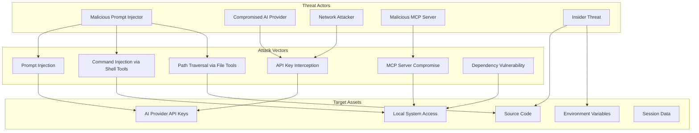
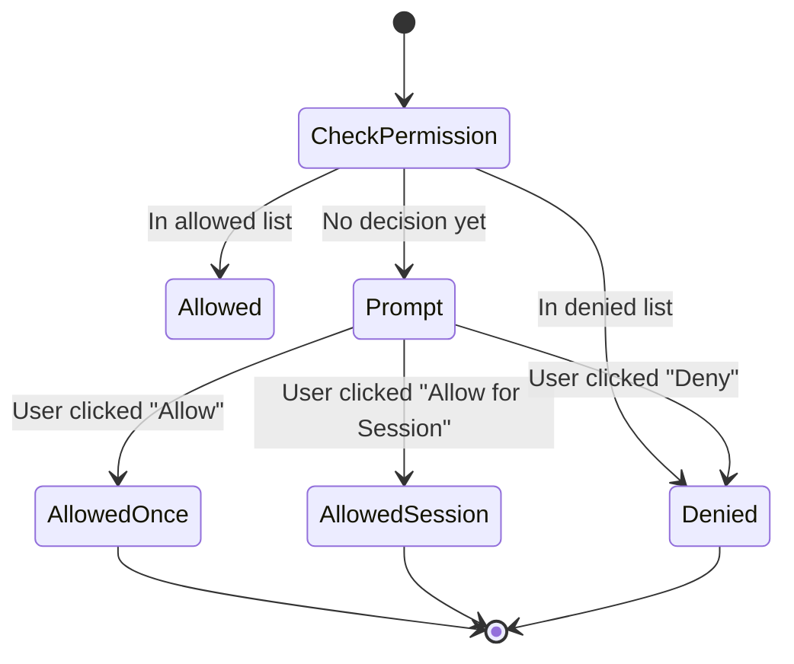
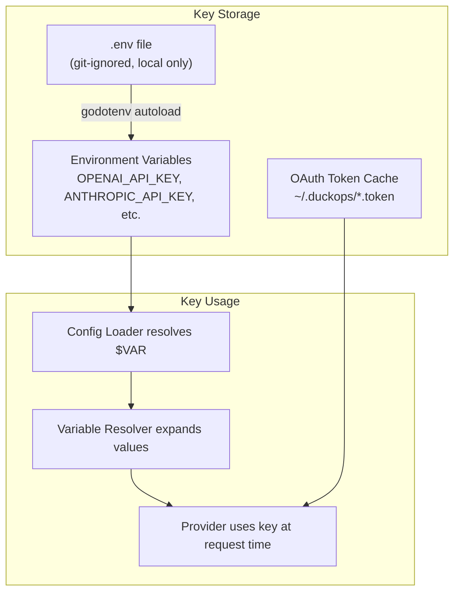
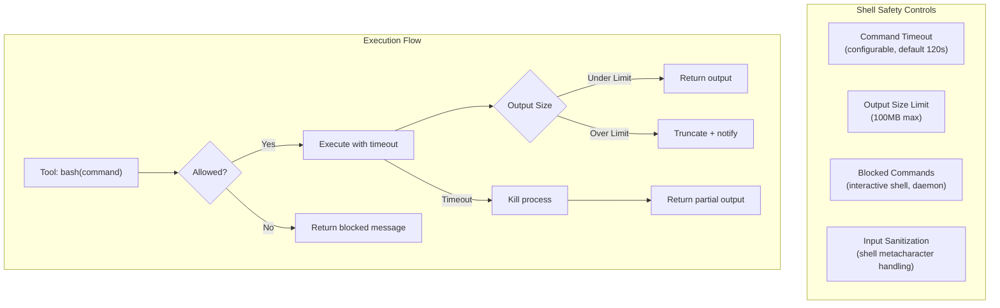
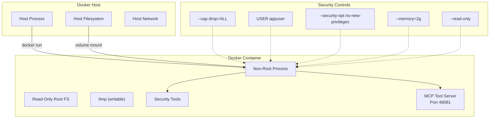
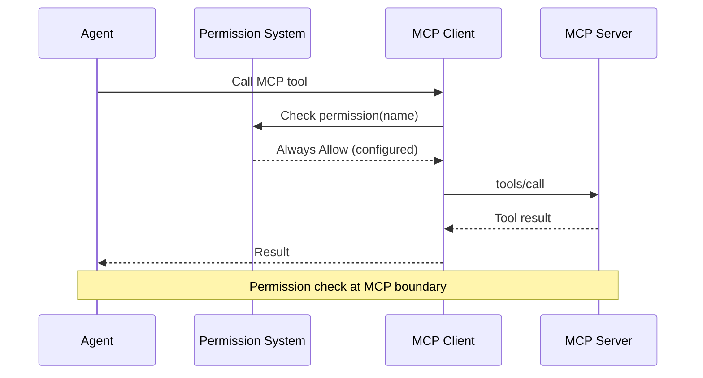

# File: docs/14-security-design.md

# Chapter 14: Security Design

## 14.1 Security Philosophy

DuckOps follows a **defense-in-depth** security strategy, implementing multiple layers of security controls:

1. **Preventive Controls**: Stop security issues before they occur
2. **Detective Controls**: Identify security events in progress
3. **Corrective Controls**: Respond to and recover from security events
4. **Deterrent Controls**: Discourage potential attackers

## 14.2 Threat Model

### 14.2.1 Threat Landscape



### 14.2.2 STRIDE Analysis

| Threat Category | Description | Risk | Mitigation |
|-----------------|-------------|------|------------|
| **S**poofing | Impersonating a legitimate provider or user | Medium | API key rotation, Bearer token auth |
| **T**ampering | Modifying session data or configuration | Medium | SQLite ACID, config validation |
| **R**epudiation | Denying tool execution or message sending | Low | Audit logging, session persistence |
| **I**nformation Disclosure | Leaking source code or credentials via tool output | High | Permission system, secret scanning |
| **D**enial of Service | Exhausting API quota or filling disk with logs | Medium | Rate limiting, log rotation |
| **E**levation of Privilege | Escaping sandbox or bypassing permissions | High | Permission system, non-root Docker |

## 14.3 Security Controls

### 14.3.1 Permission System



**Permission Levels:**

| Level | Behavior | Duration | Use Case |
|-------|----------|----------|----------|
| **Always Allow** | Execute without prompt | Permanent | Read-only tools (view, grep, glob) |
| **Allow Once** | Execute, prompt next time | Single execution | Higher-risk tools |
| **Allow Session** | Execute without prompt for session | Session lifetime | Tools needed for current task |
| **Always Deny** | Block execution | Permanent | Dangerous tools never used |
| **Ask (Default)** | Show permission dialog | - | All tools not explicitly configured |

**Default Tool Permissions:**

| Tool | Default Permission | Rationale |
|------|--------------------|-----------|
| Read (view, grep, glob, ls) | Always Allow | Read-only, low risk |
| Write (write, edit) | Ask | Can modify files |
| Execute (bash) | Ask | Can run arbitrary commands |
| Web (fetch, search) | Always Allow | Read-only data access |
| Security (nuclei, nmap) | Ask | Network reconnaissance |
| Delete (delete file) | Ask | Destructive operation |

### 14.3.2 API Key Management

**Principle**: API keys are **never** stored in configuration files or committed to version control.



**Key Protection Mechanisms:**

| Mechanism | Implementation |
|-----------|----------------|
| **Environment Variables** | Keys read from OS environment at runtime |
| **OAuth Tokens** | Stored in `~/.duckops/` with 0600 permissions |
| **Log Masking** | All env var values are masked in debug logs |
| **Memory Safety** | Keys are strings (Go GC handles cleanup) |
| **No Persistence** | Keys never written to SQLite or config JSON |

### 14.3.3 Shell Execution Safety



**Blocked Commands:**

| Category | Examples | Reason |
|----------|----------|--------|
| Interactive | `vim`, `nano`, `less`, `more` | Would hang waiting for input |
| Daemon | `systemctl`, `service` | Background process management |
| Network Servers | `nc -l`, `python -m http.server` | Opening ports |
| Window Managers | `tmux`, `screen` | Terminal multiplexer conflict |

### 14.3.4 File System Safety

**Path Traversal Prevention:**

```go
// SafePath validates that the resolved path is within the workspace
func SafePath(workspaceDir, requestedPath string) (string, error) {
    // Clean the path to prevent traversal via ../..
    clean := filepath.Clean(filepath.Join(workspaceDir, requestedPath))
    
    // Verify the resolved path is within workspace
    if !strings.HasPrefix(clean, workspaceDir) {
        return "", fmt.Errorf("path traversal detected: %s", requestedPath)
    }
    
    return clean, nil
}
```

**File Operation Safety:**

| Control | Implementation |
|---------|----------------|
| **Path Cleaning** | All paths cleaned with `filepath.Clean` |
| **Workspace Boundary** | All file operations restricted to workspace directory |
| **Symlink Safety** | Symlinks resolved and checked against workspace boundary |
| **Glob Safety** | Glob patterns restricted to workspace tree |
| **File Size Limits** | Read operations capped at configurable limit (default 100MB) |
| **Binary Detection** | Binary files detected and displayed as hex/omitted |

## 14.4 Container Security (Docker Sandbox)

See also: Chapter 16 - Docker Architecture

### 14.4.1 Docker Security Controls

| Control | Implementation |
|---------|----------------|
| **Non-Root User** | Container runs as `appuser:appgroup` |
| **Read-Only Root** | Container filesystem is read-only (except /tmp) |
| **No Privileges** | `--security-opt no-new-privileges` |
| **Capability Drop** | All capabilities dropped except `NET_RAW` (for Nmap) |
| **Seccomp Profile** | Default Docker seccomp profile limits syscalls |
| **Memory Limit** | Container memory capped at 2GB |
| **CPU Limit** | Container CPU limited to 2 cores |
| **Network Restriction** | Outbound only, no inbound (except MCP server) |

### 14.4.2 Docker Security Architecture



## 14.5 MCP Security

### 14.5.1 MCP Server Trust

| Risk | Mitigation |
|------|------------|
| **Malicious MCP Server** | MCP servers must be explicitly configured by user |
| **Data Exfiltration via MCP** | Tool permission system applies to MCP tools |
| **MCP Protocol Injection** | Input validation on all MCP tool parameters |
| **Server Impersonation** | Optional API key authentication for MCP |
| **Resource Access** | MCP resource access limited by permission system |

### 14.5.2 MCP Permission Flow



## 14.6 Audit Logging

### 14.6.1 Audit Events

All security-relevant events are logged with the following structure:

```go
type AuditEvent struct {
    Timestamp   time.Time
    EventType   string   // "tool_execution", "permission_decision", "config_change"
    UserID      string   // Session ID or user identifier
    ToolName    string   // Name of the tool or operation
    Action      string   // "allowed", "denied", "executed"
    Target      string   // File path, URL, command
    Result      string   // "success", "failure", "blocked"
    Duration    time.Duration
}
```

### 14.6.2 Log Storage

| Log Type | Location | Retention | Format |
|----------|----------|-----------|--------|
| Application Logs | `.duckops/logs/` | 30 days (rotated) | JSON structured (slog) |
| Audit Trail | SQLite messages table | Forever (session persistence) | JSON in message parts |
| Tool Server Logs | `~/.duckops/tool-server-logs/` | 7 days | Plain text |

## 14.7 Secure Configuration

### 14.7.1 Configuration File Security

| File | Permissions | Content |
|------|-------------|---------|
| `~/.duckops/duckops.json` | 0600 | Global config (no secrets) |
| `.duckops/duckops.json` | 0600 | Project config (no secrets) |
| `~/.duckops/tool-server.token` | 0600 | API access token (auto-generated) |
| `.env` | 0600 | Environment variables with API keys |

### 14.7.2 OAuth Token Storage

OAuth tokens for GitHub Copilot and Hyper providers are cached in `~/.duckops/` with 0600 permissions. Tokens are encrypted at rest using OS-level encryption where available (macOS Keychain, Linux keyring).

---

**END OF CHAPTER 14**
