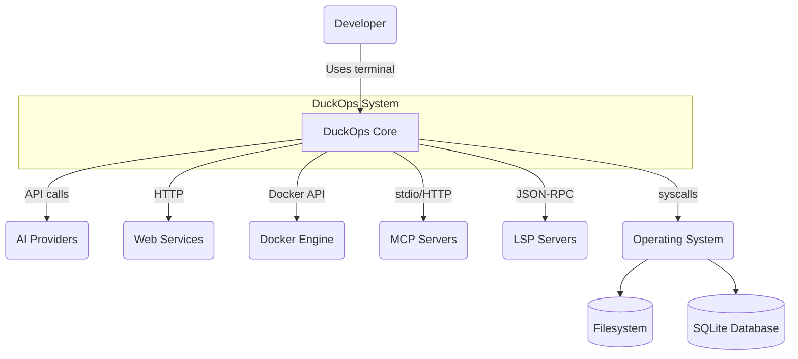
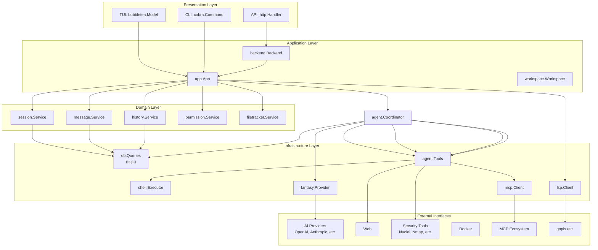
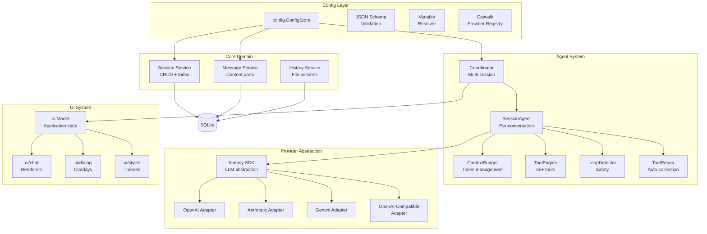
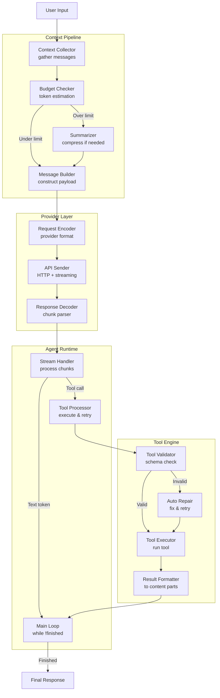
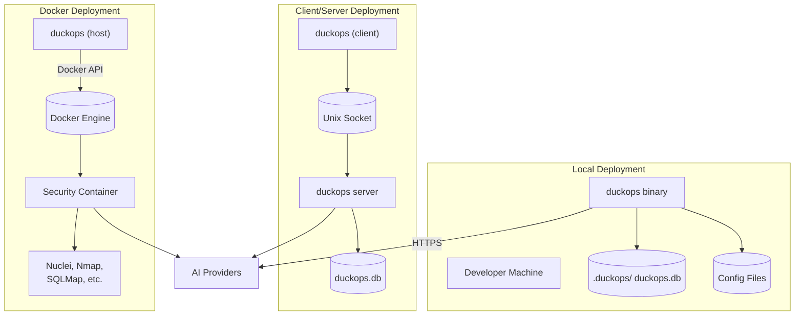
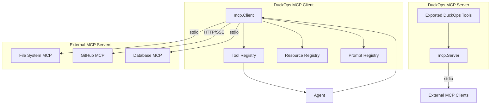

# File: docs/diagrams/architecture.md

# Architecture Diagrams

## System Context Diagram

## Layered Architecture

## Component Architecture

## Agent Architecture

## Deployment Architecture

## MCP Architecture

---

*These diagrams are referenced from the main documentation chapters.*
