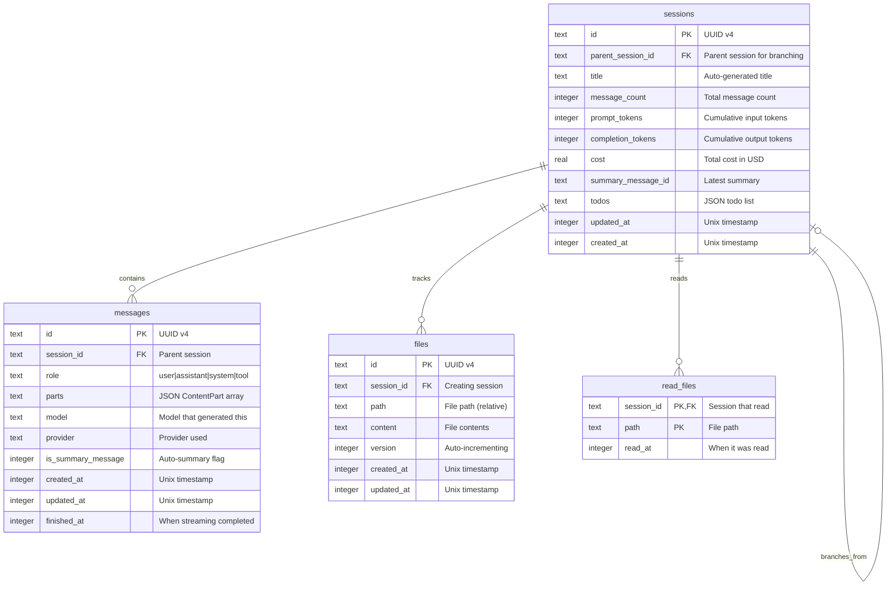
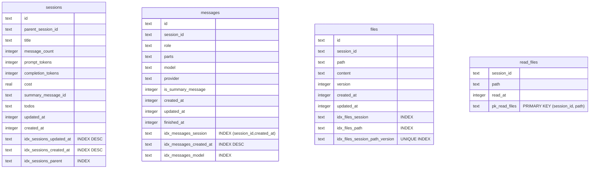
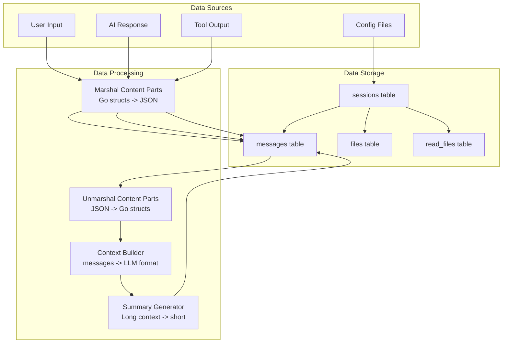
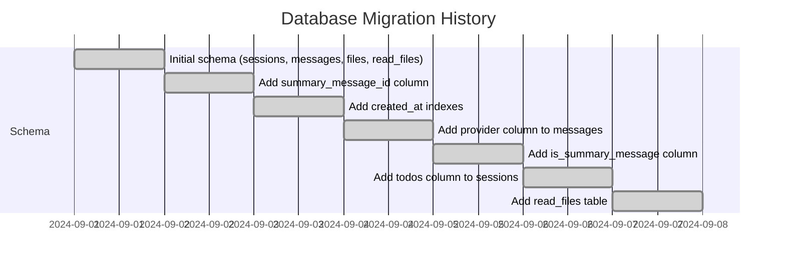
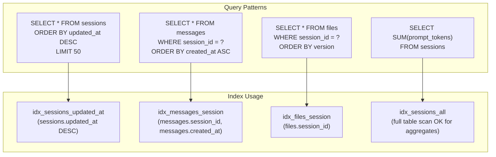

# File: docs/diagrams/erd.md

# Entity-Relationship Diagrams

## Main ERD

## Physical Data Model

## Data Flow Diagram

## Migration Timeline

## Index Strategy Visualization

---

*Referenced from Chapter 12: Database Design*
