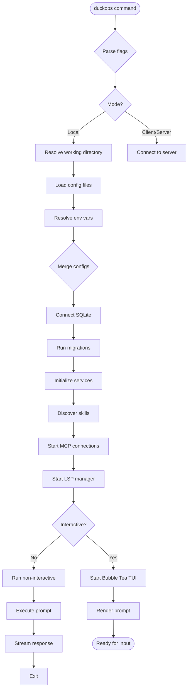
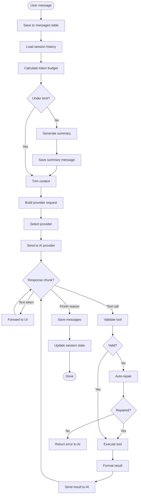
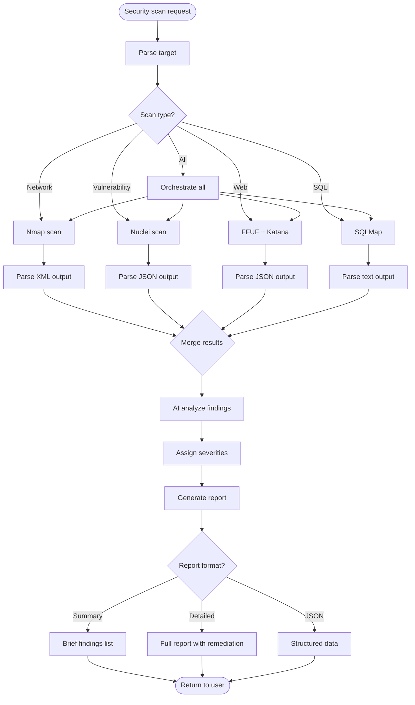
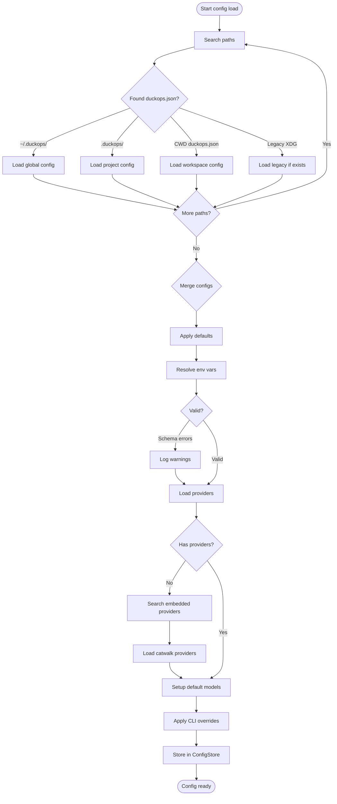
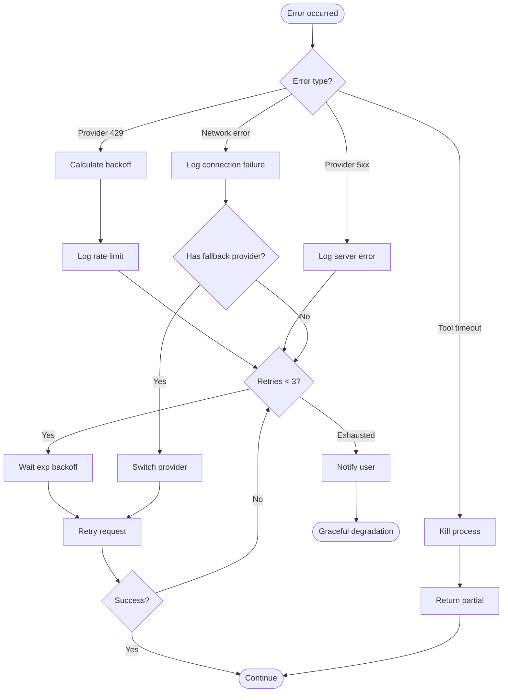

# File: docs/diagrams/flowcharts.md

# Process Flowcharts

## Application Startup Flow



## Message Processing Flow



## Security Scan Flow



## Tool Execution Flow

```mermaid
flowchart TD
    A([Tool call from AI]) --> B{Name recognized?}
    B -->|Unknown| C[Return error: unknown tool]
    B -->|Known| D{Has permission?}
    D -->|Default (Ask)| E[Show permission dialog]
    E --> F{User choice?}
    F -->|Allow Once| H[Execute]
    F -->|Allow Session| G[Cache permission]
    G --> H
    F -->|Deny| I[Return error: denied]
    D -->|Always Allow| H
    D -->|Always Deny| I
    
    H --> J{Input valid?}
    J -->|Schema error| K[Auto-repair input]
    K --> L{Repair succeeded?}
    L -->|Yes| H
    L -->|No| M[Return error: invalid]
    J -->|Valid| N[Execute with timeout]
    
    N --> O{Result?}
    O -->|Success| P[Format output]
    O -->|Timeout| Q[Kill process]
    Q --> R[Return partial output]
    O -->|Error| S{Retry?}
    S -->|Yes| T[Wait + retry]
    T --> N
    S -->|No| U[Return error]
    
    P --> V[Track file version]
    V --> W([Return to agent])
    R --> W
    U --> W
```

## Configuration Loading Flow



## Error Recovery Flow



---

*Referenced from Chapters 6, 8, 9, 10*
