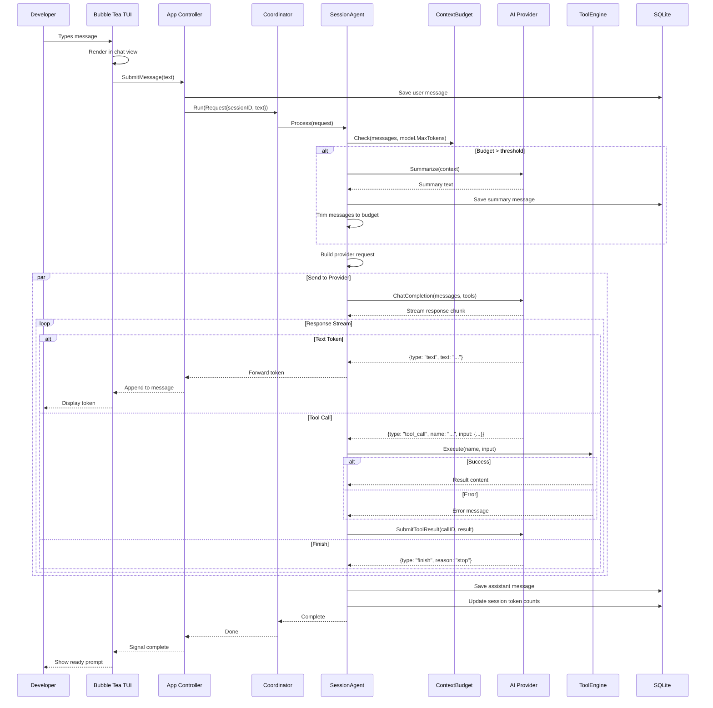
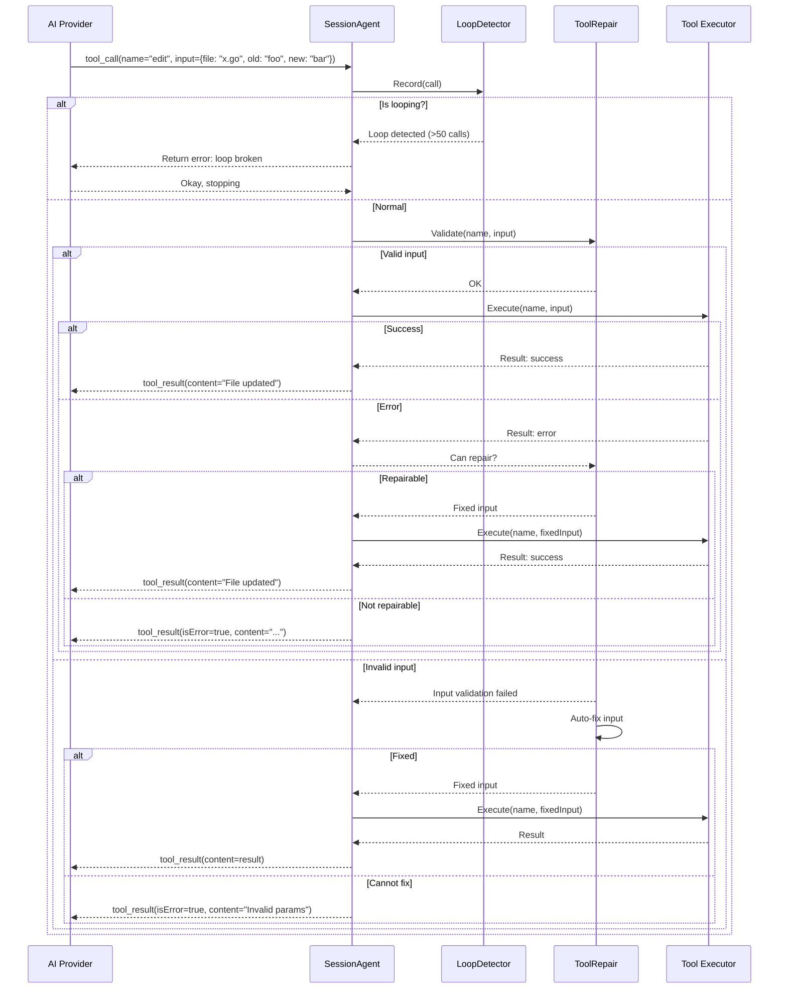
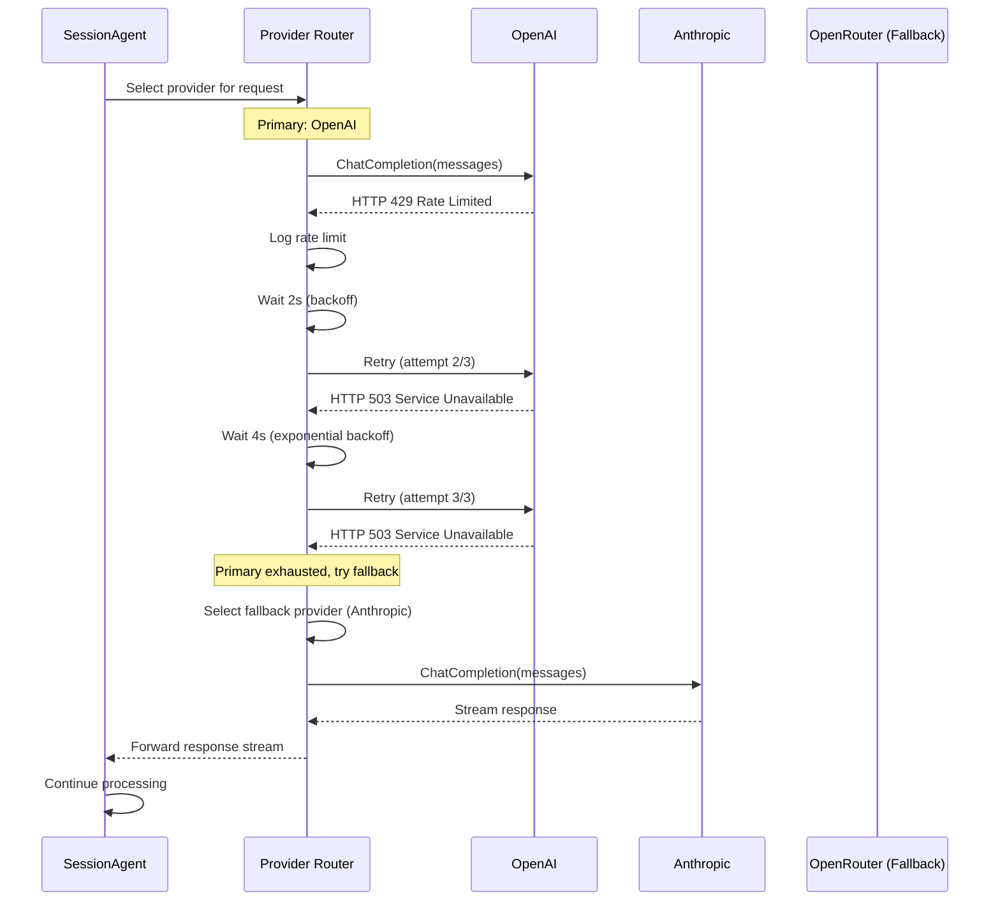
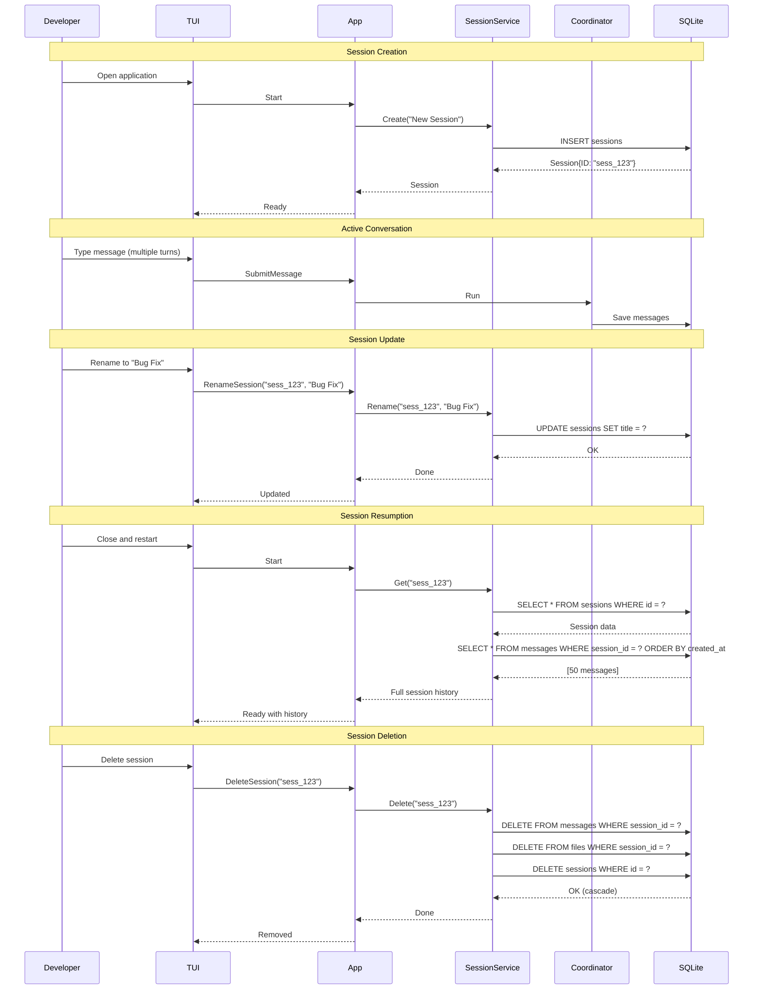
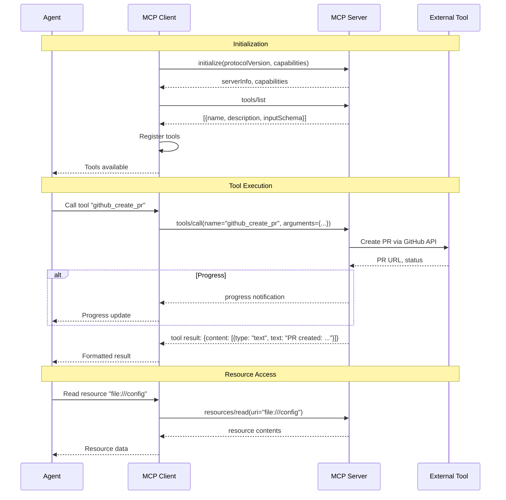
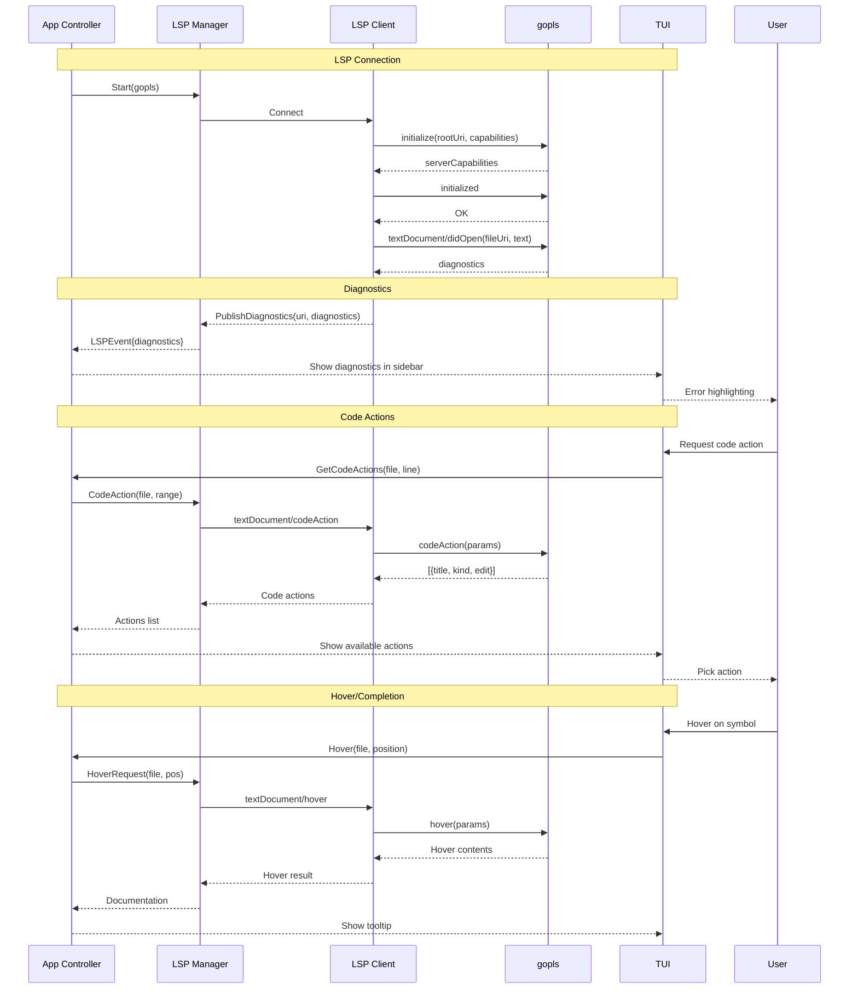
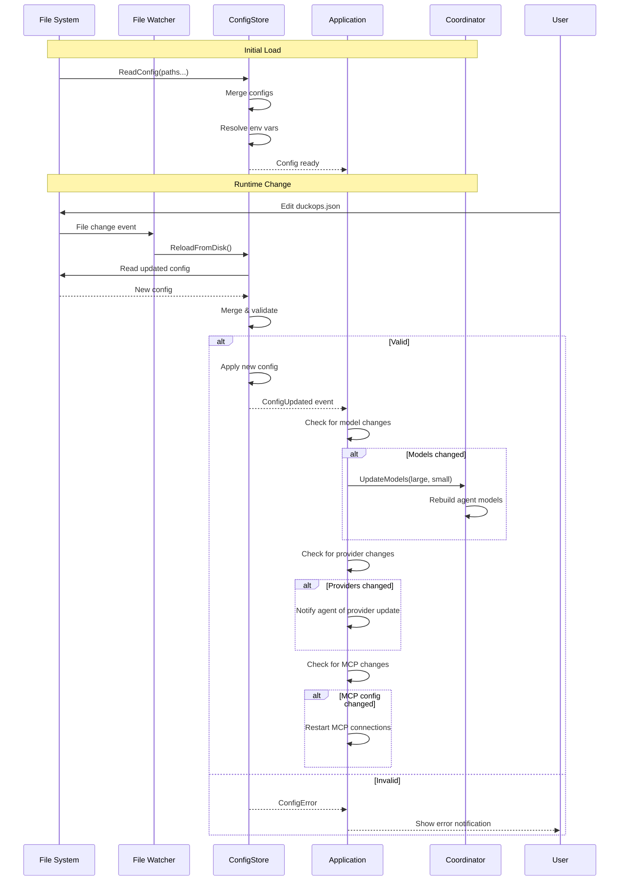

# File: docs/diagrams/sequence-diagrams.md

# Sequence Diagrams

## Full Conversation Flow

## Tool Call with Auto-Repair

## Provider Failover Flow

## Session Lifecycle

## MCP Tool Execution

## LSP Integration Flow

## Configuration Reload Flow

---

*Referenced from Chapters 9, 10, 11*
