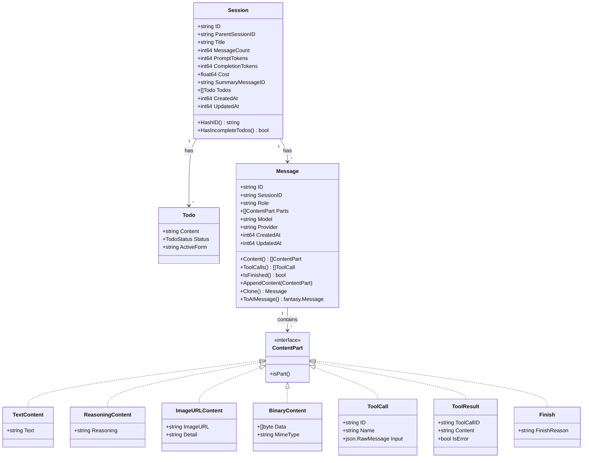
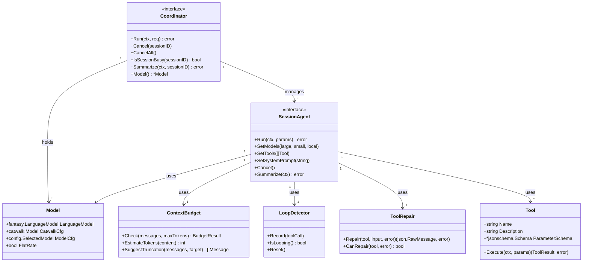
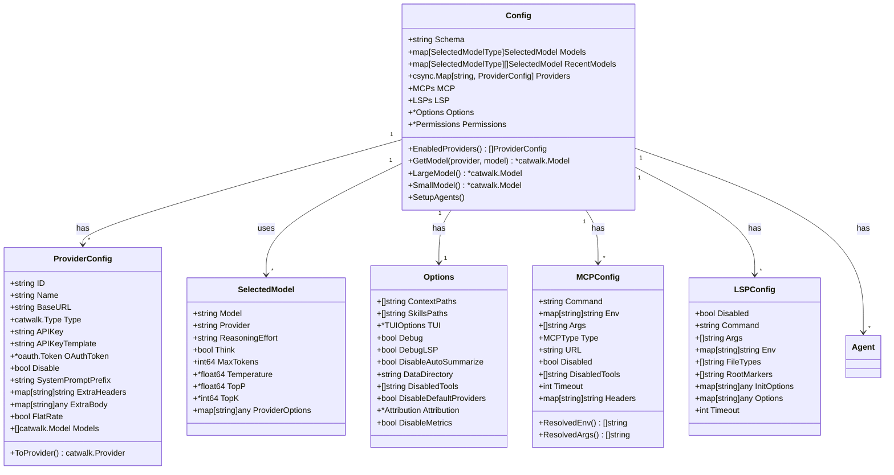
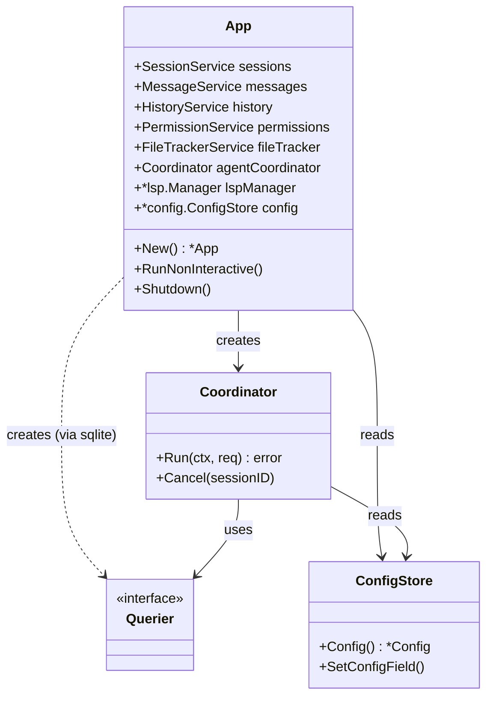

# File: docs/diagrams/uml.md

# UML Diagrams

## Class Diagram: Core Domain Models

## Class Diagram: Service Layer

```mermaid
classDiagram
    class SessionService {
        <<interface>>
        +Create(ctx, title) (Session, error)
        +Get(ctx, id) (Session, error)
        +List(ctx) ([]Session, error)
        +Save(ctx, session) (Session, error)
        +Delete(ctx, id) error
        +UpdateTitleAndUsage(ctx, id, title, tokens, cost) error
    }

    class MessageService {
        <<interface>>
        +Create(ctx, params) (Message, error)
        +Get(ctx, id) (Message, error)
        +List(ctx, sessionID) ([]Message, error)
        +Delete(ctx, id) error
        +DeleteSessionMessages(ctx, sessionID) error
    }

    class HistoryService {
        <<interface>>
        +Create(ctx, path, content, sessionID) (File, error)
        +CreateVersion(ctx, path, content, sessionID) (File, error)
        +Get(ctx, id) (File, error)
        +ListBySession(ctx, sessionID) ([]File, error)
        +Delete(ctx, id) error
    }

    class ConfigStore {
        +Config() *Config
        +SetConfigField(path string, value any) error
        +RemoveConfigField(path string) error
        +UpdatePreferredModel(modelType, provider, model) error
        +SetProviderAPIKey(provider, key) error
        +ReloadFromDisk(ctx) error
    }

    class PermissionService {
        +Check(ctx, toolName, input) (PermissionResult, error)
        +Grant(decision, toolName, sessionID)
        +SetSkip(skip bool)
    }

    class FileTrackerService {
        <<interface>>
        +RecordRead(ctx, sessionID, path) error
        +LastReadTime(ctx, sessionID, path) (int64, error)
        +ListReadFiles(ctx, sessionID) ([]ReadFile, error)
    }

    class Querier {
        <<interface>>
        +CreateSession(ctx, params) (Session, error)
        +GetSessionByID(ctx, id) (Session, error)
        +ListSessions(ctx) ([]Session, error)
        +CreateMessage(ctx, params) (Message, error)
        +ListMessagesBySession(ctx, sessionID) ([]Message, error)
        +CreateFile(ctx, params) (File, error)
        +GetFile(ctx, id) (File, error)
    }

    SessionService ..> Querier : uses
    MessageService ..> Querier : uses
    HistoryService ..> Querier : uses
    FileTrackerService ..> Querier : uses
```

## Class Diagram: Agent System

## Class Diagram: Configuration

## Component Diagram: Module Dependencies

---

*Referenced from Chapters 10, 11, 12*
