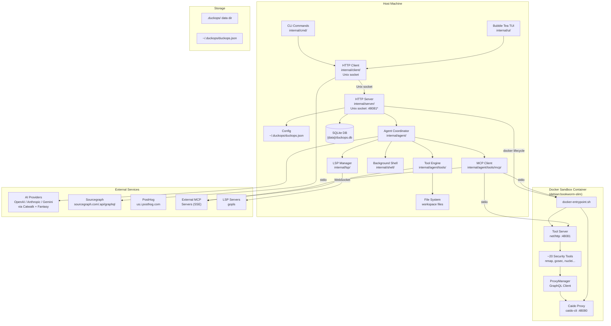
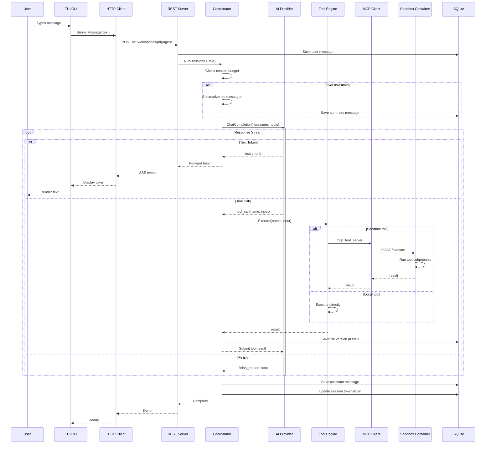
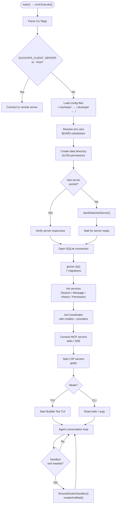
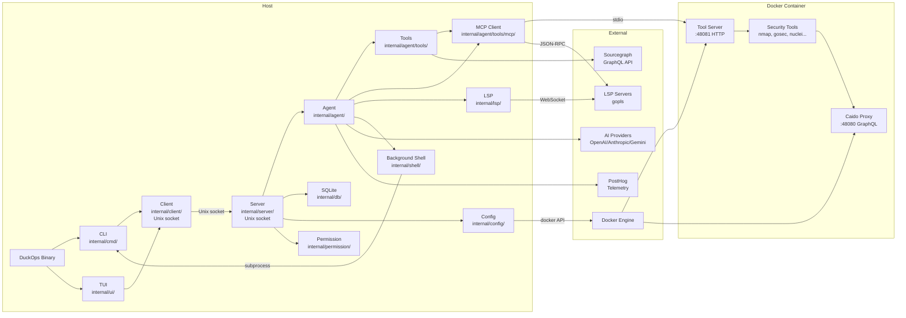

# File: docs/local-infrastructure-analysis.md

# Local Infrastructure Analysis

**Project:** DuckOps v3.0.0
**Source:** `/run/media/h3ckt0r/apps/Work/duck`
**Date:** 2026-06-09

---

## Executive Summary

DuckOps is a terminal-based AI coding assistant with a **client/server architecture** that runs entirely on the local machine. The system consists of a **REST API served over a Unix domain socket**, an **embedded SQLite database**, an optional **Docker sandbox container** for security tool execution, and a **configurable MCP (Model Context Protocol) server mesh** for tooling extensibility. No external databases, message queues, or managed services are required.

### Quick Answers

| # | Question | Answer |
|---|----------|--------|
| 1 | Do we have a local API? | Yes — REST API over Unix socket (or TCP) |
| 2 | Which port does it use? | Unix socket at `/tmp/duckops-<uid>.sock` (no TCP port by default). Sandbox tool server on `48081`. |
| 3 | Do we have a local database? | Yes — SQLite |
| 4 | Which database is used? | SQLite via `modernc.org/sqlite` (pure Go) or `ncruces/go-sqlite3` (CGo) |
| 5 | Where is the database stored? | `{data_directory}/duckops.db` — default `.duckops/duckops.db` in working directory |
| 6 | Which services depend on it? | All of them — sessions, messages, agent state, file version history, todos, audit |
| 7 | Which MCP servers are installed? | DuckOps tool-server (built-in stdio MCP), Docker MCP gateway (optional, auto-detected), plus user-configured MCP servers |
| 8 | Which Docker containers are used? | One sandbox container (`duckops-sandbox:latest`) with ~20 security tools |
| 9 | What is the complete startup sequence? | Config → SQLite → MCP → LSP → Server/Client socket → Agent → Ready |
| 10 | How does data move through the system? | User input → TUI/CLI → Client (Unix socket) → Server → Agent → SQLite + AI Provider + Tools → Response back to user |

---

## Local APIs

### Main REST API

**File:** `internal/server/server.go`
**Framework:** Go `net/http` `ServeMux` (Go 1.22+ method-prefixed routing)
**Host:** Unix domain socket (`unix:///tmp/duckops-<uid>.sock`) on Linux/macOS; Windows named pipe (`npipe:////./pipe/duckops-<uid>.sock`)
**Host (TCP mode):** User-specified via `--host tcp://192.168.1.14:8080`
**Host (default):** `unix:///tmp/duckops-<uid>.sock` (`internal/server/server.go:46-57`)
**Authentication:** None by default (Unix socket permissions); optional API key in TCP mode
**Swagger docs:** Served at `/v1/docs/` via `swaggo/http-swagger` (`internal/server/server.go:168`)

#### Endpoints

| Method | Route | Handler | Line | Purpose |
|--------|-------|---------|------|---------|
| `GET` | `/v1/health` | `handleGetHealth` | 109 | Health check |
| `GET` | `/v1/version` | `handleGetVersion` | 110 | Version info |
| `GET` | `/v1/config` | `handleGetConfig` | 111 | Get runtime config |
| `POST` | `/v1/control` | `handlePostControl` | 112 | Server control (shutdown) |
| `GET` | `/v1/workspaces` | `handleGetWorkspaces` | 113 | List workspaces |
| `POST` | `/v1/workspaces` | `handlePostWorkspaces` | 114 | Create workspace |
| `DELETE` | `/v1/workspaces/{id}` | `handleDeleteWorkspaces` | 115 | Delete workspace |
| `GET` | `/v1/workspaces/{id}` | `handleGetWorkspace` | 116 | Get workspace |
| `GET` | `/v1/workspaces/{id}/config` | `handleGetWorkspaceConfig` | 117 | Workspace config |
| `GET` | `/v1/workspaces/{id}/events` | `handleGetWorkspaceEvents` | 118 | SSE event stream |
| `GET` | `/v1/workspaces/{id}/providers` | `handleGetWorkspaceProviders` | 119 | Configured providers |
| `GET` | `/v1/workspaces/{id}/sessions` | `handleGetWorkspaceSessions` | 120 | List sessions |
| `POST` | `/v1/workspaces/{id}/sessions` | `handlePostWorkspaceSessions` | 121 | Create session |
| `GET` | `/v1/workspaces/{id}/sessions/{sid}` | `handleGetWorkspaceSession` | 122 | Get session |
| `PUT` | `/v1/workspaces/{id}/sessions/{sid}` | `handlePutWorkspaceSession` | 123 | Update session |
| `DELETE` | `/v1/workspaces/{id}/sessions/{sid}` | `handleDeleteWorkspaceSession` | 124 | Delete session |
| `GET` | `/v1/workspaces/{id}/sessions/{sid}/history` | `handleGetWorkspaceSessionHistory` | 125 | Session file history |
| `GET` | `/v1/workspaces/{id}/sessions/{sid}/messages` | `handleGetWorkspaceSessionMessages` | 126 | Session messages |
| `GET` | `/v1/workspaces/{id}/sessions/{sid}/messages/user` | `handleGetWorkspaceSessionUserMessages` | 127 | User messages |
| `GET` | `/v1/workspaces/{id}/messages/user` | `handleGetWorkspaceAllUserMessages` | 128 | All user messages |
| `GET` | `/v1/workspaces/{id}/sessions/{sid}/filetracker/files` | `handleGetWorkspaceSessionFileTrackerFiles` | 129 | Tracked files |
| `POST` | `/v1/workspaces/{id}/filetracker/read` | `handlePostWorkspaceFileTrackerRead` | 130 | Record file read |
| `GET` | `/v1/workspaces/{id}/filetracker/lastread` | `handleGetWorkspaceFileTrackerLastRead` | 131 | Last read time |
| `GET` | `/v1/workspaces/{id}/lsps` | `handleGetWorkspaceLSPs` | 132 | List LSPs |
| `GET` | `/v1/workspaces/{id}/lsps/{lsp}/diagnostics` | `handleGetWorkspaceLSPDiagnostics` | 133 | LSP diagnostics |
| `POST` | `/v1/workspaces/{id}/lsps/start` | `handlePostWorkspaceLSPStart` | 134 | Start LSP |
| `POST` | `/v1/workspaces/{id}/lsps/stop` | `handlePostWorkspaceLSPStopAll` | 135 | Stop all LSPs |
| `GET` | `/v1/workspaces/{id}/permissions/skip` | `handleGetWorkspacePermissionsSkip` | 136 | Check skip flag |
| `POST` | `/v1/workspaces/{id}/permissions/skip` | `handlePostWorkspacePermissionsSkip` | 137 | Set skip flag |
| `POST` | `/v1/workspaces/{id}/permissions/grant` | `handlePostWorkspacePermissionsGrant` | 138 | Grant permission |
| `GET` | `/v1/workspaces/{id}/agent` | `handleGetWorkspaceAgent` | 139 | Agent info |
| `POST` | `/v1/workspaces/{id}/agent` | `handlePostWorkspaceAgent` | 140 | Agent message |
| `POST` | `/v1/workspaces/{id}/agent/init` | `handlePostWorkspaceAgentInit` | 141 | Init agent |
| `POST` | `/v1/workspaces/{id}/agent/update` | `handlePostWorkspaceAgentUpdate` | 142 | Update agent |
| `GET` | `/v1/workspaces/{id}/agent/sessions/{sid}` | `handleGetWorkspaceAgentSession` | 143 | Agent session |
| `POST` | `/v1/workspaces/{id}/agent/sessions/{sid}/cancel` | `handlePostWorkspaceAgentSessionCancel` | 144 | Cancel session |
| `GET` | `/v1/workspaces/{id}/agent/sessions/{sid}/prompts/queued` | `handleGetWorkspaceAgentSessionPromptQueued` | 145 | Queued prompts |
| `GET` | `/v1/workspaces/{id}/agent/sessions/{sid}/prompts/list` | `handleGetWorkspaceAgentSessionPromptList` | 146 | Prompt list |
| `POST` | `/v1/workspaces/{id}/agent/sessions/{sid}/prompts/clear` | `handlePostWorkspaceAgentSessionPromptClear` | 147 | Clear prompts |
| `POST` | `/v1/workspaces/{id}/agent/sessions/{sid}/summarize` | `handlePostWorkspaceAgentSessionSummarize` | 148 | Summarize session |
| `GET` | `/v1/workspaces/{id}/agent/default-small-model` | `handleGetWorkspaceAgentDefaultSmallModel` | 149 | Default small model |
| `POST` | `/v1/workspaces/{id}/config/set` | `handlePostWorkspaceConfigSet` | 150 | Set config field |
| `POST` | `/v1/workspaces/{id}/config/remove` | `handlePostWorkspaceConfigRemove` | 151 | Remove config field |
| `POST` | `/v1/workspaces/{id}/config/model` | `handlePostWorkspaceConfigModel` | 152 | Update model |
| `POST` | `/v1/workspaces/{id}/config/compact` | `handlePostWorkspaceConfigCompact` | 153 | Set compact mode |
| `POST` | `/v1/workspaces/{id}/config/provider-key` | `handlePostWorkspaceConfigProviderKey` | 154 | Set provider key |
| `POST` | `/v1/workspaces/{id}/config/import-copilot` | `handlePostWorkspaceConfigImportCopilot` | 155 | Import Copilot config |
| `POST` | `/v1/workspaces/{id}/config/refresh-oauth` | `handlePostWorkspaceConfigRefreshOAuth` | 156 | Refresh OAuth token |
| `GET` | `/v1/workspaces/{id}/project/needs-init` | `handleGetWorkspaceProjectNeedsInit` | 157 | Check init status |
| `POST` | `/v1/workspaces/{id}/project/init` | `handlePostWorkspaceProjectInit` | 158 | Init project |
| `GET` | `/v1/workspaces/{id}/project/init-prompt` | `handleGetWorkspaceProjectInitPrompt` | 159 | Init prompt |
| `POST` | `/v1/workspaces/{id}/mcp/refresh-tools` | `handlePostWorkspaceMCPRefreshTools` | 160 | Refresh MCP tools |
| `POST` | `/v1/workspaces/{id}/mcp/read-resource` | `handlePostWorkspaceMCPReadResource` | 161 | Read MCP resource |
| `POST` | `/v1/workspaces/{id}/mcp/get-prompt` | `handlePostWorkspaceMCPGetPrompt` | 162 | Get MCP prompt |
| `GET` | `/v1/workspaces/{id}/mcp/states` | `handleGetWorkspaceMCPStates` | 163 | MCP server states |
| `POST` | `/v1/workspaces/{id}/mcp/refresh-prompts` | `handlePostWorkspaceMCPRefreshPrompts` | 164 | Refresh MCP prompts |
| `POST` | `/v1/workspaces/{id}/mcp/refresh-resources` | `handlePostWorkspaceMCPRefreshResources` | 165 | Refresh MCP resources |
| `POST` | `/v1/workspaces/{id}/mcp/docker/enable` | `handlePostWorkspaceMCPEnableDocker` | 166 | Enable Docker MCP |
| `POST` | `/v1/workspaces/{id}/mcp/docker/disable` | `handlePostWorkspaceMCPDisableDocker` | 167 | Disable Docker MCP |

#### Middleware

- Request/response logging wrapper via `loggingHandler()` (`internal/server/logging.go:9-10`)
- Bearer token verification on tool-server only (`internal/cmd/toolserver.go:153-173`)

#### SSE Event Streaming

- **Endpoint:** `GET /v1/workspaces/{id}/events`
- **Events:** session updates, message arrivals, tool call progress, LSP diagnostics, MCP state changes, permission requests
- **Dispatch:** `internal/server/events.go:36` — wraps internal `pubsub.Event` to proto types
- **Client reads:** `internal/client/proto.go:105` — goroutine reads SSE stream

#### Registration

- **File:** `internal/server/server.go:89-107`
- Backend created with shutdown callback that triggers graceful server shutdown via goroutine
- Supports HTTP/1 and unencrypted HTTP/2

---

### Tool Server (Sandbox HTTP)

**File:** `internal/cmd/toolserver.go` (509 lines)
**Framework:** Go `net/http` `ServeMux`
**Host:** `192.168.1.14` (inside container), user-specified via `--port` flag
**Port:** `48081` (default, configurable)
**Authentication:** Bearer token (64-char random base64, stored in `~/.duckops/.tool_server_token`)

#### Endpoints

| Method | Route | Handler | Line | Purpose |
|--------|-------|---------|------|---------|
| `POST` | `/execute` | `handleExecute` | 96 | Execute a tool (bandit, gosec, semgrep, etc.) |
| `POST` | `/scan` | `handleScan` | 97 | Run security scan |
| `POST` | `/register_agent` | `handleRegisterAgent` | 98 | Register agent for task tracking |
| `GET` | `/health` | `handleHealth` | 99 | Health check |
| `GET` | `/verify` | `handleVerify` | 100 | Token verification |

#### Authentication

- Bearer token verified in `ServeHTTP` wrapper (`toolserver.go:153-173`)
- Token generated at startup via `openssl rand -base64 32`

#### Guard

- The server refuses to start without a valid token:
  ```go
  // internal/cmd/toolserver.go:146-149
  if !verifyToken(token) {
      log.Fatal("invalid tool server token")
  }
  ```

#### Setup

- Started via `docker-entrypoint.sh:184-187`:
  ```bash
  exec /usr/local/bin/duckops tool-server \
      --port "$TOOL_SERVER_PORT" \
      --timeout "$TOOL_SERVER_TIMEOUT" \
      --token "$TOOL_SERVER_TOKEN"
  ```

---

### Caido Proxy (In-Container GraphQL Server)

**Framework:** Caido CLI (Go-based intercepting proxy)
**Host:** `0.0.0.0` (inside container)
**Port:** `48080` (fixed inside container, mapped to random host port)
**Authentication:** Guest login → GraphQL mutation token

#### Setup Sequence

1. Started in `docker-entrypoint.sh:60-64`:
   ```bash
   caido-cli --listen 0.0.0.0:${CAIDO_PORT} \
             --allow-guests --no-logging --no-open \
             --import-ca-cert /app/certs/ca.p12 \
             --import-ca-cert-pass ""
   ```
2. API readiness polled via `curl` (`docker-entrypoint.sh:78-92`)
3. Guest authentication via GraphQL mutation `LoginAsGuest` (`docker-entrypoint.sh:98-111`)
4. Temporary project created via `CreateProject` mutation (`docker-entrypoint.sh:118-128`)
5. System-wide proxy env vars set for container traffic (`docker-entrypoint.sh:132-137`)

#### Purpose

Acts as a Man-in-the-Middle proxy for all HTTP traffic from the sandbox container. Every outbound request from security tools is routed through Caido for capture and analysis.

---

## Local Databases

### SQLite

**File:** `internal/db/connect.go:42`
**Driver:** `modernc.org/sqlite` (pure Go, default) or `github.com/ncruces/go-sqlite3` (CGo, build tag)
**File:** `{data_directory}/duckops.db` (default `.duckops/duckops.db`)
**Connection limit:** `MaxOpenConns(1)` — serialized single connection to prevent WAL/header desync
**Migrations:** goose v3 (`github.com/pressly/goose/v3`), 7 migrations embedded via `embed.FS`
**SQL codegen:** sqlc v1.30.0 — SQL in `internal/db/sql/`, generated Go in `internal/db/`

#### Schema

| Table | Columns | Purpose | Migration |
|-------|---------|---------|-----------|
| `sessions` | id, parent_session_id, title, message_count, prompt_tokens, completion_tokens, cost, summary_message_id, todos, created_at, updated_at | Conversation sessions | `20250424200609_initial.sql` |
| `messages` | id, session_id, role, parts (JSON), model, provider, is_summary_message, finished_at, created_at, updated_at | Chat messages with tool calls | `20250424200609_initial.sql` |
| `files` | id, session_id, path, content, version, created_at, updated_at | File version history | `20250424200609_initial.sql` |
| `read_files` | session_id, path, read_at | File read tracking | `20260127000000_add_read_files_table.sql` |

#### Triggers

- `update_sessions_updated_at` — auto-update `sessions.updated_at` on write
- `update_messages_updated_at` — auto-update `messages.updated_at` on write
- `update_files_updated_at` — auto-update `files.updated_at` on write
- `update_session_message_count_on_insert` — auto-increment `sessions.message_count`
- `update_session_message_count_on_delete` — auto-decrement `sessions.message_count`

#### Migration History (7 total)

| Migration ID | Description |
|-------------|-------------|
| `20250424200609_initial.sql` | Create sessions, files, messages tables |
| `20250515105448_add_summary_message_id.sql` | Add summary_message_id to sessions |
| `20250624000000_add_created_at_indexes.sql` | Indexes on created_at columns |
| `20250627000000_add_provider_to_messages.sql` | Add provider column to messages |
| `20250810000000_add_is_summary_message.sql` | Add is_summary_message flag |
| `20250812000000_add_todos_to_sessions.sql` | Add todos JSON column to sessions |
| `20260127000000_add_read_files_table.sql` | Create read_files table |

#### Dependencies NOT Used

- PostgreSQL, MySQL, MariaDB, MongoDB — not present in `go.mod`
- Redis — not present in `go.mod`
- BoltDB, BadgerDB, LevelDB, Pebble, RocksDB — not present in `go.mod`
- GORM, Ent — not present in `go.mod`

---

## Internal Services

### LSP Manager (Language Server Protocol)

**File:** `internal/lsp/manager.go`
**Protocol:** JSON-RPC 2.0 over WebSocket (via `github.com/sourcegraph/jsonrpc2`)

Provides code intelligence (diagnostics, completions, hover) by managing LSP server subprocesses.

#### LSP Servers

| Server | Default | File Types | Configuration |
|--------|---------|------------|---------------|
| gopls | Enabled (configured in `duckops.json`) | `.go` | `internal/lsp/` |

#### Client Implementation

**File:** `internal/lsp/client.go`

| Operation | Method | Line | Purpose |
|-----------|--------|------|---------|
| `textDocument/didOpen` | `SendDidOpen()` | — | Notify LSP of opened file |
| `textDocument/didChange` | `SendDidChange()` | — | Notify LSP of file changes |
| `textDocument/hover` | `SendHover()` | — | Get hover documentation |
| `textDocument/completion` | `SendCompletion()` | — | Get code completions |
| `textDocument/codeAction` | `SendCodeAction()` | — | Get code actions |
| `textDocument/diagnostic` | — | — | Receive diagnostics from server |

#### Diagnostics Debouncing

- `ticker`: 500ms for diagnostic settle (`internal/lsp/client.go:315-329`)
- `settleTicker`: 50ms for completion settle (`internal/lsp/client.go:632-644`)

### Background Shell Manager

**File:** `internal/shell/background.go`
**Maximum jobs:** 50 (`MaxBackgroundJobs = 50`)

| Method | Line | Purpose |
|--------|------|---------|
| `Start()` | 89 | Launch background shell command |
| `Get()` | 133 | Get background shell by ID |
| `Remove()` | 148 | Remove completed shell |
| `Kill()` | 158 | Kill a background shell |
| `KillAll()` | 197 | Kill all background shells |
| `List()` | 175 | List all active shells |
| `Cleanup()` | 178 | Clean up completed shells |
| `GetOutput()` | 216 | Get buffered output |
| `Wait()` | 252 | Wait for completion |

### OAuth Token Refresh

**File:** `internal/oauth/copilot/oauth.go:72` — GitHub Copilot OAuth polling
**File:** `internal/oauth/hyper/device.go:92` — Hyper device flow OAuth polling

Both use `time.NewTicker` to poll for token completion during device authorization flows.

---

## Docker Services

### Single Sandbox Container

**Dockerfile:** `containers/Dockerfile` (184 lines, 5 build stages)
**Entrypoint:** `containers/docker-entrypoint.sh` (191 lines)
**Base image:** `debian:bookworm-slim`
**Image name:** `duckops-sandbox:latest`
**Build:** `containers/Dockerfile` — multi-stage with 5 stages (server-builder, go-tool-builder, cert-builder, extras-builder, runtime)

#### Container Configuration

| Property | Value | File | Line |
|----------|-------|------|------|
| Name | `duckops-sandbox` | `docker_lifecycle.go` | 15 |
| Command | `docker-entrypoint.sh` | `containers/Dockerfile` | 184 |
| Port mappings | `48081` (tool server), `48080` (Caido proxy) → random host ports | `docker_lifecycle.go` | 257 |
| User | `duckops` (UID 1000) | `containers/Dockerfile` | 180 |
| Workspace | `/workspace` | `containers/Dockerfile` | 181 |
| Labels | Auto-generated | `docker_lifecycle.go` | — |

#### Environment Variables Set on Container

| Variable | Value | File | Line |
|----------|-------|------|------|
| `TOOL_SERVER_PORT` | `48081` | `docker_lifecycle.go` | — |
| `TOOL_SERVER_TOKEN` | Random 64-char base64 | `docker_lifecycle.go` | — |
| `DUCKOPS_SANDBOX_MODE` | `true` | `containers/Dockerfile` | 182 |
| `DUCKOPS_CONTAINER_WORKSPACE` | `/workspace` | `docker_lifecycle.go` | — |
| `TOOL_SERVER_DEBUG` | `false` | `docker_lifecycle.go` | — |

#### Tools Installed in Container

**Network Scanning:**
- nmap (with `cap_net_raw,cap_net_admin,cap_net_bind_service+eip`)

**Go Security Tools:**
- gosec, gitleaks, tfsec

**Vulnerability Scanners:**
- trivy, nuclei (with templates), syft

**Project Discovery Tools:**
- subfinder, httpx, katana

**Static Analysis:**
- semgrep, bandit, checkov

**Secrets:**
- trufflehog

**Web Security:**
- sqlmap, wapiti, arjun, Caido CLI proxy

**Code Quality:**
- eslint, retire

**JWT:**
- jwt_tool

**Docker Security:**
- docker-bench-security

**General:**
- jq, curl, git, bash, Go 1.26, Python 3, Node.js

#### Docker Runtime (Host Side)

**File:** `internal/cmd/docker_lifecycle.go` (311 lines)

| Method | Line | Purpose |
|--------|------|---------|
| `EnsureDockerSandbox()` | 48 | Main entry point, checks container state |
| `ensureImage()` | 100 | Checks/pulls Docker image |
| `imageExistsLocally()` | 111 | Checks local image cache |
| `pullImage()` | 125 | Pulls image from registry |
| `inspectContainer()` | 143 | Inspects container status |
| `containerConfigMatches()` | 175 | Verifies image and port match config |
| `recoverTokenFromContainer()` | 198 | Reads tool token from container filesystem |
| `createAndWait()` | 206 | Creates container and waits for health |
| `removeAndRecreate()` | 248 | Removes and recreates container |
| `buildDockerRunArgs()` | 253 | Builds docker run argument list |
| `containerLogs()` | 304 | Retrieves container logs |

#### Container Lifecycle

```
User invokes tool requiring sandbox
  → EnsureToolServer()
    → EnsureDockerSandbox()
      → inspectContainer()
        ↓
      ┌─ "running" → recover token → return
      ├─ "stopped" → docker start → recover token → return
      ├─ "config_changed" → docker rm -f → recreate
      └─ "not_found" → createAndWait()
                        → docker pull (if missing)
                        → buildDockerRunArgs()
                        → exec.Command("docker", "run", ...)
                        → Container starts
                          → docker-entrypoint.sh executes:
                            1. Start caido-cli proxy (:48080)
                            2. Wait for Caido API ready
                            3. LoginAsGuest graphql
                            4. CreateProject graphql
                            5. Set system proxy env vars
                            6. Start tool-server (:48081)
                            7. Wait for /health
                            8. exec sleep infinity (fallback)
                        → Poll /health (30s timeout)
                        → recover token from container
                        → Return (port, token, ready)
```

---

## MCP Services

### MCP Client

**Files:** `internal/agent/tools/mcp/` (init.go, tools.go, resources.go, prompts.go)
**Library:** `github.com/modelcontextprotocol/go-sdk` v1.6.0

#### Connection Types

| Transport | Config Type | Protocol | Use Case |
|-----------|-------------|----------|----------|
| **stdio** | `"type": "stdio"` | JSON-RPC 2.0 over stdin/stdout | Local subprocess MCP servers |
| **SSE** | `"type": "sse"` | JSON-RPC 2.0 over HTTP SSE | Remote MCP servers |

#### Connection Flow

1. Parse MCP config (`internal/config/config.go:206` — `MCPConfig` struct)
2. Resolve env vars via `${VAR}` substitution
3. Create transport: spawn subprocess (stdio) or HTTP connection (SSE)
4. Send `initialize` request → exchange capabilities
5. `tools/list` → register tools with `mcp_{server}_{tool}` prefix
6. `resources/list` + `prompts/list` — discover resources and prompts
7. Handle tool calls via `tools/call` JSON-RPC

### Built-in MCP Server: `mcp-tool-server`

**File:** `internal/cmd/mcp_tool_server.go`
**Transport:** stdio
**Command:** `duckops mcp-tool-server`

#### Tools Exposed

| MCP Tool | Internal Action | Description |
|----------|----------------|-------------|
| `security_scan` | `POST /scan` | Run default security scan preset in sandbox container |
| `execute_tool` | `POST /execute` | Execute any sandbox tool (gosec, semgrep, nmap, etc.) |

**Source:** `internal/cmd/mcp_tool_server.go:98-104`

### Docker MCP Gateway

**File:** `internal/config/docker_mcp.go`
**Command:** `docker mcp gateway run`

Provides container management tools to the AI agent:

| Tool Name | Purpose |
|-----------|---------|
| `mcp_docker_mcp-find` | Find available MCP servers |
| `mcp_docker_mcp-add` | Add an MCP server |
| `mcp_docker_mcp-remove` | Remove an MCP server |
| `mcp_docker_mcp-config-set` | Set MCP server config |
| `mcp_docker_code-mode` | Toggle Docker code mode |

### Configuration in `duckops.json`

```json
{
  "mcp": {
    "duckops": {
      "type": "stdio",
      "command": "duckops",
      "args": ["mcp-tool-server"],
      "env": {
        "DUCKOPS_TOOL_SERVER_URL": "http://192.168.1.14:48081",
        "DUCKOPS_CONTAINER_WORKSPACE": "/workspace/duck"
      },
      "workspace_mount": "/workspace/duck",
      "path_mapping": {
        "/run/media/h3ckt0r/apps/Work/duck": "/workspace/duck"
      },
      "timeout": 180
    }
  }
}
```

### MCP REST API Endpoints (on main server)

| Endpoint | Purpose |
|----------|---------|
| `POST /v1/workspaces/{id}/mcp/refresh-tools` | Refresh MCP tool list |
| `POST /v1/workspaces/{id}/mcp/read-resource` | Read MCP resource |
| `POST /v1/workspaces/{id}/mcp/get-prompt` | Get MCP prompt |
| `GET /v1/workspaces/{id}/mcp/states` | Get MCP server connection states |
| `POST /v1/workspaces/{id}/mcp/refresh-prompts` | Refresh MCP prompts |
| `POST /v1/workspaces/{id}/mcp/refresh-resources` | Refresh MCP resources |
| `POST /v1/workspaces/{id}/mcp/docker/enable` | Enable Docker MCP gateway |
| `POST /v1/workspaces/{id}/mcp/docker/disable` | Disable Docker MCP gateway |

---

## External Services

### 1. AI Providers (via Catwalk + Fantasy)

**Files:** `internal/config/catwalk.go`, `internal/agent/coordinator.go`
**Library:** `charm.land/catwalk` + `charm.land/fantasy`
**Purpose:** Core AI reasoning for all agent interactions
**Supported backends:** OpenAI, Anthropic, Google Gemini, OpenRouter, Ollama, Groq, Together AI, Mistral, DeepSeek, and any OpenAI-compatible endpoint
**Auth:** `${PROVIDER}_API_KEY` env var resolution
**Configuration:** `duckops.json` — `models.large`, `models.small`, `models.local`

### 2. Sourcegraph (Code Search)

**File:** `internal/agent/tools/sourcegraph.go`
**Endpoint:** `POST https://sourcegraph.com/.api/graphql`
**Auth:** None (public API)
**Purpose:** Code search and context retrieval during development

### 3. PostHog (Telemetry)

**File:** `go.mod:55` — `github.com/posthog/posthog-go`
**Purpose:** Product analytics (optional, configurable)
**Configuration:** `options.disable_metrics: true/false`

### 4. Docker Engine (via subprocess)

**Files:** `internal/cmd/docker_lifecycle.go`, `internal/config/docker_mcp.go`
**Connection:** `exec.Command("docker", ...)` — subprocess calls to local Docker daemon
**Purpose:** Container lifecycle management
**Configuration:** `DOCKER_HOST` env var for remote daemon

### 5. Git (via subprocess)

**File:** `internal/agent/tools/` — bash tool with git commands
**Purpose:** Repository cloning, diff analysis, git operations

---

## Background Workers

| Worker | Mechanism | File | Line | Purpose |
|--------|-----------|------|------|---------|
| Background shell | `go func()` + ticker | `internal/shell/background.go` | 121 | Long-running shell command execution (max 50) |
| LSP diagnostics poll | `time.NewTicker(500ms)` | `internal/lsp/client.go` | 315 | Debounce and settle LSP diagnostics |
| LSP hover debounce | `time.NewTicker(100ms)` | `internal/lsp/client.go` | 605 | Debounce hover requests |
| LSP completion settle | `time.NewTicker(50ms)` | `internal/lsp/client.go` | 632 | Settle completion requests |
| OAuth device poll | `time.NewTicker(interval)` | `internal/oauth/hyper/device.go` | 92 | Poll for device authorization completion |
| Copilot OAuth poll | `time.NewTicker(interval)` | `internal/oauth/copilot/oauth.go` | 72 | Poll for Copilot device auth completion |
| SSE event stream | `go func()` | `internal/client/proto.go` | 105 | Continuous SSE stream reading and dispatch |
| MCP connect | `go func()` | `internal/agent/tools/mcp/init.go` | 181 | Async MCP server connection |
| GraphX file watch | `time.NewTicker(interval)` | `internal/graphx/engine/watch/watch.go` | 172 | Polling file watcher for dependency graph |
| Hook execution | `go func()` | `internal/hooks/runner.go` | 114 | Background hook command execution |
| Server shutdown | `go func()` | `internal/server/server.go` | 96 | Graceful shutdown callback |
| HTTP listen | `go func()` | `internal/cmd/server.go` | 68 | Background HTTP server goroutine |
| Tool server listen | `go func()` | `internal/cmd/toolserver.go` | 129 | Background tool server goroutine |

---

## Runtime Architecture

### Architecture Diagram



### Data Flow



---

## Startup Sequence

### Phase 0: Binary Init (Immediate, `main.go:19`)

```
1. cmd.Execute() called                    [main.go:19]
2. Cobra command tree parsed               [internal/cmd/root.go]
```

### Phase 1: Config Loading (`internal/cmd/root.go:234-262`)

```
3. Parse CLI flags                         [root.go:53-58] — --data-dir, --host, --debug, etc.
4. Check DUCKOPS_CLIENT_SERVER env var     [root.go:206-211]
5. Load config files (merge order):        [internal/config/load.go]
   a. ~/.duckops/duckops.json (global)
   b. ./.duckops/duckops.json (project)
   c. ./duckops.json (workspace)
6. Resolve env vars in config values       [internal/config/resolve.go]
7. Create data directory (0o700)           [root.go:262]
```

### Phase 2: Server Connection (`internal/cmd/root.go:322-387`)

```
8. Check server socket at /tmp/duckops-{uid}.sock
9a. Socket exists? → Verify server responsive → Connect
9b. Socket stale? → Remove → startDetachedServer()
9c. Socket missing? → startDetachedServer()
10. startDetachedServer() spawns:         [root.go:470-515]
    duckops server --host unix:///tmp/duckops-{uid}.sock
    in a detached child process (Unix: Setsid, Windows: CREATE_NEW_PROCESS_GROUP)
```

### Phase 3: Database Connection (`internal/db/connect.go:42`)

```
11. openDB(dbPath):                       [connect.go:48]
    a. sql.Open("sqlite", dsn)            [connect_modernc.go:25]
    b. Apply pragmas: WAL, NORMAL sync, 30s busy timeout, foreign_keys ON
    c. Set MaxOpenConns(1)
12. goose.Up(db, "migrations"):           [connect.go:70]
    a. Read embedded migrations from embed.FS
    b. Apply all pending migrations (7 total)
13. Create sqlc Querier                   [db.go]
```

### Phase 4: Service Initialization (`internal/cmd/root.go:274-298`)

```
14. Init SessionService                   [internal/session/session.go]
15. Init MessageService                   [internal/message/message.go]
16. Init HistoryService (file versions)   [internal/history/file.go]
17. Init PermissionService                [internal/permission/]
18. Init FileTrackerService               [internal/db/read_files.sql.go]
19. Init Coordinator with models:
    a. Load large/small/local from config
    b. Wire to AI providers via Catwalk + Fantasy
```

### Phase 5: MCP + LSP Init

```
20. For each configured MCP server:       [internal/agent/tools/mcp/init.go:181]
    a. Resolve env vars
    b. Create transport (stdio or SSE)
    c. Initialize MCP session
    d. List tools → register in agent's tool registry
21. For each configured LSP (gopls):      [internal/lsp/manager.go]
    a. Start LSP subprocess
    b. Initialize JSON-RPC 2.0 connection
    c. Register file watchers
```

### Phase 6: Docker Sandbox (Lazy, On Demand)

```
22. EnsureToolServer() → EnsureDockerSandbox():   [docker_lifecycle.go:48]
    a. inspectContainer("duckops-sandbox")
    b. If not running: createAndWait()
    c. If config changed: removeAndRecreate()
    d. Pull image if missing
    e. Start container → entrypoint runs:
       1. Start Caido proxy (:48080)
       2. Wait + auth via GraphQL LoginAsGuest
       3. Create temporary project
       4. Set system proxy env
       5. Start tool-server (:48081)
       6. Wait for /health
    f. Recover token from container filesystem
```

### Phase 7: UI/Agent Loop

```
23. Start workspace via REST API
24a. TUI Mode: start Bubble Tea app         [internal/ui/]
    - Show chat view with session history
    - Listen for user input
24b. CLI Mode: read from stdin or args       [internal/cmd/run.go]
    - Process single prompt, stream response, exit
25. Agent loop:
    - User message → Coordinator
    - Context budget check → Auto-summarize if needed
    - Build provider request → Send to AI
    - Stream response + tool calls
    - Save messages to SQLite
    - Loop back for next user input
```

### Startup Sequence Diagram



---

## Dependency Graph



---

## Security Considerations

### Authentication

1. **Unix socket permissions** — `/tmp/duckops-<uid>.sock` inherits filesystem-level security. Only the owning user can connect.
2. **Tool Server Bearer Token** — 64-character random base64 token generated at startup, stored in `~/.duckops/.tool_server_token`. Verified on every `/execute` and `/scan` request.
3. **No authentication on main API** — The Unix socket REST API has no built-in auth. TCP mode has no default auth either (currently unprotected).
4. **Caido API Token** — Obtained via `LoginAsGuest` mutation with guest access enabled (`docker-entrypoint.sh:98-111`).

### Secrets Management

- **API keys** stored in `duckops.json` (typically `chmod 600`), resolved from `${VAR}` environment variable references
- **No hardcoded credentials** in source code
- **Config file** directory created with `0o700` permissions (`internal/cmd/root.go:262`)
- **Tool server token** stored in `~/.duckops/.tool_server_token` with `chmod 600`

### Container Security

1. **Non-root user** — Container runs as `duckops` user (UID 1000)
2. **Nmap capabilities** — Only nmap gets elevated capabilities (`cap_net_raw,cap_net_admin,cap_net_bind_service+eip`)
3. **Custom CA certificate** — Generated for Caido HTTPS interception, stored in `/app/certs/`
4. **Docker socket** — Optional mount (`/var/run/docker.sock`) only when Docker MCP features are needed

### Network Security

1. **Unix socket by default** — No TCP port exposed on the main API
2. **Caido proxy** — Routes all container HTTP traffic through intercepting proxy for analysis
3. **Path mapping** — Host-to-container path translations prevent container from accessing arbitrary host files (`internal/config/config.go:210-211`)

### Risks

- Main REST API has no authentication on Unix socket (relies solely on filesystem permissions)
- No database encryption at rest
- Container has nmap with raw socket capabilities
- Docker socket mount gives container broad access when enabled
- Tool server HTTP is unencrypted

---

## Findings

| # | Finding | Severity | Details |
|---|---------|----------|---------|
| 1 | SQLite single connection | Medium | `MaxOpenConns(1)` prevents concurrent write corruption but limits throughput |
| 2 | No API auth on Unix socket | Medium | Main REST API relies solely on filesystem permissions; TCP mode has no auth |
| 3 | No database encryption | Medium | `duckops.db` is unencrypted; any filesystem access exposes all session data |
| 4 | Two SQLite drivers | Low | `modernc.org/sqlite` (pure Go) and `ncruces/go-sqlite3` (CGo) — dual maintenance |
| 5 | No connection pooling | Low | Single connection serializes all DB operations |
| 6 | Docker socket mount risk | Medium | Optional `docker.sock` mount gives broad daemon access when enabled |
| 7 | Tool server no TLS | Low | Port 48081 HTTP is unencrypted (inside container only) |
| 8 | Caido integration complexity | Info | Multi-step Caido setup (GraphQL auth, project creation, proxy config) is undocumented |
| 9 | 7 goose migrations | Info | Schema evolved cleanly; candidates for squashing at next major release |

---

## Recommendations

1. **Add SQLite encryption** — Use `sqlcipher` or page-level encryption for database file, especially in shared environments
2. **Optional TCP authentication** — When running in TCP mode, require API key authentication by default
3. **Evaluate connection pool sizing** — For high-throughput, test increasing `MaxOpenConns` with careful WAL coordination
4. **Tool server TLS** — Add TLS support for remote sandbox deployments
5. **Graceful Docker fallback** — When Docker unavailable, fall back to host-side tool execution with warnings
6. **Squash migrations** — Combine 7 migrations into initial schema for next major release
7. **Unix socket hardening** — Explicitly set `0700` on socket directory, `0600` on socket file
8. **Document Caido proxy** — The container proxy setup is complex and user-facing docs are missing

---

## Missing Components

| Component | Status | Notes |
|-----------|--------|-------|
| Message queue (RabbitMQ, Kafka) | Not present | Not needed for single-user architecture |
| Redis / cache layer | Not present | All state lives in SQLite or in-memory |
| Read replica database | Not present | Single SQLite file, single connection |
| Load balancer | Not present | Single-process architecture |
| API gateway | Not present | Direct Unix socket connection |
| Service mesh | Not present | Single binary, no microservices |
| CDN | Not present | Local application only |
| Object storage (S3) | Not present | File versions stored in SQLite |
| Metrics dashboard | Not present | Prometheus metrics potentially available but no UI |
| Distributed tracing | Not present | OpenTelemetry is transitive dependency only |
| Health dashboard | Not present | Health endpoint exists, no aggregation UI |
| Backup automation | Not present | Manual `sqlite3 .backup` only |
| Docker Compose | Not present | Lifecycle managed programmatically |
| CI/CD pipeline in repo | Not present | No `.github/workflows/` found |

---

## Conclusion

DuckOps has a **self-contained, single-binary architecture** with four infrastructure pillars:

- **One REST API** served over a Unix domain socket (59 endpoints for workspaces, sessions, agents, LSP, MCP, permissions, and file tracking). Uses Go standard `net/http` — no Gin, Echo, Fiber, or Chi. Communication is strictly local by default.

- **One embedded SQLite database** (`duckops.db`) with goose migrations and sqlc code generation. Stores sessions, messages, file versions, and read tracking. Single-connection design prevents WAL corruption but limits concurrency.

- **One optional Docker sandbox container** (`duckops-sandbox:latest`, Debian-based) with ~20 security tools. Communication via HTTP to tool-server on port 48081. Container lifecycle managed programmatically in Go — no Docker Compose.

- **Full MCP (Model Context Protocol) implementation** — A client for consuming MCP servers (stdio/SSE), a built-in `mcp-tool-server` that wraps the sandbox tool-server in MCP, and Docker MCP gateway integration for container management.

The system has **zero external infrastructure dependencies** for core operation. AI providers (OpenAI, Anthropic, Gemini, Ollama) are the only external services called, and they are optional (local models via Ollama work offline). No PostgreSQL, Redis, message queues, or cloud services are required.

---

*Analysis generated from source code at `/run/media/h3ckt0r/apps/Work/duck`*
*Key references: `internal/server/`, `internal/client/`, `internal/db/`, `internal/agent/tools/mcp/`, `internal/cmd/`, `containers/Dockerfile`, `duckops.json`*
