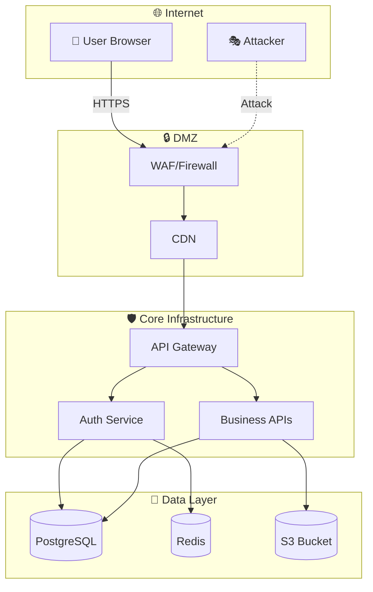
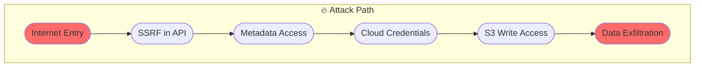
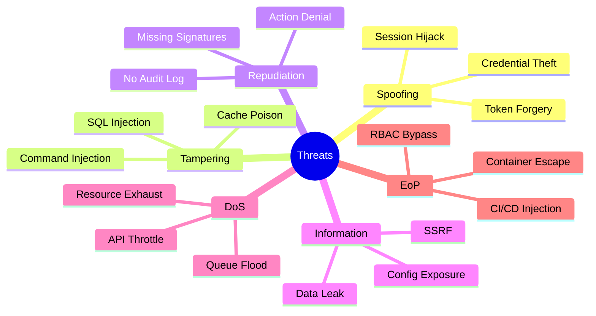

# Visualization Engine

Generate interactive security visualizations for threat models, attack paths, and architecture analysis.

## Visualization Types

| Type | Format | Use Case |
|------|--------|----------|
| Architecture | C4, Mermaid | Architecture review |
| Trust Boundaries | Mermaid | Security zones |
| Attack Paths | Cytoscape | Red team exercises |
| Data Flows | Mermaid | DFD analysis |
| Risk Heatmap | HTML/D3 | Prioritization |
| Threat Overview | Mermaid | Documentation |

## Mermaid Diagrams

### Architecture Diagram (C4)



### Trust Boundary Diagram

```mermaid
graph LR
    subgraph Internet["🌐 Internet<br/>Risk: CRITICAL"]
        E1[External User]
        E2[Attacker]
    end
    
    subgraph DMZ["DMZ<br/>Risk: HIGH"]
        WAF[WAF]
        LB[Load Balancer]
    end
    
    subgraph Internal["Internal Network<br/>Risk: MEDIUM"]
        SVC1[Service A]
        SVC2[Service B]
    end
    
    subgraph Data["Data Layer<br/>Risk: CRITICAL"]
        DB[(Database)]
        SEC[(Secrets)]
    end
    
    E1 -->|TLS+Auth| WAF
    E2 -.x.|Attack| WAF
    WAF --> LB
    LB --> SVC1
    SVC1 --> SVC2
    SVC2 --> DB
    SVC2 --> SEC
```

### Attack Path Diagram



### STRIDE Threat Overview



## Risk Heatmap

```html
<!-- Interactive Risk Heatmap -->
<div id="risk-heatmap"></div>

<script>
// Components on X axis, Risk factors on Y axis
const components = ['API Gateway', 'Auth Service', 'Database', 'Queue'];
const factors = ['Internet Exposure', 'Auth Strength', 'Data Sensitivity', 'Dependencies'];

const heatmap = [
  // Component risk factors [0-1]
  [0.9, 0.7, 0.5, 0.3], // API Gateway
  [0.3, 0.9, 0.8, 0.2], // Auth Service
  [0.1, 0.5, 1.0, 0.6], // Database
  [0.2, 0.4, 0.7, 0.8], // Queue
];

// Color scale: green (0) → yellow (0.5) → red (1)
function getColor(value) {
  if (value < 0.3) return '#22c55e';
  if (value < 0.6) return '#eab308';
  if (value < 0.8) return '#f97316';
  return '#ef4444';
}
</script>
```

## Attack Path Visualization

### Cytoscape.js Configuration

```javascript
const cy = cytoscape({
  container: document.getElementById('attack-paths'),
  
  style: [
    {
      selector: 'node',
      style: {
        'label': 'data(label)',
        'background-color': 'data(color)',
        'width': 60,
        'height': 60,
      }
    },
    {
      selector: 'edge',
      style: {
        'width': 3,
        'line-color': '#ef4444',
        'target-arrow-color': '#ef4444',
        'curve-style': 'bezier',
        'label': 'data(technique)',
      }
    },
    {
      selector: '.entry-point',
      style: { 'background-color': '#ff6b6b' }
    },
    {
      selector: '.target',
      style: { 'background-color': '#dc2626' }
    }
  ],
  
  elements: [
    { data: { id: 'internet', label: '🌐 Internet', color: '#ff6b6b' }, classes: 'entry-point' },
    { data: { id: 'ssrf', label: 'SSRF', color: '#f97316' } },
    { data: { id: 'metadata', label: 'Metadata', color: '#f97316' } },
    { data: { id: 'creds', label: 'Cloud Creds', color: '#dc2626' }, classes: 'target' },
    
    { data: { source: 'internet', target: 'ssrf', technique: 'T1190' } },
    { data: { source: 'ssrf', target: 'metadata', technique: 'T1552.001' } },
    { data: { source: 'metadata', target: 'creds', technique: 'T1552.001' } },
  ],
  
  layout: {
    name: 'breadthfirst',
    directed: true,
    roots: '#internet'
  }
});

// Animate attack path
cy.elements().animate({
  step: function(i) { console.log(i); },
  duration: 2000,
  easing: 'ease-in-out'
});
```

## GraphX Integration

### Query Attack Paths from Graph

```bash
# Get all attack paths
GraphX: Query edge_type="attack_path"

# Get nodes with highest threat count
GraphX: Query type="service" ORDER BY threat_count DESC LIMIT 10

# Get trust boundary crossings
GraphX: Query edge_type="trust_boundary_crossing"

# Get blast radius for component
GraphX: GetBlastRadius("api-gateway-id")
```

## Export Formats

| Format | Description | Use Case |
|--------|-------------|----------|
| Mermaid | Text-based diagrams | Markdown, docs |
| SVG | Vector graphics | Reports, presentations |
| HTML | Interactive D3.js | Web dashboards |
| JSON | Graph data | API integration |
| PNG | Raster image | Non-interactive docs |

## CLI Commands for Visualization

```bash
# Generate all diagrams
graphx diagram --all

# Specific diagrams
graphx diagram --type architecture --format mermaid
graphx diagram --type attack-paths --format cytoscape
graphx diagram --type heatmap --format html

# Export options
graphx diagram --output ./threat-models --format svg

# Interactive viewer
graphx visualize --live --port 8080
```

## Interactive Features

### Filter Controls

- [ ] Filter by severity
- [ ] Filter by attack surface
- [ ] Filter by trust zone
- [ ] Highlight specific paths
- [ ] Animate attack sequences

### Exploration

- Click node → Show component details
- Hover edge → Show technique
- Double-click → Drill into sub-component
- Right-click → Context menu (mitigations, similar)

## Performance

| Diagram Type | Nodes | Render Time |
|--------------|-------|-------------|
| C4 Architecture | 50 | < 1s |
| Trust Boundaries | 30 | < 500ms |
| Attack Paths | 100 | < 2s |
| Risk Heatmap | 200 | < 1s |