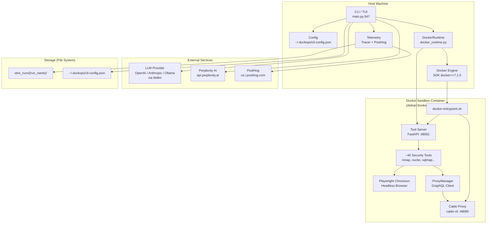
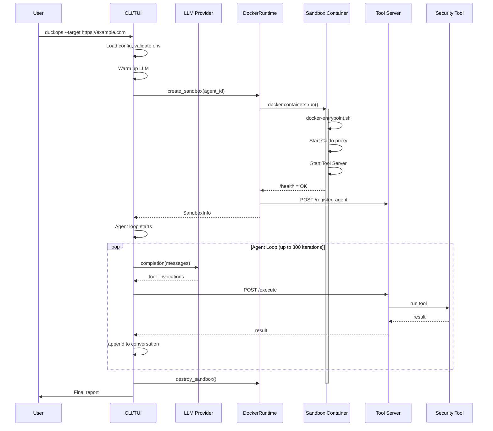
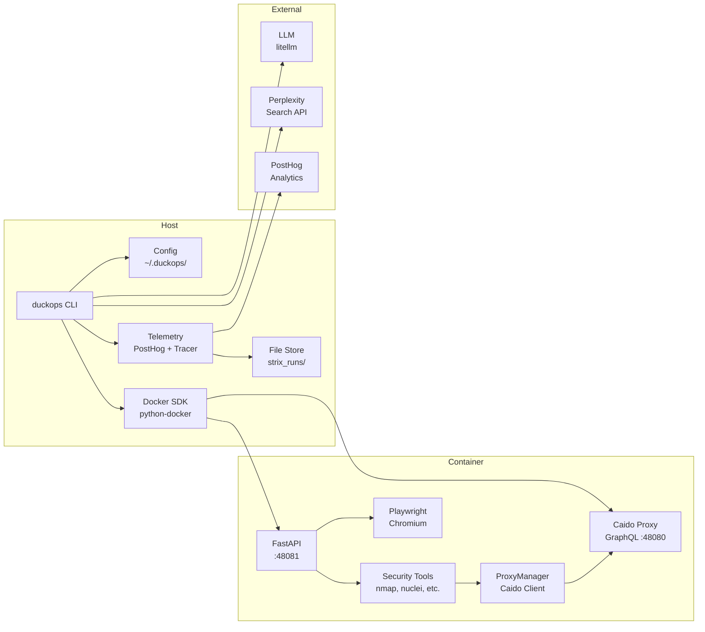

# Local Infrastructure Analysis

**Project:** duckops-agent v0.8.3
**Source:** `/run/media/h3ckt0r/apps/Coding/strix`
**Date:** 2026-06-09

---

## Executive Summary

duckops-agent is a multi-agent AI cybersecurity penetration testing tool. It orchestrates an LLM-driven agent swarm that executes security tools inside **Docker sandbox containers**. The project has **no traditional database**, **one local HTTP API** (a FastAPI tool server internal to the Docker sandbox), **no MCP servers** (the image name references MCP but no MCP implementation exists), and **one Docker container image** with ~40 security tools pre-installed.

### Quick Answers

| # | Question | Answer |
|---|----------|--------|
| 1 | Do we have a local API? | Yes — FastAPI tool server inside Docker container |
| 2 | Which port does it use? | `48081` inside container (mapped to random host port) |
| 3 | Do we have a local database? | No — all storage is file-based |
| 4 | Which database is used? | None |
| 5 | Where is the database stored? | N/A |
| 6 | Which services depend on it? | N/A |
| 7 | Which MCP servers are installed? | None (image name is `duckops-mcp-server:local` but no MCP code exists) |
| 8 | Which Docker containers are used? | One sandbox container per scan (`duckops-scan-{scan_id}`) |
| 9 | What is the complete startup sequence? | Config → Docker check → Image pull → LLM warm-up → Agent → Sandbox → Tool server → Agent loop |
| 10 | How does data move through the system? | User target → LLM reasoning → Tool invocation → Docker sandbox → Tool execution → Results → Agent → Report |

---

## Local APIs

### Tool Server (FastAPI)

**File:** `strix/runtime/tool_server.py`
**Framework:** FastAPI + uvicorn
**Host:** `0.0.0.0` (inside container, bound to container port `48081`)
**Host port:** Random available port mapped at container creation
**Authentication:** Bearer token (32-byte random URL-safe, generated at container creation)

#### Endpoints

| Method | Route | Handler | Line | Purpose |
|--------|-------|---------|------|---------|
| `POST` | `/execute` | `execute_tool` | 86 | Executes a tool by name with kwargs for an agent |
| `POST` | `/register_agent` | `register_agent` | 130 | Registers an agent ID with the server |
| `GET` | `/health` | `health_check` | 138 | Health check returning status, sandbox mode, auth config, and active agents |

#### Authentication

- `HTTPBearer` security dependency injected via `Depends(security)` on `/execute` and `/register_agent`
- Custom `verify_token()` function (`tool_server.py:42-57`) validates Bearer token against `EXPECTED_TOKEN` (set from `--token` CLI arg, `tool_server.py:32`)

#### Middleware

- `HTTPBearer` security (FastAPI dependency injection)
- `SIGTERM`/`SIGINT` signal handler for graceful shutdown (`tool_server.py:161-162`)
- `SIGPIPE` signal ignored (`tool_server.py:158-159`)

#### Request/Response Models

- `ToolExecutionRequest` (`tool_server.py:60-63`): `agent_id`, `tool_name`, `kwargs`
- `ToolExecutionResponse` (`tool_server.py:66-68`): `result` or `error`

#### Tool Execution Flow

1. Receives tool execution request with `agent_id`, `tool_name`, `kwargs`
2. Cancels any previous pending task for the same `agent_id`
3. Runs `_run_tool()` (`tool_server.py:71-83`) which:
   - Sets the current agent ID via `set_current_agent_id()`
   - Looks up the tool function from registry via `get_tool_by_name()`
   - Converts arguments via `convert_arguments()`
   - Executes the tool synchronously in a thread via `asyncio.to_thread()`
4. Returns result or error, with timeout enforced by `asyncio.wait_for()`

#### Guard

- The server refuses to start outside sandbox mode (`tool_server.py:16-18`):
  ```python
  SANDBOX_MODE = os.getenv("duckops_SANDBOX_MODE", "false").lower() == "true"
  if not SANDBOX_MODE:
      raise RuntimeError("Tool server should only run in sandbox mode")
  ```

#### Startup

- Started via `docker-entrypoint.sh` (`containers/docker-entrypoint.sh:161-166`):
  ```bash
  sudo -E -u duckops \
    /app/.venv/bin/python -m duckops.runtime.tool_server \
    --token="$TOOL_SERVER_TOKEN" \
    --host=0.0.0.0 \
    --port="$TOOL_SERVER_PORT" \
    --timeout="$TOOL_SERVER_TIMEOUT"
  ```
- Health is verified by polling `/health` before considering the container ready

---

## Local Databases

**No local database is used.** The project uses exclusively file-based persistence.

### File-Based Storage

| Storage Type | Format | Location | Line | Purpose |
|-------------|--------|----------|------|---------|
| CLI config | JSON | `~/.duckops/cli-config.json` | `config.py:99-102` | Persists user configuration (env vars) |
| Telemetry events | JSONL | `strix_runs/{run_name}/events.jsonl` | `tracer.py:97` | OpenTelemetry span and event export |
| Notes journal | JSONL | `strix_runs/{run_name}/notes/notes.jsonl` | `notes_actions.py:37` | Persistent note-taking |
| Wiki notes | Markdown | `strix_runs/{run_name}/wiki/{id}-{slug}.md` | `notes_actions.py:136-147` | Wiki-style persistent notes |
| Vulnerability reports | Markdown | `strix_runs/{run_name}/vulnerabilities/{id}.md` | `tracer.py:637-731` | Individual finding reports |
| Pen test report | Markdown | `strix_runs/{run_name}/penetration_test_report.md` | `tracer.py:624-634` | Final comprehensive report |
| Vulnerability summary | CSV | `strix_runs/{run_name}/vulnerabilities.csv` | `tracer.py:733-749` | Tabular findings summary |
| First-run marker | Touch | `~/.duckops/.seen` | `posthog.py:26-34` | Telemetry first-run detection |

### Dependencies NOT Used (found in `uv.lock` as transitive only)

- **Redis** (`uv.lock:4875-4880`): Pulled in by `opentelemetry-instrumentation-redis`, never imported in source
- **SQLAlchemy** (`uv.lock:3546-3558`): Pulled in by `opentelemetry-instrumentation-sqlalchemy`, never imported in source

---

## Internal Services

### Caido Proxy (In-Container GraphQL Server)

**Framework:** Caido CLI (Go-based intercepting proxy)
**Host:** `0.0.0.0` (inside container)
**Port:** `48080` (fixed inside container, mapped to random host port)
**Authentication:** Guest login → GraphQL mutation token

#### Purpose

Acts as a Man-in-the-Middle proxy for all HTTP traffic from the sandbox container. Every outbound request from tools (browser, terminal, etc.) is routed through Caido, which captures and logs traffic for security analysis.

#### Setup Sequence

1. Started in `docker-entrypoint.sh:12-17`:
   ```bash
   caido-cli --listen 0.0.0.0:${CAIDO_PORT} \
             --allow-guests \
             --no-logging \
             --no-open \
             --import-ca-cert /app/certs/ca.p12 \
             --import-ca-cert-pass ""
   ```
2. API readiness polled via `curl` (`docker-entrypoint.sh:22-46`)
3. Guest authentication via GraphQL mutation `LoginAsGuest` (`docker-entrypoint.sh:50-77`)
4. Temporary project "sandbox" created via `CreateProject` mutation (`docker-entrypoint.sh:79-94`)
5. Project selected via `SelectProject` mutation (`docker-entrypoint.sh:96-111`)
6. System-wide proxy environment written to `/etc/profile.d/proxy.sh`, `/etc/environment`, `/etc/wgetrc` (`docker-entrypoint.sh:113-146`)
7. CA certificate added to NSS browser trust store (`docker-entrypoint.sh:148-152`)

#### GraphQL Operations Supported (via `ProxyManager`)

**File:** `strix/tools/proxy/proxy_manager.py`

| Operation | Method | Line | Purpose |
|-----------|--------|------|---------|
| `GetRequests` | `list_requests()` | 38 | Lists proxied requests with filtering/pagination |
| `GetRequest` | `get_request()` | 123 | Views individual request/response details |
| `CreateScope` | `create_scope()` | 441 | Creates a Caido scope |
| `UpdateScope` | `update_scope()` | 473 | Updates an existing Caido scope |
| `DeleteScope` | `delete_scope()` | 505 | Deletes a Caido scope |
| `scopes` | `list_scopes()` | 521 | Lists all Caido scopes |
| `scope` | `get_scope()` | 553 | Gets a specific Caido scope |
| `GetSitemapRoots` | `get_sitemap_roots()` | 596 | Gets sitemap root entries |
| `GetSitemapDescendants` | `get_sitemap_descendants()` | 644 | Gets sitemap child entries |
| `GetSitemapEntry` | `get_sitemap_entry()` | 693 | Gets a specific sitemap entry |

### OpenTelemetry / Traceloop (Observability)

- **Local export:** JSONL file via custom `JsonlSpanExporter` (`telemetry/utils.py:206-243`)
- **Remote export:** OTLP HTTP exporter to Traceloop (optional)
- **Secrets scrubbing:** `scrubadub` library for PII/secret redaction

---

## Docker Services

### Single Sandbox Container

**Dockerfile:** `containers/Dockerfile` (223 lines)
**Entrypoint:** `containers/docker-entrypoint.sh` (185 lines)
**Base image:** `debian:bookworm-slim`
**Image name:** `duckops-mcp-server:local` (configurable via `duckops_IMAGE` env var)
**Build script:** `scripts/docker.sh`

#### Container Configuration

| Property | Value | File | Line |
|----------|-------|------|------|
| Name | `duckops-scan-{scan_id}` | `docker_runtime.py` | 112 |
| Command | `sleep infinity` | `docker_runtime.py` | 136 |
| Port mappings | `48081` (tool server), `48080` (caido) → random host ports | `docker_runtime.py` | 140-143 |
| Capabilities | `NET_ADMIN`, `NET_RAW` | `docker_runtime.py` | 144 |
| Labels | `duckops-scan-id: {scan_id}` | `docker_runtime.py` | 145 |
| Extra hosts | `host.docker.internal` → `host-gateway` | `docker_runtime.py` | 153 |
| User | `duckops` (with passwordless sudo) | `Dockerfile` | 10-13 |

#### Environment Variables Set on Container

| Variable | Value | File | Line |
|----------|-------|------|------|
| `PYTHONUNBUFFERED` | `1` | `docker_runtime.py` | 147 |
| `TOOL_SERVER_PORT` | `48081` | `docker_runtime.py` | 148 |
| `TOOL_SERVER_TOKEN` | Random 32-byte URL-safe | `docker_runtime.py` | 149 |
| `duckops_SANDBOX_EXECUTION_TIMEOUT` | `120` (configurable) | `docker_runtime.py` | 150 |
| `HOST_GATEWAY` | `host.docker.internal` | `docker_runtime.py` | 151 |
| `duckops_SANDBOX_MODE` | `true` | `Dockerfile` | 189 |
| `PYTHONPATH` | `/app` | `Dockerfile` | 190 |
| `SSL_CERT_FILE` | `/etc/ssl/certs/ca-certificates.crt` | `Dockerfile` | 192 |

#### Tools Installed in Container

**Network Scanning:**
- nmap, netcat, dnsutils, iputils-ping, iproute2

**Security Tools:**
- nuclei, subfinder, naabu, ffuf, sqlmap
- httpx, katana, gospider, interactsh-client
- arjun, dirsearch, wafw00f
- trufflehog, gitleaks
- zaproxy, trivy, wapiti
- semgrep, bandit

**JavaScript/Web Analysis:**
- retire, eslint, jshint, js-beautify
- ast-grep, tree-sitter (with 8 language parsers)
- JS-Snooper, jsniper, jwt_tool
- Playwright (Chromium headless browser)

**General Tools:**
- golang, nodejs, python3, pipx, uv
- jq, ripgrep, parallel, tmux

#### Docker Runtime (Host Side)

**File:** `strix/runtime/docker_runtime.py` (352 lines)

| Method | Line | Purpose |
|--------|------|---------|
| `__init__()` | 28 | Initializes Docker client via `docker.from_env(timeout=60)` |
| `_find_available_port()` | 43 | Finds a random free TCP port via socket |
| `_verify_image_available()` | 59 | Checks if Docker image exists, retries up to 3× |
| `_recover_container_state()` | 72 | Recovers token/port from existing container's env |
| `_wait_for_tool_server()` | 87 | Polls `/health` up to 30× with exponential backoff |
| `_create_container()` | 111 | Creates the sandbox container with port mappings and capabilities |
| `_get_or_create_container()` | 175 | Reuses existing container or creates new one |
| `_copy_local_directory_to_container()` | 222 | Copies local source code into container via tar archive |
| `create_sandbox()` | 250 | Full sandbox creation: container → sources → agent registration |
| `_register_agent()` | 292 | Registers agent with tool server via POST |
| `destroy_sandbox()` | 322 | Stops and removes container |
| `cleanup()` | 334 | Force-removes container via `docker rm -f` subprocess |

#### Container Lifecycle

```
User initiates scan
  → DockerRuntime.create_sandbox()
    → _get_or_create_container()
      → _create_container()
        → docker.containers.run(image, command="sleep infinity", ...)
        → Container starts
          → docker-entrypoint.sh executes:
            1. Start caido-cli proxy
            2. Wait for Caido API ready
            3. LoginAsGuest graphql
            4. CreateProject graphql
            5. SelectProject graphql
            6. Configure system proxy
            7. Start tool server (FastAPI)
            8. Wait for tool server health
            9. exec "$@" (sleep infinity)
    → _wait_for_tool_server() [host side polls /health]
    → copy local sources into container
    → _register_agent() [host side POST /register_agent]
  → Sandbox ready for tool execution
```

---

## MCP Services

### No MCP Implementation Found

The project does **not** implement any Model Context Protocol (MCP) server or client. The only reference to MCP is:

- `config.py:42`: `duckops_image = "duckops-mcp-server:local"` — the Docker image name
- The tool registry (`strix/tools/registry.py`) provides decorator-based tool registration but is a simple Python function registry, not an MCP implementation

---

## External Services

### 1. LLM Providers (via litellm)

**File:** `strix/llm/llm.py`
**Library:** `litellm[proxy]>=1.81.1`
**Purpose:** Core AI reasoning for all agents
**Supported backends:** OpenAI, Anthropic, Vertex AI, AWS Bedrock, Ollama, LMStudio, OpenRouter, any OpenAI-compatible endpoint
**Auth:** `LLM_API_KEY` env var
**Configuration:** `duckops_LLM` (model name), `LLM_API_BASE`, `OPENAI_API_BASE`, `LITELLM_BASE_URL`, `OLLAMA_API_BASE`

### 2. Perplexity AI (Web Search)

**File:** `strix/tools/web_search/web_search_actions.py`
**Endpoint:** `POST https://api.perplexity.ai/chat/completions`
**Auth:** `PERPLEXITY_API_KEY` env var (optional)
**Purpose:** Real-time web research during penetration testing
**Line:** 37 (API key), 56 (HTTP call)

### 3. PostHog (Telemetry)

**File:** `strix/telemetry/posthog.py`
**Endpoint:** `POST https://us.i.posthog.com/capture/`
**API Key:** Hardcoded (`phc_7rO3XRuNT5sgSKAl6HDIrWdSGh1COzxw0vxVIAR6vVZ`)
**Purpose:** Product analytics (scan start, findings, errors, scan end)
**Events:** `scan_started`, `finding_reported`, `scan_ended`, `error`
**Configuration:** `duckops_TELEMETRY`, `duckops_POSTHOG_TELEMETRY`

### 4. Docker Engine (via Python SDK)

**File:** `strix/runtime/docker_runtime.py`
**Library:** `docker>=7.1.0`
**Connection:** `docker.from_env(timeout=60)` — connects to local Docker daemon
**Purpose:** Container lifecycle management
**Configuration:** `DOCKER_HOST` env var for remote daemon, `duckops_IMAGE` for image selection

### 5. Git (via subprocess)

**File:** `strix/interface/utils.py`
**Purpose:** Repository cloning and diff-scope analysis
**Called in:** `main.py:570` (`clone_repository()`)

---

## Background Workers

### TUI Mode Workers

| Worker | Interval | File | Line | Purpose |
|--------|----------|------|------|---------|
| Splash animation | 0.05s | `tui.py` | — | Shining text effect on startup |
| UI update poll | 0.35s | `tui.py` | — | Polls Tracer for new agents, messages, vulnerabilities |
| Dot animation | 0.06s | `tui.py` | — | Sweep animation for active agent status |
| Scan thread | — | `tui.py` | — | Runs `duckopsAgent.execute_scan()` in a background thread |

### CLI Mode Workers

| Worker | Interval | File | Line | Purpose |
|--------|----------|------|------|---------|
| Status daemon thread | 2s | `cli.py` | — | Updates rich.live status panel |

---

## Runtime Architecture

### Architecture Diagram



### Data Flow



---

## Startup Sequence

### Phase 0: Module Import (Immediate, `main.py:26`)

```
1. Config class definition              [config/config.py:10-223]
2. apply_saved_config() called          [main.py:26] — loads ~/.duckops/cli-config.json
3. Tool registry population             [tools/__init__.py] — @register_tool decorators fire
4. LLM logging suppression              [llm/__init__.py] — disables litellm debug, asyncio warnings
```

### Phase 1: CLI Argument Parsing (`main.py:551`)

```
5. parse_arguments()                    — -t/--target (required), --instruction, --scan-mode, etc.
6. infer_target_type()                  — URL, repo, local dir, domain, or IP
7. assign_workspace_subdirs()           — assigns target subdirectories in container
8. rewrite_localhost_targets()          — 127.0.0.1 → host.docker.internal
```

### Phase 2: Config Override (`main.py:553-554`)

```
9. apply_config_override()              — if --config specified, clears default config, loads custom
```

### Phase 3: Environment Validation (`main.py:556-560`)

```
10. check_docker_installed()            — shutil.which("docker") [main.py:185-204]
11. pull_docker_image()                 — docker pull if image not present [main.py:487-528]
12. validate_environment()              — checks duckops_LLM (required), LLM_API_KEY, etc. [main.py:53-182]
13. warm_up_llm()                       — sends "Reply with just 'OK'" to LLM [main.py:207-255]
```

### Phase 4: Config Persistence (`main.py:562`)

```
14. persist_config()                    — saves current env to ~/.duckops/cli-config.json [main.py:542-544]
```

### Phase 5: Run Preparation (`main.py:564-615`)

```
15. generate_run_name()                 — slug from target + random hex
16. clone_repository()                  — for repo targets, clones to /tmp/duckops_repos/
17. collect_local_sources()             — gathers local code/repo paths
18. resolve_diff_scope_context()        — PR diff scope for CI/CD integration
19. posthog.start()                     — sends "scan_started" event
```

### Phase 6: Execution (`main.py:618-628`)

```
20a. TUI Mode: run_tui(args)           [main.py:622]
    - Creates duckopsTUIApp (Textual)
    - Shows splash screen (4.5s)
    - Starts agent in background thread
20b. CLI Mode: run_cli(args)           [main.py:620]
    - Creates Tracer instance
    - Runs agent via asyncio.run()
```

### Phase 7: Agent Loop (Lazy Initialization)

```
21. LLMConfig + LLM created            — resolves model, API key, base
22. duckopsAgent created               — base_agent.py:55 — sets up state, LLM, prompt templates
23. get_runtime() called                — runtime/__init__.py:18 — lazy-initializes DockerRuntime
24. create_sandbox()                    — docker_runtime.py:250:
    a. _get_or_create_container()       — docker_runtime.py:175
        i.  _create_container()         — docker_runtime.py:111:
            - docker.containers.run()
            - Container starts → docker-entrypoint.sh:
                1. Start caido-cli on :48080
                2. Wait for Caido API (30s timeout)
                3. LoginAsGuest → get token
                4. CreateProject("sandbox")
                5. SelectProject
                6. Write proxy env files
                7. Start Tool Server on :48081
                8. Wait for /health (10s timeout)
                9. exec sleep infinity
            - Host waits for /health (30 retries)
        ii. _copy_local_directory_to_container()
    b. _register_agent()                — POST /register_agent
25. Agent loop starts (up to 300 iterations):
    - LLM completion → tool invocations
    - Process tool invocations:
        - Sandbox tools: POST /execute → Tool Server → tool function
        - Local tools: direct function call
    - Append to conversation history
```

### Phase 8: Cleanup (`main.py:629-632`)

```
26. posthog.end()                       — sends "scan_ended" event with stats
27. Tracer.save_data()                  — writes reports, vulnerabilities, events to disk
28. Runtime cleanup                     — DockerRuntime.cleanup() → docker rm -f
29. Signal handlers                     — SIGINT, SIGTERM, SIGHUP trigger cleanup
```

### Startup Sequence Diagram

```mermaid
flowchart TD
    Start(["main()"]) --> ParseArgs["parse_arguments()"]
    ParseArgs --> ConfigOverride["apply_config_override()\n(if --config)"]
    ConfigOverride --> DockerCheck["check_docker_installed()"]
    DockerCheck --> PullImage["pull_docker_image()"]
    PullImage --> ValidateEnv["validate_environment()"]
    ValidateEnv --> WarmUp["warm_up_llm()"]
    WarmUp --> PersistConfig["persist_config()"]
    PersistConfig --> CloneRepo["clone_repository()\n(for repo targets)"]
    CloneRepo --> DiffScope["resolve_diff_scope_context()"]
    DiffScope --> PostHogStart["posthog.start()"]
    PostHogStart --> Choice{"-n\nnon-interactive?"}
    Choice -->|Yes| CLIMode["run_cli()"]
    Choice -->|No| TUIMode["run_tui()"]
    CLIMode --> AgentInit["LLM + Agent Initialization"]
    TUIMode --> AgentInit
    AgentInit --> LazyRuntime["get_runtime() → DockerRuntime"]
    LazyRuntime --> CreateSandbox["create_sandbox()"]
    subgraph ContainerStartup["Docker Container Startup"]
        direction TB
        DockerRun["docker.containers.run()"] --> Entrypoint["docker-entrypoint.sh"]
        Entrypoint --> Caido["Start Caido Proxy (:48080)"]
        Caido --> CaidoReady["Wait for Caido API (30s)"]
        CaidoReady --> CaidoAuth["LoginAsGuest GraphQL"]
        CaidoAuth --> CaidoProject["CreateProject + SelectProject"]
        CaidoProject --> ProxyConfig["Write Proxy Config\n/etc/profile.d/proxy.sh\n/etc/environment"]
        ProxyConfig --> SSLCert["Add CA to NSS DB"]
        SSLCert --> ToolServerStart["Start FastAPI Tool Server (:48081)"]
        ToolServerStart --> HealthWait["Wait for /health (10s)"]
        HealthWait --> Ready["Container Ready"]
    end
    CreateSandbox --> ContainerStartup
    ContainerStartup --> RegisterAgent["POST /register_agent"]
    RegisterAgent --> AgentLoop["Agent Loop\n(up to 300 iterations)"]
    AgentLoop --> ToolExec{"Tool needs\nsandbox?"}
    ToolExec -->|Yes| SandboxExec["POST /execute → Tool Server"]
    ToolExec -->|No| LocalExec["Direct function call"]
    SandboxExec --> AgentLoop
    LocalExec --> AgentLoop
    AgentLoop --> Finish{"finish_scan\nor 300 iterations?"}
    Finish -->|Yes| Cleanup["Cleanup Phase"]
    Cleanup --> PostHogEnd["posthog.end()"]
    PostHogEnd --> SaveReport["Save reports to\nstrix_runs/{run_name}/"]
    SaveReport --> DestroyContainer["destroy_sandbox()"]
    DestroyContainer --> Done(["Done"])
```



---

## Dependency Graph



---

## Security Considerations

### Authentication

1. **Tool Server Bearer Token:** 32-byte random URL-safe token generated per container (`docker_runtime.py:131`). Used for both `/execute` and `/register_agent`.
2. **Caido API Token:** Obtained via `LoginAsSaved` mutation with guest access enabled (`docker-entrypoint.sh:55-56`).
3. **Container capabilities:** `NET_ADMIN` + `NET_RAW` — allows network manipulation inside sandbox.
4. **Container user:** `duckops` with passwordless sudo (`Dockerfile:12`).

### Secrets Management

- **Hardcoded PostHog API key** in `posthog.py:15` — public key, but still a credential in source
- **LLM API keys** passed via environment variables (`LLM_API_KEY`)
- **Perplexity API key** passed via environment variable (`PERPLEXITY_API_KEY`)
- **Telemetry secrets scrubbing** via `scrubadub` library
- **Config file** saved with `0o600` permissions (`config.py:125-126`)

### Network Security

1. **`host.docker.internal`** mapped via `extra_hosts` — container can reach host network
2. **Localhost targets rewritten** to `host.docker.internal` — directs tools at host services
3. **System-wide proxy** inside container routes all traffic through Caido for inspection
4. **Custom CA certificate** generated and trusted for HTTPS interception

### Risks

- Container has broad network capabilities (`NET_ADMIN`, `NET_RAW`)
- Container user has passwordless sudo
- `host.docker.internal` enables container-to-host communication
- Tools like nmap with raw socket capabilities inside container
- PostHog API key hardcoded in source

---

## Findings

| # | Finding | Severity | Details |
|---|---------|----------|---------|
| 1 | No database | Info | All persistence is file-based; no SQLite, Postgres, Redis, etc. |
| 2 | No MCP implementation | Info | Image named `duckops-mcp-server` but no MCP protocol code exists |
| 3 | Single Docker image | Info | One sandbox image with ~40 pre-installed security tools |
| 4 | FastAPI internal API | Info | Tool server only runs inside Docker container, not exposed to user |
| 5 | Caido proxy integration | Info | All HTTP traffic inside sandbox is intercepted and logged |
| 6 | LLM-first architecture | Info | No routing logic; LLM decides which tools to invoke |
| 7 | Hardcoded telemetry key | Low | PostHog public API key in source (`posthog.py:15`) |
| 8 | Container has broad caps | Medium | `NET_ADMIN` + `NET_RAW` + passwordless sudo |
| 9 | host.docker.internal access | Medium | Container can access host services |

---

## Recommendations

1. **Consider SQLite for structured state** — File-based JSONL works but lacks querying, concurrency, and integrity guarantees
2. **No docker-compose needed** — Single-container architecture doesn't require orchestration
3. **Remove "mcp-server" from image name** — Misleading since no MCP protocol is implemented
4. **Add network sandboxing** — Consider dropping unnecessary capabilities or using seccomp profiles
5. **Move PostHog API key to env var** — Hardcoded key should be configurable at build time
6. **Consider persistent volume** — If local sources need to survive container restarts
7. **Document the Caido integration** — Proxy setup is complex and undocumented in user-facing docs

---

## Missing Components

| Component | Status | Notes |
|-----------|--------|-------|
| SQL database | Not present | All storage is file-based |
| Message queue | Not present | Direct agent ↔ tool communication |
| Service discovery | Not present | Single container, no multi-service orchestration |
| Load balancer | Not present | Not needed — single-agent-per-scan model |
| API gateway | Not present | Tool server is internal-only |
| CI/CD pipeline | Not present | GitHub Actions for build/release only |
| Health monitoring | Partial | Container health check only |
| Backup system | Not present | No backup mechanism for run artifacts |
| Rate limiting | Not present | Tool server has no rate limits |
| Audit logging | Partial | OpenTelemetry spans capture tool executions |

---

## Conclusion

duckops-agent has a **minimal infrastructure footprint**:

- **One local API**: A FastAPI tool server (`/execute`, `/register_agent`, `/health`) that runs **inside** a Docker sandbox container, never exposed to the user
- **No database**: All state is file-based (JSONL for events, Markdown for reports, CSV for summaries, JSON for config)
- **One Docker container**: A Debian-based sandbox with ~40 security tools, Caido intercepting proxy (`:48080`), and the tool server (`:48081`)
- **No MCP servers**: Despite the image name containing "mcp-server", no Model Context Protocol code exists
- **External dependencies**: LLM providers (via litellm), Perplexity AI (web search), PostHog (telemetry), Docker Engine

The architecture follows a simple pattern: user input → LLM reasoning → tool execution (either locally or forwarded to the Docker sandbox via HTTP) → results back to LLM → final report. There is no complex service mesh, no message queue, no database cluster — just a Python CLI, one Docker container per scan, and file-based persistence.
